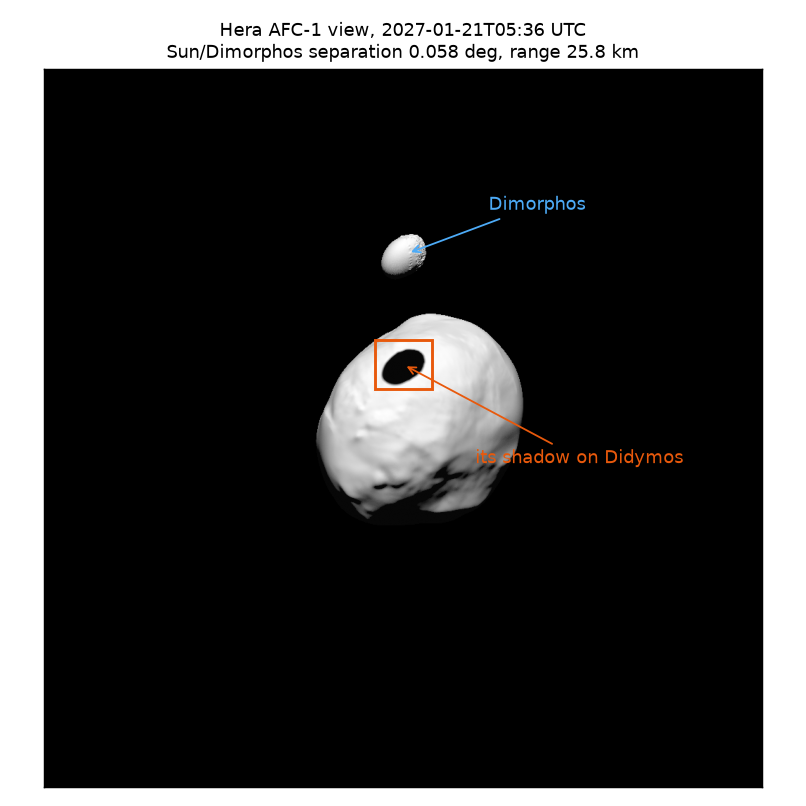
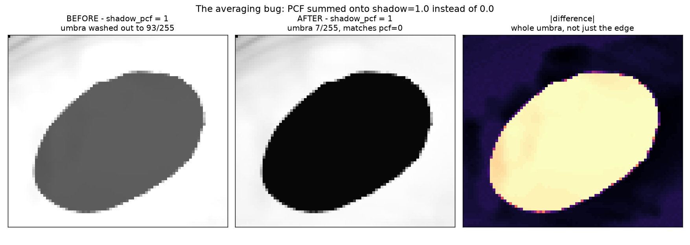
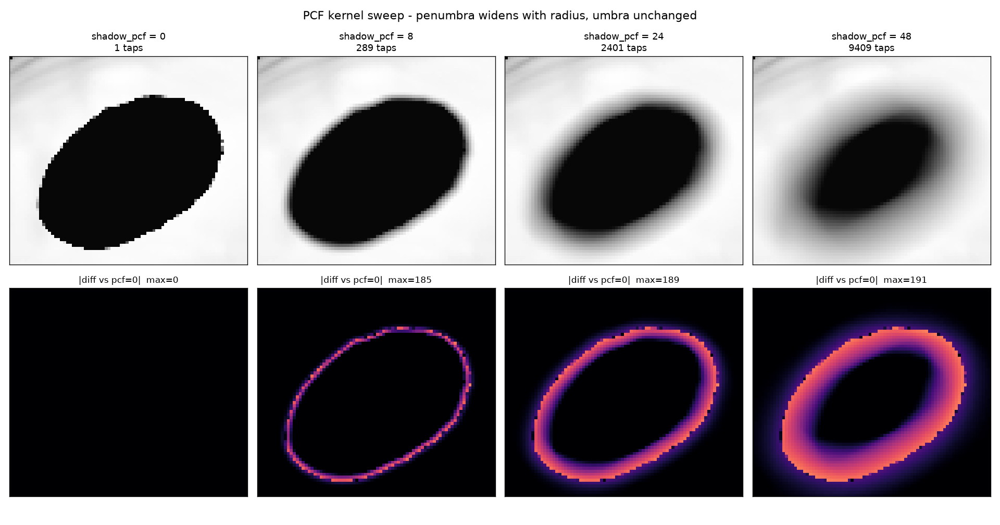

# PCF shadow filtering: bug fix and kernel comparison

What `shadow_pcf` does to a real cast shadow, and a bug in its averaging that
made every non-zero value wrong. Rendered from
`examples/hera_didymos/afc_eclip_didy_manual.py`'s exact settings, at the one
epoch in the sweep where Dimorphos transits the Sun as seen from Didymos.

## The scene



**2027-01-21T05:36:00 UTC.** Found by scanning the script's 6-month sweep at
60 s steps for the minimum angular separation between the Didymos->Sun and
Didymos->Dimorphos directions. At this epoch they are **0.058 deg** apart, so
Dimorphos sits almost exactly between the Sun and Didymos and drops a clean
elliptical shadow on the primary. Hera is 25.8 km out, Dimorphos 1.151 km from
Didymos centre.

Other usable epochs within Hera's coverage, same criterion:

| Separation | UTC |
|---|---|
| 0.058 deg | 2027-01-21T05:36:00 |
| 0.075 deg | 2027-01-20T18:15:00 |
| 0.170 deg | 2027-01-21T16:57:00 |
| 0.189 deg | 2027-01-20T06:54:00 |

They cluster in a few days around 2027-01-20/22 -- that is when the mutual
orbit plane lines up with the Sun. Nothing outside that window casts.

Note the sweep's `etf` (2027-05-01) is **past the end of Hera's ephemeris
coverage**; `spkpos` for HERA throws `SPKINSUFFDATA` before reaching it. That
is a pre-existing property of the committed script, not something introduced
here, but a full run will fail near the end.

## The bug



`shaders/mesh_shadow.wgsl` initialised `var shadow = 1.0` (the no-shadow
default, correct for the `shadow_pcf == 0` path) and the PCF branch then
accumulated taps onto that same variable:

```wgsl
var shadow = 1.0;
...
for (...) { shadow += textureSampleCompare(...); }
shadow /= pow(f32(globals.shadow_pcf * 2 + 1), 2.0);
```

So the average started from 1.0 instead of 0.0, adding a constant
`1 / (2*pcf + 1)^2` of *unshadowed* light to every filtered fragment. This is
not an edge artifact -- it lifts the whole umbra.

Fixed by accumulating into a separate `sum`:

```wgsl
var sum = 0.0;
for (...) { sum += textureSampleCompare(...); }
let taps = f32(globals.shadow_pcf * 2u + 1u);
shadow = sum / (taps * taps);
```

### Measured

Umbra brightness (mean of fully-shadowed pixels, 0-255) at the epoch above.
`shadow_pcf = 0` never used the broken branch, so it is the reference:

| `shadow_pcf` | taps | umbra before | umbra after | reference (pcf=0) |
|---|---|---|---|---|
| 1 | 9 | **93.05** | 7.00 | 6.997 |
| 2 | 25 | **56.96** | 7.00 | 6.997 |

At `shadow_pcf = 1` the shadow was **13x too bright**. The severity falls off
as the kernel grows, which is why it was easy to miss at large radii.

The numbers agree with the prediction quantitatively. The surface is
sRGB-encoded, so backing that out of the measured values:

- pcf=1: `(93.05/255)^2.2 = 0.1067` linear; minus ambient gives
  `diffuse/9 = 0.1064`, so `diffuse = 0.957`
- pcf=2: `(56.96/255)^2.2 = 0.0369` linear; minus ambient gives
  `diffuse/25 = 0.0366`, so `diffuse = 0.915`

Two independent measurements recovering the same diffuse term (~0.94) is what
confirms the error was exactly `+diffuse/taps`.

## Kernel size comparison



All post-fix. Top row is the shadow, bottom row is the absolute difference
against `shadow_pcf = 0`.

| `shadow_pcf` | taps | effect |
|---|---|---|
| 0 | 1 | hard edge, visible stair-stepping along the ellipse |
| 8 | 289 | aliasing gone, narrow penumbra |
| 24 | 2401 | clearly soft edge |
| 48 | 9409 | wide penumbra, umbra starting to shrink noticeably |

The difference maps show the change is confined to a ring at the boundary --
umbra and fully-lit terrain are untouched, which is the correct behaviour and
a useful sanity check that the fix holds at every radius (measured umbra mean:
6.997 / 6.999 / 7.010 / 7.021 across the four).

### Why small values look like nothing

The blur width in *image* pixels is what you actually see, and it is small
here. With `shadow_resolution = 8192` over a light projection `side = 2.0` km,
one shadow texel is ~0.24 m. At 25.8 km range with `fovy = 5.5 deg`, the frame
covers ~2.48 km across 1020 px, so one image pixel is ~2.43 m.

That makes the kernel radius in image pixels roughly `pcf * 0.1`. So
`shadow_pcf = 2` blurs over about a fifth of a pixel -- invisible, as it first
appeared. Meaningful softening at this geometry starts around `pcf = 8` and is
obvious by `pcf = 24`.

If you want softer shadows more cheaply, lowering `shadow_resolution` widens
each texel and gets more blur per tap, at the cost of blockier shadow-map
sampling. Raising `pcf` is the quadratically expensive way to do it.

### Cost

Each render above is a single frame, so these are not throughput numbers, but
the whole 9409-tap frame still rendered without difficulty on an RTX 5080 --
end-to-end script time (process start, loading two 170 MB full-resolution
meshes, render, export) was 20-21 s for every value from 0 to 48, i.e. the
kernel cost was lost in the mesh loading. Cost grows as `(2*pcf+1)^2`, so it
will matter in a continuous run in a way it does not here.

## Reproducing

Renders came from a throwaway script (not committed) that mirrors
`afc_eclip_didy_manual.py`'s config exactly, pins `et` to the epoch above,
sets `shadow_pcf`, exports one frame with `export_sync = True` so the file is
guaranteed written, then exits. Relevant settings, matching the example:

```python
app.config.width = app.config.height = 1020
app.config.color_mode = 0
app.config.shadow_normal_offset_scale = 2e-4
app.config.shadow_bias_scale = 1e-3
app.config.shadow_bias_minimum = 5e-4
app.simulation.sun.projection.side = 2.0
app.simulation.camera.projection.fovy = 5.5 * RPD
```

The crop used in the figures is `[385:455, 470:550]` of the 1020x1020 frame.

See `../2026-08-25_CONFIG_options.md` for `shadow_pcf` and the other shadow parameters.
