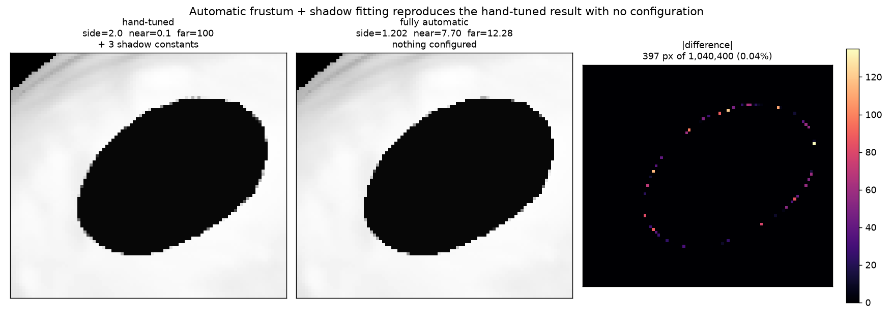
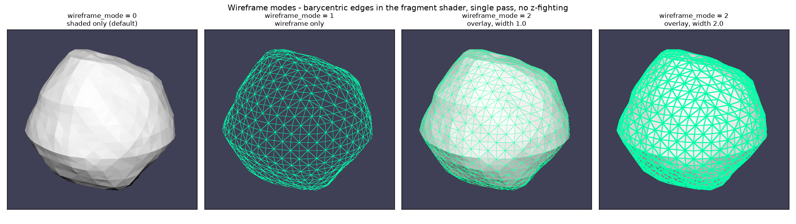
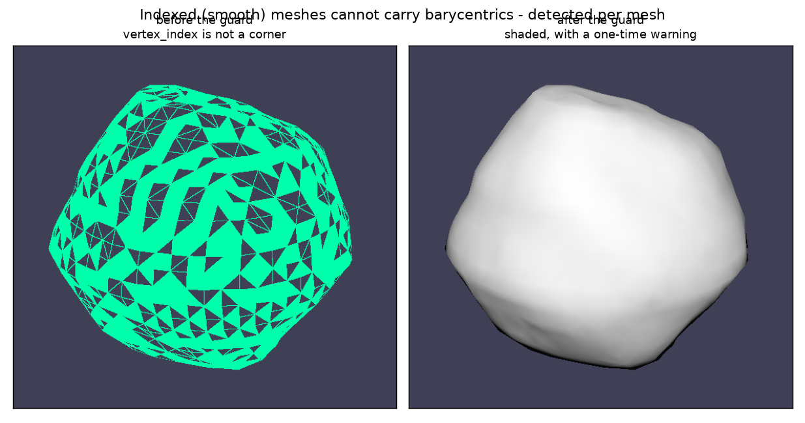

# Automatic frustum + shadow fitting, wireframe, and mouse camera controls

Four renderer changes, all aimed at the same thing: stop making the user
supply scene-scale-dependent numbers by hand.

Every setting described here keeps a manual override. The rule throughout is
**`None` means automatic**, and assigning a value pins that one parameter while
the rest stay automatic.

---

## 1 + 2. Automatic frustum and shadow parameters

These shipped together because they are one problem: the fitted light frustum
is what makes the shadow bias derivable.

### What was wrong

`sun.projection.side/near/far`, the camera's `near/far`, and the three shadow
constants all had to be picked by hand for each scene. The Hera example
hardcoded values tuned for a 780 m body seen from 25 km:

```python
app.config.shadow_normal_offset_scale = 2e-4
app.config.shadow_bias_scale          = 1e-3
app.config.shadow_bias_minimum        = 5e-4
app.simulation.sun.projection.side    = 2.0
app.simulation.sun.projection.near    = 0.1
app.simulation.sun.projection.far     = 100.0
```

Those are meaningless for any other scene, and the struct defaults (`1e-5`)
were wrong for *this* one, so every script had to override them. Too tight a
frustum clips geometry; too loose destroys shadow-map depth precision.

### How it works now

Every frame, before building the uniforms:

1. `Simulation::scene_bounds()` unions each body's model-space AABB
   transformed by its current `mat`. Mesh bounds are computed once at load
   (`Aabb::from_vertices`), not per frame — 8 corners per body per frame is
   all the runtime cost.
2. `Eye::fit_projection` transforms those corners into eye space and fits the
   planes. Perspective fits `near/far` to the depth range; orthographic sizes
   itself from the **bounding sphere radius**, which is rotation-invariant, so
   the light's world-per-texel scale does not breathe as the sun moves. The
   ortho fit also quantises to whole shadow texels, the standard stabilisation
   step that stops the shadow edge crawling between frames.
3. `fit_shadow` derives the three constants from the fitted light frustum and
   `shadow_resolution`, expressed relative to one shadow texel:

   ```
   world_per_texel = 2 * side / shadow_resolution
   depth_range     = far - near

   normal_offset_scale = world_per_texel * sqrt(2)      // one texel diagonal
   bias_minimum        = world_per_texel / depth_range  // one texel of depth
   bias_scale          = bias_minimum * 10              // slope term
   ```

   Expressing them per-texel is what makes them scale-free: the same scene in
   metres or kilometres, or at a different `shadow_resolution`, comes out
   consistent with no retuning.

### Result



Automatic reproduces the hand-tuned render almost exactly — **397 differing
pixels out of 1,040,400 (0.04%)**, all on the shadow edge, with an identical
umbra (6.979 both) and no acne in either.

But it fits a far better frustum than the hand-tuned one:

| | hand-tuned | automatic | |
|---|---|---|---|
| light `side` | 2.0 | 1.202 | **2.8x** the shadow texel density |
| light depth range | 0.1 → 100 (99.9) | 7.70 → 12.28 (4.58) | **21.8x** the depth resolution |

The hand-picked `far = 100` was throwing away almost the entire depth buffer
on empty space. Automatic gets a better result *and* needs no configuration.

Scale independence checked on a completely different scene (a 1996-facet body
at ~1 unit, camera 2.6 units out): fitted `side = 0.7355`, `near/far =
2.957/5.812`, correct with nothing configured.

### Consequence: globals are now uploaded every frame

`Globals` used to be built once in `Window::new` and never re-uploaded, which
silently froze every shading option after `start()` (documented in
`../CONFIG_options.md`). The automatic constants change as the scene moves, so
it now goes up each frame — 80 bytes. Side effect: `color_mode`, `gamma`,
`shadow_pcf` and the rest are now re-read every frame instead of being frozen
at startup.

That said, it does **not** yet let a script animate them: `app.config` cannot
be touched from inside `tick`, because the app is already mutably borrowed for
the callback and any access raises `RuntimeError: Already mutably borrowed`.
Verified, not assumed. Making config writable from `tick` would need the
borrow reworked and is a separate job.

---

## 3. Wireframe rendering

`wireframe_mode` — `0` shaded only (default), `1` wireframe only, `2` overlay
— plus `wireframe_color` and `wireframe_width` (pixels).



### Why not `PolygonMode::Line`

The obvious approach does not meet the requirement. wgpu's `PrimitiveState`
has **no line-width field** (verified in `wgpu-types-29.0.4/src/render.rs`) —
`PolygonMode::Line` is 1 px only, and native-only. Thickness has to come from
the fragment shader.

### Barycentric edges, for free

The wireframe measures each fragment's distance to the nearest triangle edge
using barycentric coordinates, then converts that to pixels with `fwidth`:

```wgsl
let px = bary / max(fwidth(bary), vec3<f32>(1e-8));
let edge = 1.0 - smoothstep(width - 1.0, width, min(min(px.x, px.y), px.z));
```

Dividing by the screen-space derivative is what makes a given width look the
same at any distance or zoom, and `smoothstep` antialiases it for nothing.

Normally barycentrics cost a vertex attribute. Here they are free:
`Mesh::flatten()` already emits one vertex per triangle corner, and those
meshes are drawn **non-indexed**, so `@builtin(vertex_index) % 3u` *is* the
corner index. No extra attribute, no extra memory, no extra GPU feature.

Because it is all in one fragment shader, the overlay needs no second pass and
therefore cannot z-fight.

### Indexed meshes are detected, not mangled



Smooth (indexed) meshes share vertices, so `vertex_index` is not a corner and
the trick produces noise — the left panel. Flatness is per-mesh while
`wireframe_mode` is global, so the flag rides along in `InstanceInput.flags`
(bit 0, `INSTANCE_FLAG_FLAT`) and the shader skips wireframing those meshes.
The CPU side warns once:

```
[WINDOW] wireframe needs flat meshes (load with flatten=True);
         smooth meshes render shaded only
```

This is a real limitation, not a workaround: correct thick wireframes on
indexed geometry would need either de-indexing (3x the vertices — 28 M for the
full-resolution Didymos) or a `PolygonMode::Line` pass limited to 1 px. Since
every kalast example already loads with `flatten=True`, neither is worth it.

**Note on dense meshes.** At 100k+ facets seen from a distance, triangles are
sub-pixel, so every fragment is within `width` of an edge and the body renders
solid. That is inherent to wireframing a mesh finer than the framebuffer, not
a bug — zoom in, or use a decimated mesh.

---

## 4. Mouse + keyboard camera controls

No figure for this one — it is interaction, not output.

### What was wrong

The arcball was built around macOS trackpad gestures and had five separate
problems on a mouse:

1. **Rotation came from scroll events.** A trackpad sends smooth two-axis
   `PixelDelta`; a mouse wheel sends `LineDelta(0, ±1)` — one axis, in
   notches — which was then multiplied by `100`. So a mouse could only spin
   the camera vertically, in huge jumps.
2. **Zoom came from `PinchGesture`**, which is trackpad-only. A mouse had no
   zoom at all.
3. **`MouseInput` was an empty match arm** — dragging did nothing.
4. **`DeviceEvent::MouseMotion` was gated to WASD mode**, so it never reached
   the arcball.
5. **Pointer deltas were multiplied by `dt`.** A mouse delta is a
   displacement, not a rate, so sensitivity scaled with frame rate — the same
   drag turned the camera **8x further at 30 fps than at 240 fps**. This is
   probably most of why it felt fine on the Mac and broken on a fast Windows
   box.

There was also a sixth: `mouse_motion`/`zoom` *assigned* rather than
accumulated, so when several events arrived between two frames only the last
survived, losing motion during fast drags.

### Bindings now

| Input | Action |
|---|---|
| Middle-drag | orbit |
| Shift + middle-drag | pan |
| Wheel | zoom |
| Pinch gesture | zoom (trackpad, unchanged) |
| Two-finger scroll | zoom — **was** orbit |

Left-click is deliberately left free for future picking.

### Changes worth knowing

- `dt` is gone from every pointer-driven term. It is kept for WASD movement,
  which genuinely is a rate.
- Wheel units are normalised: `LineDelta` is notches, `PixelDelta` is pixels
  divided by 50, so one sensitivity constant feels right on both devices.
- Zoom is now **geometric** — each notch multiplies the anchor distance by a
  constant factor. The old linear `pos += dir * k * distance` could step
  through the anchor and flip the camera; this cannot, at any scroll speed.
- Pan moves eye and anchor together, so the thing you orbit stays the thing
  you are looking at.
- Input accumulates within a frame.

Six unit tests in `src/app/frame.rs` cover this (the repo had no tests before;
run them with `cargo test --lib`, which on Windows needs the Python DLL
directory on `PATH`). The frame-rate one was checked against the old code to
confirm it actually catches the bug — it fails with the exact 8x discrepancy
predicted.

### Behaviour change: the camera no longer re-aims itself

The old arcball ran `look_anchor()` unconditionally every frame, which
**silently overwrote any `camera.dir` a script had just set**. The arcball now
only touches the camera when there is actual input.

This is visible in the Hera example. It sets the camera from the real AFC
boresight:

```python
sim.camera.dir = m_afc_ej2k @ numpy.array([0.0, 0.0, 1.0])
```

The boresight is **0.1454°** off the direction to Didymos' centre — 2.6% of
the 5.5° frame height, about 27 px. Previously that offset was discarded and
the body was always centred; now the render matches the true instrument
pointing. So frames rendered before and after this change differ slightly.

The new behaviour is the correct one — an explicit assignment should not be
silently thrown away — but if you want the old auto-centring, call
`sim.camera.look_anchor()` at the end of `tick`, or
`sim.camera.set_control_none()`.

---

## Also fixed

`examples/hera_didymos/afc_eclip_didy_manual.py` swept to `2027-05-01`, past
the end of Hera's coverage, so a full run failed near the end. Measured limits
under `hera_plan.tm` (v182/20260823):

| Call | Last valid epoch |
|---|---|
| `pxform("HERA_AFC-1", ...)` | **2027-04-30T10:33:51** (binding) |
| `spkpos("HERA", ...)` | 2027-04-30T10:40:00 |

`etf` is now `2027-04-30 00:00:00 UTC`, ~10.5 h of margin. The camera
*orientation* runs out before the position does. Note this is for the current
kernel set — a kernel update will move it.

---

## Migration

Scripts that set these values keep working unchanged; they simply pin what
would otherwise be automatic. To get the benefit, **delete** those lines:

```python
# all of this can now be removed
app.config.shadow_normal_offset_scale = 2e-4
app.config.shadow_bias_scale          = 1e-3
app.config.shadow_bias_minimum        = 5e-4
app.simulation.sun.projection.side    = 2.0
app.simulation.sun.projection.near    = 0.1
app.simulation.sun.projection.far     = 100.0
```

`fovy` is not automatic and should stay — it is a real instrument property,
not something derivable from the scene.

Reading a field that is automatic returns `None`. To see what the fit chose,
use `projection.resolved_near` / `resolved_far` / `resolved_side`.

See `../CONFIG_options.md` for the full option reference.
