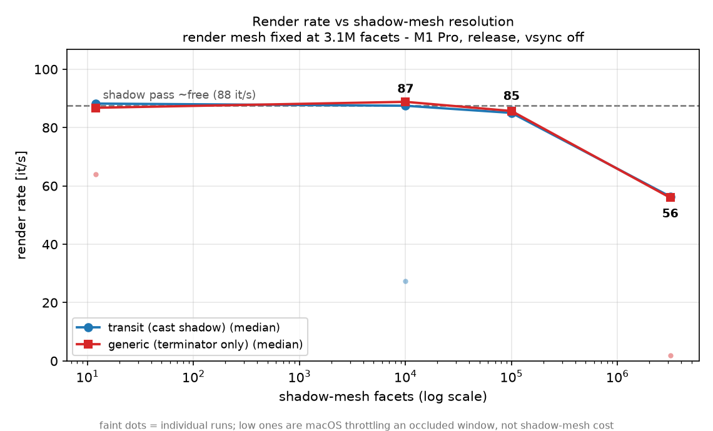
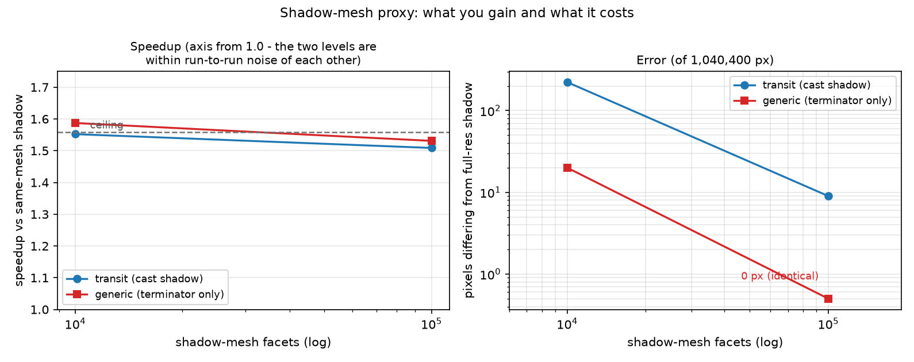
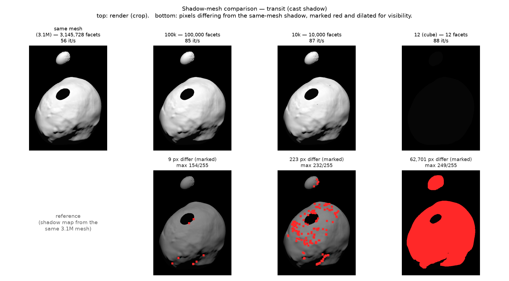
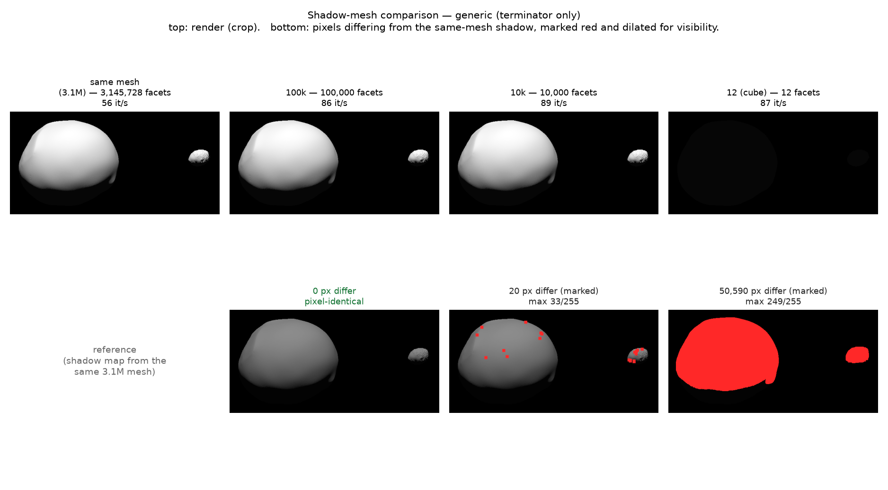

# Shadow-mesh proxies: same mesh, or a coarser one?

**Question.** The shadow pass renders every body a second time, from the
light's point of view, to build the shadow map. Must it use the same
full-resolution mesh the camera sees, or can it use a coarser stand-in — and
if so, how coarse before the image changes?

**Answer.** Against a 3.1M-facet render mesh, a 100k-facet shadow proxy is
**~1.5x faster** and changes **9 of 1,040,400 pixels** in the demanding case,
**0 pixels** in the ordinary one. Going below 100k is not worth it: by then
the shadow pass has already stopped being the bottleneck, so coarser proxies
trade accuracy for a few percent at most.

---

## 1. Why this is safe when LOD is not

The shadow map answers one question per texel: *how far is the nearest
occluder from the light?* The main pass then compares each fragment's
light-space depth against it to decide lit or shadowed. No facet index ever
leaves the shadow map.

That is what separates it from a level-of-detail swap on the **render** mesh.
Per-facet science output — `tmp_surf.csv`, `rad_all.csv`, the colormaps in
`tiri_data.py` — is indexed by facet number into one specific topology. A
decimated render mesh has different facets, so the mapping breaks. A
decimated *shadow* mesh cannot break it.

| | can it be decimated? | why |
|---|---|---|
| render mesh | only for frames carrying no per-facet data | facet indices are the data's coordinate system |
| shadow mesh | **always** | produces a depth buffer, never facet identity |

## 2. Method

`load_mesh(..., shadow_path=...)` (Rust: `Simulation::load_mesh_with_shadow`)
loads a second mesh per body into its own `MeshBuffer`, rendered only by the
shadow pass. It inherits the body's transform every frame and the same
`flatten` setting. Omitting `shadow_path` reuses the main mesh — the previous
behaviour, and the reference here.

**Scenes.** Geometry frozen at one epoch, so the only variable is the shadow
mesh.

| Scene | Epoch (UTC) | Exercises |
|---|---|---|
| `transit` | 2027-01-21 05:36:00 | Dimorphos transits the Sun 0.058° from Didymos — a hard elliptical shadow cast on the primary, plus both terminators |
| `generic` | 2026-11-05 00:00:00 | no mutual event; terminator self-shadowing only — the common case |

**Shadow meshes.** Both bodies always *render* at 3,145,728 facets; only the
occluder varies.

| Label | Facets | Source |
|---|---|---|
| `same` | 3,145,728 | the render mesh itself (reference) |
| `100k` | 100,000 | meshlab quadric decimation |
| `10k` | 10,000 | meshlab quadric decimation |
| `12` | 12 | `res/cube.obj` — **not a usable occluder** |

The 12-facet cube is a *performance* reference only. A unit cube is larger
than Didymos, so it shadows the entire body — its render is nearly black and
~6% of pixels are wrong. Its purpose is to measure the floor: what a frame
costs when the shadow pass draws essentially nothing, so the real proxies can
be judged against "shadow pass is free" rather than only against each other.

Both decimation levels come from the same meshlab quadric algorithm, so this
varies facet count at fixed decimation quality.

**Conditions.** Apple M1 Pro, `maturin develop --release`, `vsync = False`,
1020x1020, 200 frames per run with the first 40 discarded as warm-up,
3 repeats per configuration, **medians** reported.

> **Measurement caveat — read before trusting any single number.** macOS
> throttles rendering for occluded or backgrounded windows. Several runs came
> back at 1.8, 27.4 and 64.1 it/s where their siblings agreed to within 1
> it/s, and one run stalled indefinitely. These are the machine, not the
> shadow mesh. They are plotted as faint dots in figure 1 rather than hidden,
> and medians are used throughout. It is also why repeats stopped at 3: an
> attempted 8-repeat sweep deadlocked on a throttled window. The effect being
> measured (~30 it/s between `same` and any proxy) is an order of magnitude
> larger than this noise, so the conclusion holds — but do not read the
> `100k` vs `10k` gap as real.

## 3. Results

### Rate

Flat from 12 facets up to 100k; it only falls at the full-resolution end.
Dashed line is the free-shadow-pass floor.

| Scene | `same` | `100k` | `10k` | `12` (floor) |
|---|---|---|---|---|
| transit | 56.4 it/s | **85.0** (1.51x) | 87.5 (1.55x) | 88.2 (1.57x) |
| generic | 56.0 it/s | **85.7** (1.53x) | 88.8 (1.59x) | 86.8 (1.55x) |

Expressed as *how much of the available gain each proxy captures*, where the
12-facet floor is 100%:

| Scene | `100k` | `10k` |
|---|---|---|
| transit | 90.0% | 97.7% |
| generic | 96.4% | 106.6%* |

\* over 100% is the noise floor showing through — `10k` cannot really beat an
empty shadow pass. Treat 100k, 10k and 12 as indistinguishable.

### Error

| Scene | Proxy | px differing | >8/255 | >32/255 | max | mean over lit body |
|---|---|---|---|---|---|---|
| transit | 100k | **9** (0.001%) | 6 | 3 | 154 | 0.0043 |
| transit | 10k | 223 (0.021%) | 121 | 52 | 232 | 0.0797 |
| generic | 100k | **0** | 0 | 0 | 0 | 0.0000 |
| generic | 10k | 20 (0.002%) | 6 | 1 | 33 | 0.0025 |
| transit | 12 | 62,701 (6.0%) | 62,614 | 62,098 | 249 | 156.7 |
| generic | 12 | 50,590 (4.9%) | 50,485 | 49,797 | 249 | 145.7 |

Bottom rows mark every differing pixel in red, dilated so a 9-pixel
difference is visible at all. Differences sit on the rim of the cast shadow
and along the terminator — exactly where a coarser occluder moves the shadow
boundary by a fraction of a pixel. Nothing lands in the shadow interior or on
smoothly-lit terrain.

The `12` rows are what a *broken* occluder looks like, and confirm the test
has teeth: if shadows barely mattered in these frames, the cube column would
resemble the others instead of being 5-6% wrong.

## 4. Reading the numbers

**100k already sits at the ceiling.** It captures 90-96% of everything the
shadow pass has to give; the rest is ~3 it/s, comparable to the run-to-run
noise. That settles whether a smarter silhouette-matching decimator below
100k would pay: it would compete for those few percent, against an option
that already costs 9 pixels.

**10k is not measurably faster than 100k** but costs ~25x the error (223 px
vs 9 px in `transit`). No reason to prefer it.

**The error is boundary-limited, not area-limited.** Differences appear only
where a shadow edge falls, so they scale with the *length* of shadow boundary
on screen, not body area. `generic` — terminator only — is pixel-identical at
100k; `transit`, with an extra hard shadow rim, costs 9 pixels. A scene with
much more boundary visible would cost proportionally more.

## 5. Recommendation

- Use a **100k-facet shadow proxy** for full-resolution bodies: ~1.5x, ≤9
  pixels.
- **Do not generate levels below 100k**, and do not build a silhouette
  decimator — there is nothing left to win in this pass.
- Leave `shadow_path` unset when the render mesh is already ≤100k; the proxy
  would cost more than it saves.
- If a future scene leans much harder on shadow detail than these two, re-run
  this comparison for that geometry rather than assuming 9 pixels.

## 6. Where the remaining time goes

With the shadow pass effectively free, the ~86 it/s floor is the main render
pass drawing 3.1M facets — and at this range that is heavily oversampled. The
bodies cover ~71,800 of 1,040,400 pixels, so the full mesh is **~44 facets
per pixel**, far past what the framebuffer can resolve.

Dropping the *render* mesh to 100k measures **5.5x** (55 → 305 it/s), but
with a different error profile entirely: ~40,800 differing pixels rather than
9, mean 1.3/255 across the body. That is the LOD trade-off, and it is only
available for frames carrying no per-facet data.

Break-even for the full mesh (~1 facet per pixel) is roughly **6.6x closer,
around 4 km**. Inside that, full resolution earns its keep; outside it, it
pays for detail the pixels cannot show. That distance is what
distance-driven LOD should key off, if it is ever built.

## 7. Reproducing

Harness scripts were throwaway copies under `/tmp`, not committed. To redo:
render one frozen epoch with `shadow_path` set to each candidate, export a
frame, diff the PNGs against the no-`shadow_path` render. Discard the first
run after a rebuild, take medians over repeats, and **keep the render window
visible and frontmost** — an occluded window is throttled and produces
numbers that look like data.
