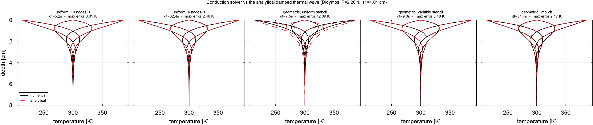
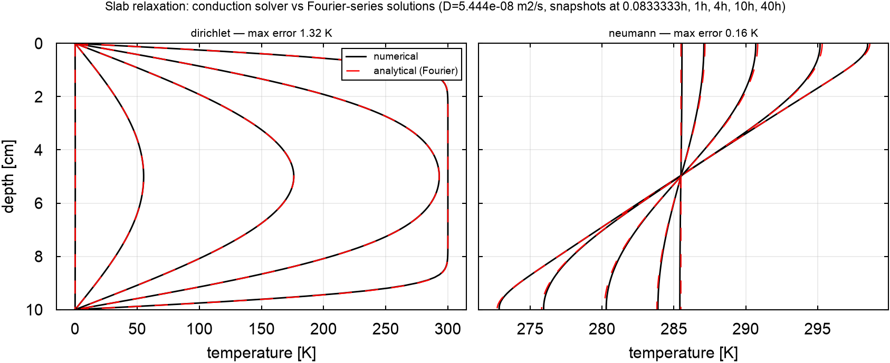

# Conduction solvers: variable spacing, implicit stepping, and what the analytical tests found

Written while preparing a Didymos thermophysical run that has to resolve both
the diurnal wave (2.26 h) and the seasonal one (700 d). That combination is
what forced the work: it cannot be done on a uniform grid at a reasonable
cost, and reaching for the non-uniform machinery already in kalast turned out
to give **12 K errors** because the grid builder and the solver had never been
used together.

**Headline: `nonuniform.column()` and `core::conduction_1d` did not compose.**
Adding a variable-spacing stencil brings a 16-node geometric grid to 0.48 K,
against 0.32 K for an 81-node uniform grid — 5x fewer nodes at comparable
accuracy. A working implicit solver adds a further 9x in timestep.



---

## 1. Why a uniform grid does not work here

Didymos with Γ=320 J m⁻² K⁻¹ s⁻¹ᐟ²: `k = 0.0632 W/m/K`, `D = 3.90e-8 m²/s`.

| wave | period | `ls1` | `ls2pi` |
|---|---|---|---|
| diurnal | 2.26 h | **1.01 cm** | 6.32 cm |
| seasonal | 700 d | 86.7 cm | **5.45 m** |

The column must reach several metres for the seasonal wave while resolving a
1 cm diurnal wave at the surface. Uniformly, at 10 nodes per diurnal skin
depth, that is ~5,400 nodes — and the explicit stability limit is set by the
*thinnest* layer, so `dt <= 13 s`, about 600 steps per rotation where ~100
would resolve the diurnal cycle. Over two solar orbits (14,867 rotations)
that is millions of unnecessary steps.

A geometric grid solves the depth problem: **41 nodes reach 8.9 m** with a
1 mm first layer.

## 2. The trap

`kalast.tpm.nonuniform.column()` builds exactly that grid.
`kalast.tpm.core.conduction_1d` implements

```rust
t_mid + d * dtpdx2 * (t[i-1] - 2 t[i] + t[i+1])
```

which is the **equal-spacing** second difference, second-order only when every
layer has the same thickness. On a geometric grid it is inconsistent — and it
fails silently, since nothing checks that the grid it is handed is uniform.

Both pieces shipped; nothing in the repository used them together, so nothing
had ever exercised the combination.

## 3. Validation against the analytical damped wave

`examples/analytical/sinusoidal.py`. A half-space forced sinusoidally at the
surface has the closed-form solution

```
T(z,t) = Tm + Ta exp(-z/ls) sin(z/ls - 2 pi t/P)
```

Run with Didymos's real properties and spin period, Dirichlet-forced at the
surface so the test isolates the conduction scheme from the radiative
boundary. Domain 8 `ls1` deep, four periods, error taken over six snapshots
of the final period.

| case | nodes | dt | max err | mean err |
|---|---|---|---|---|
| uniform grid, 10 nodes/`ls` | 81 | 5.18 s | **0.315 K** | 0.018 K |
| uniform grid, 4 nodes/`ls` | 33 | 32.37 s | 2.455 K | 0.085 K |
| geometric grid, **uniform stencil** | 16 | 7.46 s | **12.092 K** | 3.324 K |
| geometric grid, **variable stencil** | 16 | 8.95 s | **0.478 K** | 0.123 K |
| geometric grid, **implicit**, dt = spin/100 | 16 | 81.36 s | 2.170 K | 0.526 K |
| geometric grid, implicit at the explicit dt | 16 | 8.95 s | 0.638 K | 0.157 K |

Reading the table:

- Row 3 is the trap: **25x worse** than row 4 on the identical grid. The only
  difference is the stencil.
- Row 4 is the fix: **0.48 K in 16 nodes**, against 0.32 K in 81 uniform
  nodes. Comparable accuracy at a fifth of the nodes — which is what makes a
  seasonal column affordable.
- Row 6 is the consistency check that matters for trusting the implicit
  solver: at the *same* timestep it lands at 0.64 K against the explicit
  0.48 K. Backward Euler is first-order in time where the explicit scheme is
  effectively second-order at this step size, so slightly worse is exactly
  right. Agreement here means the two schemes are solving the same equation.
- Row 5 is the trade the implicit solver actually buys: **9.1x the timestep**
  for 2.17 K instead of 0.48 K.

## 4. What was added

### `core::conduction_1d_nonuniform` (Rust)

```
d2T/dz2 ~ 2/(h- + h+) [ (T+ - T)/h+ - (T - T-)/h- ]
```

with the two coefficients precomputed per interior node, mirroring how
`conduction_1d` takes `dt/dx²`:

```
coef_lo = 2 dt / (h- (h- + h+))        coef_hi = 2 dt / (h+ (h- + h+))
```

For equal spacing both collapse to `dt/h²` and it reduces *exactly* to
`conduction_1d`, so the uniform path is unchanged.

### `kalast/tpm/routine.py` — was empty

Holds what turns a grid into solver inputs, so these are not re-derived (and
mis-derived) per script: `uniform_coefficients`, `nonuniform_coefficients`,
`nonuniform_max_dt` (stability is `h- h+ / D`, set by the tightest node), and
`resolution_report` / `print_resolution_report` giving nodes per skin depth
and depth in skin depths.

### `kalast/tpm/implicit.py` — was not runnable

The module held a partial port of multiheats that **could never have
executed**: `flux_bc_implicit` and `bc_up_implicit` were module-level
functions taking `self` and dereferencing `self.temp` / `self.cond` /
`self.dx`, which do not exist; `flux_bc_implicit` called `bc_up_implicit` with
two arguments against a seven-argument signature; and no routine solved the
system at all. Nothing in the repository called any of it.

Replaced with a working backward-Euler solver on a variable-spacing grid:
`banded_matrix(z, D, dt)` assembles the tridiagonal system once (constant
while grid, diffusivity and `dt` hold), `step_dirichlet(ab, T, T_surface)`
takes one step via `scipy.linalg.solve_banded`. Unconditionally stable, so
`dt` follows accuracy rather than the thinnest layer.

**Not yet implemented: the radiative surface boundary.** It is non-linear in
`T` (absorbed flux against `sigma e T⁴` plus conduction) and needs a Newton
iteration wrapped around the solve. Until that exists the implicit path is
usable only with a prescribed surface temperature — which is what the
validation above uses, and is *not* what a thermophysical run needs. Use the
explicit path for radiative runs.

## 5. Examples brought out of `old/`

Both were written against an API that has since moved — `diffusivity` and
`skin_depth_1` migrated from `tpm.core` to `tpm.properties` — and both split
one calculation across several modules imported by bare name, so they only
ran from inside their own directory.

- `examples/old/sinusoidal/{setup,tpm,main}.py` -> **`examples/analytical/sinusoidal.py`**,
  one self-contained script, now covering five solver/grid combinations
  rather than one.
- `examples/old/analytical/{setup,dirichlet,neumann}.py` ->
  **`examples/analytical/slab_relaxation.py`**, both boundary conditions in
  one script.

### Slab relaxation



Complements the periodic test by exercising the *transient* response and the
zero-flux boundary a TPM column uses at depth. Fourier-series solutions for a
finite slab, `L=0.1 m`, `D=5.44e-8 m²/s`, 100 nodes, `dt=3.75 s`:

| boundary | max abs error per snapshot (5 min, 1 h, 4 h, 10 h, 40 h) |
|---|---|
| Dirichlet (`T=0` both faces) | 1.315, 0.076, 0.052, 0.017, 0.000 K |
| Neumann (zero flux both faces) | 0.158, 0.149, 0.136, 0.074, 0.070 K |

The Dirichlet case starts at 1.3 K because the initial condition is
discontinuous at the faces — a step the truncated series resolves with
Gibbs ringing while the grid resolves it by diffusing — and converges to zero
as the sharp corner decays. The Neumann case holds ~0.1 K throughout, which
is series truncation at 100 modes rather than solver error; it conserves heat
and relaxes to the mean of the initial profile, as it should.

## 6. Consequences for the Didymos run

The intended progression, in order:

1. **Analytical** — done, this note.
2. **Explicit, coarse uniform grid** — the reference implementation, and worth
   timing even though it is slow: the runtime is a number worth having in a
   paper, and it is the baseline the other two are judged against.
3. **Explicit, non-uniform grid** — now correct and validated. Fewer nodes for
   the same accuracy, but the timestep is still capped by the thinnest layer.
4. **Implicit** — the timestep gain, once the radiative surface boundary is
   written.

### Measured, on the real problem

`examples/hera_didymos/tpm.py`, 10,000 facets, two solar orbits
(2023-03-23 -> 2027-01-21, 14,867 rotations), 4 nodes per diurnal skin depth,
column reaching one seasonal `ls2pi` (5.45 m). Benchmarked over 200 steps and
extrapolated:

| grid | nodes | dt | ms/step | steps | total |
|---|---|---|---|---|---|
| uniform | 2,168 | 32.4 s | 66.1 | 3,736,551 | **68.6 h (2.9 d)** |
| geometric | 34 | 55.9 s | 46.3 | 2,162,356 | **27.8 h (1.2 d)** |

The geometric grid is 2.5x faster end to end — fewer nodes *and* a larger
stable timestep, since the stability limit is `h- h+ / D` and the geometric
grid's second layer is already thicker than the uniform spacing.

**But look at the per-step column: 64x fewer nodes bought only 1.4x.** The
cost is not the conduction arithmetic, it is the per-facet Python call
overhead — roughly 4.6 us x 10,000 facets = 46 ms, with the node work nearly
free on top. The TPM loops over facets in Python, calling into Rust once per
facet per step.

So the solver choice is second-order here. Vectorising that loop — stepping
all facets as one array operation — is worth more than everything measured
above.

**Measured**, 10,000 facets on the 34-node geometric grid, Newton surface
solve plus conduction:

| | ms/step | 2,162,356 steps |
|---|---|---|
| per-facet Python loop | 20.04 | 12.0 h |
| vectorised numpy | **1.49** | **0.89 h** |

**13.5x**, and that is the conduction core alone — the per-facet insolation
terms vectorise trivially too, so the full step should fall from ~46 ms to
under 2 ms and the two-orbit run from ~28 h to about an hour. `routine.py`
gains `step_surface_newton` and `step_conduction` for this.

This also changes the case for the implicit solver: its advantage is a larger
timestep, which only pays once the per-step cost is not dominated by Python
overhead. Vectorise first, then re-evaluate.

**A bug the vectorisation exposed.** `math::cosine_incidence` clamps negative
cosines to zero, but `core::radiation_sun` did not. Every existing caller went
through the former, so the gap was invisible — until a vectorised inner loop
computes the dot product directly and passes it straight in. A night-side
facet would then receive *negative* insolation, which does not merely drop a
term: it actively drives the surface below its radiative balance, and the
error is largest exactly where the diurnal wave is coldest.

Fixed at source rather than in the caller: `radiation_sun` and
`radiation_sun_reflected` both clamp now, with tests. The reflected form
matters for §7.2 — unclamped, a shadowed facet would have *removed* energy
from whatever it illuminates, and that term is about to be built.

### Coverage trap, worth recording

The first attempt failed with `SPKINSUFFDATA` at 2023-03-23. `hera_plan_local.tm`
loads only the Hera proximity-phase Didymos ephemeris
(`didymos_flp_000007_260701_270701_v01.bsp`, 2026-07-01 -> 2027-07-01), which
cannot reach a two-orbit spin-up. `didymos_hor_000101_500101_v01.bsp`
(Horizons, 1999-2050) is in the same directory but not in the meta-kernel;
`tpm.py` furnishes it explicitly, after the meta-kernel so it takes precedence
for Didymos throughout and the spin-up does not cross an ephemeris boundary.

---

# 7. Required before the production run

The surface boundary condition in `examples/hera_didymos/tpm.py` is currently
**direct insolation only**:

```python
sflux = kalast.tpm.core.radiation_sun(d_sun / AU, cosi, prop.albedo)
```

`cosi < 0` gives night, but nothing else darkens or warms a facet. Three terms
are missing, and for a *binary* asteroid at a *mutual event epoch* they are
not small. The 2027-01-21 target epoch was chosen precisely because Dimorphos
transits — so the one thing that makes the scene interesting is the one thing
the model does not yet contain.

## 7.1 Eclipse shadowing, via the shadow map

Dimorphos casts a real shadow on Didymos (and vice versa). A facet in umbra
loses its entire solar term while its temperature keeps evolving, which is the
signature a thermal camera actually sees during a mutual event.

kalast already has the mechanism: `config.access_shadow_map = True` plus
`sim.facet_shadow(body)` returns the occluded fraction per facet, validated
to 0.013% on the absorbed-flux integral (`2026-08-26_facet_shadow_query/`).
The boundary condition becomes

```python
lit = 1.0 - frac[ii]          # 0 fully shadowed, 1 fully lit
sflux = radiation_sun(...) * lit
```

The quarter-step resolution (4 samples/facet) matters here: penumbral facets
at the shadow rim get 0.25/0.5/0.75 rather than a hard flip.

**Structural consequence.** The query reads the GPU shadow map, so the TPM has
to run *inside* the render loop rather than headless — `before_render` sets
the epoch and body transforms from spice, `after_render` reads the shadow
fractions and takes the conduction step. This is exactly what the two-callback
split was built for (`2026-08-26_facet_shadow_query/` §1), but it does mean
the two-orbit run drives 2.16M rendered frames.

Cheaper alternative worth measuring first: mutual events occupy a small
fraction of the orbit. Detect the eclipse windows geometrically (angular
separation of the Sun and the companion as seen from each body, as in
`2026-08-25_pcf_shadow_comparison/`) and only pay for shadow queries inside
them, using `lit = 1` elsewhere.

## 7.2 Mutual heating

Each body sees the other as an extended source of

- **reflected sunlight**, `~ albedo * F_sun * view_factor`, and
- **thermal emission**, `~ epsilon sigma T^4 * view_factor`.

At the Didymos-Dimorphos separation (~1.15 km, bodies ~800 m and ~170 m
across) the view factors are not negligible, and they peak exactly during the
mutual events being modelled.

The radiative kernels already exist in `tpm/core.rs` (both solar terms now
clamp `cosi` at zero — see the note at the end of §6):

```rust
radiation_sun_reflected(viewf, a, cosi, dau)      // reflected solar
radiation_sun_reflected_reuse(viewf, f, a)        // reflected, flux reused
radiation_emitted(viewf, t, e)                    // thermal IR, eps sigma T^4
```

and `mesh.rs` provides `view_factor_facets(face_a, face_b, trans_b2a)` plus
the scalar forms. So the missing piece is the per-timestep accumulation and
the view-factor matrix, not the physics kernels.

Cost scales as `n_facets(A) x n_facets(B)` per step if done naively — 10^8 for
two 10k meshes, far too slow. The standard treatment is to precompute the
view-factor matrix once in the body-fixed frames and re-use it, which works
here because Dimorphos is tidally locked: the relative geometry repeats every
orbit rather than every timestep.

## 7.3 Self-heating

Within one body, concave regions exchange radiation: a facet inside a
depression sees other facets of the same body, receiving both reflected solar
and thermal IR from them. This raises daytime temperatures in bowls and
crater floors and is the same physics as roughness (§8) but at facet
resolution rather than sub-facet.

**The near-field caveat is the crux here.** The view factor is a
point-to-point approximation valid for `d >> facet size`, which is exactly
what neighbouring facets violate — and neighbours are the dominant
contributors inside a depression. Subdividing neighbouring facets and summing
the sub-pairs is the honest treatment; see §9, where the current code instead
returns zero in that regime.

The view-factor machinery is otherwise shared with §7.2; the extra requirement
is a visibility test between facet pairs of the same body, since a view factor
is only valid if the two facets can actually see each other. `intersect_mesh`
does this exactly but is brute force; the shadow-map query does it from one
direction at a time. Precomputing the self-visibility matrix once per body is
the tractable route, again exploiting that it is fixed in the body frame.

**Ordering.** These three are the difference between "a 1D column model of a
sphere" and "a thermophysical model of a binary system at a mutual event". Do
7.1 first — it is a boolean multiplier on a term already present, uses
machinery that is built and validated, and it dominates the signal during the
transit. 7.2 and 7.3 both reduce to view-factor bookkeeping and can share one
implementation.

## 7.4 Two-phase strategy, and whether spin-up can omit them

The terms above are episodic or geometrically local, while the spin-up exists
to settle the *deep, orbit-averaged* field. That motivates splitting the run:

1. **Coarse spin-up.** Two orbits, 1D columns, direct insolation only. Save
   the full equilibrated column state.
2. **High-fidelity final segment.** Restart from that state a few diurnal
   cycles before the study epoch and switch everything on — eclipse and self
   shadowing, mutual and self heating, reflection and emission.

This is cheap where it can be and exact where it matters, and it makes each
effect separately measurable: run the final segment with terms enabled one at
a time and difference the result. That ablation *is* the quantification of how
much binary mutual effects contribute, which is a result worth publishing on
its own rather than a diagnostic.

**The catch to check first** is whether any facet's temperature is set by
something other than direct sun. On the Moon, permanently shadowed crater
floors are heated almost entirely by scattered light and thermal IR from their
own walls; omit self-heating there and the model does not make a small error,
it produces a qualitatively wrong, far-too-cold surface. Worse for a staged
run, such a facet could not be repaired in a short final segment: its
temperature is set by the *orbit-averaged* balance, so the deep field carries
the bias and needs a seasonal timescale to relax.

**Measured for Didymos.** Sampling one full orbit at 20,000 epochs
(step 0.84 h, incommensurate with the 2.26 h spin so rotation and orbital
phase are both covered), taking each facet's peak `cos i`:

| | |
|---|---|
| facets never facing the Sun | **0 of 10,000** |
| facets peaking below `cos i = 0.05` | **0** |
| min / median / max peak `cos i` | 0.273 / 0.923 / 1.000 |
| obliquity (spin axis vs orbit normal) | 165.4 deg |

The worst-illuminated facet still reaches `cos i = 0.27`, i.e. 74 deg
incidence, at some point in the orbit. There are no permanently shadowed
regions in the lunar sense, and the reason is the obliquity: at 14.6 deg from
the orbit normal (retrograde), the polar regions get a genuine seasonal sun
cycle rather than the Moon's near-1.5 deg permanent grazing.

**So self-heating is not required for the spin-up on Didymos.** Every facet is
directly forced, so self-heating is a modest systematic warm bias — bounded by
facet-scale concavity, which is limited at ~10 m resolution — rather than the
dominant term for any facet. Omitting it during phase 1 and enabling it in
phase 2 is defensible, and the ablation above measures what was left out.

**Residual caveat.** This tests facet *orientation*, not terrain blocking: a
facet can face the Sun and still be occluded by a ridge or boulder. Ruling
that out needs the shadow-map query rather than `cos i`, which is cheap now
that §7.1 exists — worth running once over an orbit before trusting the
staged result. The conclusion would only change if that turned up facets
shadowed for essentially all of the orbit.

**Dimorphos is a separate question.** It is tidally locked, so it keeps one
face toward Didymos permanently, and it is eclipsed regularly. Its illumination
statistics need computing separately before assuming the same conclusion
carries over.

## 7.5 Spin-up result and convergence

Two-orbit spin-up, 10,000 facets, 34-node geometric grid, vectorised:
**2,162,356 steps in ~55 min** (1.52 ms/step). Surface 88.3-346.3 K, mean
265.2 K.

Physically consistent where it can be checked independently: the study epoch
falls at **1.025 AU**, near perihelion, where subsolar equilibrium is 392.6 K.
The peak surface temperature is 346.3 K — below equilibrium, which is what
thermal inertia must do. The diurnal spread damps monotonically from 258 K at
the surface to 12 K at 6.17 m.

**The deep field is not converged, and the initialisation disguises it.** The
base node reported 200.11 K against a `T_INIT` of 200.0 — the number that
looks most reassuring is the least informative, because it is the initial
condition barely touched. Thermal information diffuses only

```
sqrt(D t) = sqrt(3.9e-8 * 1.21e8) ~ 2.2 m
```

in two orbits, while reaching the 6.17 m base needs `z^2/D ~ 31 yr`, about 16
orbits.

Measured by continuing a **third orbit** from the saved state and differencing
at the study epoch:

| | surface | z=1.42 m | z=3.56 m | z=6.17 m |
|---|---|---|---|---|
| change per orbit | +0.061 K | -0.069 K | +0.298 K | +0.540 K |

| surface statistic | value |
|---|---|
| max abs change | **1.69 K** |
| mean / median | 0.51 / 0.34 K |
| facets changing >1 K | 1,749 of 10,000 (17.5%) |

So the shallow column (<= 1.4 m, ~1.6 seasonal skin depths) **is** converged,
the deep layers are still climbing ~0.5 K per orbit off the initialisation,
and that drift barely reaches the surface because the converged shallow
layers buffer it.

**Whether 1.7 K matters depends on the observable.** In the TIRI band it is not
negligible: at 10 um and 300 K,

```
dB/B ~ (hc / lambda k T) dT/T = 4.8 * 1.7/300 ~ 2.7 %
```

worst case, ~0.8% typical. That sits below the uncertainty from thermal
inertia and unmodelled roughness, but it should be carried as a stated error
term rather than called converged.

**Use the 3-orbit state for phase 2** — it is strictly closer to equilibrium
at no extra cost now that it exists. And for any future run, initialising the
column at the estimated equilibrium temperature rather than a flat 200 K would
remove most of this: the deep layers are slowly walking toward a value that
can be estimated analytically in advance from the orbit-averaged insolation.

---

# 8. Next steps: thermal surface roughness

## 8.1 The science

Real regolith is rough far below facet resolution — the 10k mesh resolves
~10 m facets on Didymos, while the thermally relevant structure runs from
centimetres (the diurnal skin depth is 1 cm) to metres. That unresolved
roughness changes the emitted radiance in ways a smooth-facet model cannot
reproduce:

- **Thermal beaming.** Sunlit slopes tilted toward the observer are hotter
  than the facet mean, and at small phase angle you preferentially see exactly
  those slopes. A rough surface therefore appears *warmer* than a smooth one
  of the same thermal inertia, and the effect is strongly phase-dependent.
  This is what the NEATM beaming parameter eta absorbs empirically, and what a
  thermophysical model should instead produce from geometry.
- **Self-heating inside depressions.** Facets of a bowl irradiate one another
  in the thermal IR and multiply-scatter sunlight, raising the floor
  temperature above what an isolated flat element would reach.
- **Sub-facet shadowing.** At grazing incidence, parts of each depression are
  shadowed, which lowers the mean and — because shadowed and lit sub-elements
  have very different temperatures — makes the *fourth-power* average diverge
  from the average temperature. Radiance responds to `<T^4>`, not `<T>^4`, and
  roughness widens that gap.
- **Directional emissivity.** The angular distribution of emitted flux
  departs from Lambertian, mattering most at high emission angle near the limb.

The standard parameterisations treat each facet as carrying a sub-grid
depression — a spherical-cap or hemispherical crater (Lagerros; Spencer;
Rozitis & Green) — or a Gaussian random surface characterised by an RMS slope.
kalast already carries much of this: `rms_slope`, `rms_slope_hemisphere`,
`rms_slope_terrain`, `distribution_slope_angles`, `z_in_crater`,
`curvature_radius`, `largest_slope_angle_sphere`, plus the whole
`examples/crater_self_shadow/` study.

## 8.2 Step one: a geometric correction to the radiance

Keep the smooth-facet TPM exactly as it is; correct the emitted radiance
afterwards. The hook already exists — `examples/hera_mars_swingby/rad.py`
carries

```python
R = numpy.ones((nit, nface))   # roughness correction placeholder
```

and threads `R[it, iif]` into `spectral_radiance`. Today it is unity.

Plan:

1. Build a crater model once: a spherical-cap depression discretised into
   sub-facets, parameterised by an opening angle (equivalently an RMS slope).
   `z_in_crater` and `curvature_radius` already generate the geometry.
2. For a grid of (incidence, emission, azimuth, RMS slope), solve the
   sub-facet energy balance including shadowing, self-heating and multiple
   scattering — steady state first, which is defensible when the depression is
   small compared with the diurnal skin depth response time.
3. Integrate sub-facet Planck emission weighted by projected area toward the
   observer, and divide by what a smooth facet at the TPM temperature would
   emit. That ratio is `R`.
4. Store it as a lookup table, interpolate per facet per epoch in `rad.py`.

Cheap, reversible, and directly testable: `R = 1` recovers today's result, so
the change is isolated. Its limitation is conceptual and should be stated
plainly — it corrects what is *emitted* while leaving the subsurface
temperature field smooth, so it captures beaming but not the way roughness
alters the mean temperature and thermal lag.

## 8.3 Step two: roughness in the boundary condition

Move the depression into the solver. Each facet carries N sub-facets, each with
its own 1D column, and the surface boundary condition for sub-facet *j* becomes

```
absorbed_j = (1-A) [ F_sun cos i_j * lit_j  +  sum_k F_scat,k->j ]
           + sum_k epsilon sigma T_k^4 * VF_k->j
```

with `lit_j` the sub-facet shadowing and `VF` the intra-crater view factors —
the same bookkeeping as §7.3, one level down. Emitted radiance then integrates
true `<T^4>` over sub-facets rather than applying a correction to `<T>`.

This captures what step one cannot: self-heating raises the floor temperature
throughout the diurnal cycle, which changes the subsurface gradient and hence
the apparent thermal inertia retrieved from a lightcurve. Since retrieved
inertia is the headline product of this kind of modelling, the difference
between the two steps is not cosmetic.

Cost is `N` times the columns — N ~ 50-100 in the literature, so 10k facets
becomes 0.5-1M columns. **This is only tractable after the facet loop is
vectorised** (§6), which is one more reason that work comes first.

Validation path: with roughness switched off the two steps must agree with
today's smooth result; against each other, step two minus step one isolates
the thermal-history contribution that the geometric correction misses.

## 8.4 Future work: Hapke bidirectional reflectance

The reflected-solar term is currently a single Lambertian albedo. Hapke's
bidirectional reflectance model instead describes the surface with single
scattering albedo, an opposition-effect amplitude and width, a phase function,
porosity, and a **macroscopic roughness** parameter — that last one describing
the same unresolved topography as §8.1, from the optical side.

Two reasons it belongs on this list:

- TIRI's shorter filters and any AFC visible simulation both need a reflected
  component that a Lambertian albedo gets wrong at non-trivial phase angle,
  especially near opposition.
- **Consistency.** The thermal roughness of §8.3 and Hapke's photometric
  roughness are two views of one surface. Deriving each independently — thermal
  from TIRI, optical from AFC — and checking that they agree is a genuine test
  of the model rather than a fit. Disagreement would be informative about
  either the roughness parameterisation or the scale each observable is
  sensitive to.

## 8.5 Future work: FEM and lateral heat transfer

Everything above assumes heat flows only vertically: independent 1D columns,
no lateral conduction between facets. That holds while the lateral temperature
gradient varies slowly compared with the skin depth, which is fine for a large
body at coarse resolution.

It becomes questionable exactly where this project is heading:

- **Dimorphos is small compared with its own seasonal skin depth.** With the
  Didymos thermal properties above, `ls2pi_seasonal = 5.45 m` against
  Dimorphos semi-axes of 88.5 x 84 x 57 m — the seasonal wave penetrates
  roughly 6-10% of the body. A 1D column of that depth is no longer short
  compared with the local radius of curvature, so the geometry the column
  assumes is wrong, and the deep boundary is not an infinite half-space but
  the rest of a small body.
- **Sharp lateral gradients.** Across the terminator, and across the rim of an
  eclipse shadow during a mutual event, the surface temperature changes by
  ~100 K over a distance that can approach the skin depth. Lateral conduction
  smooths precisely the feature a thermal camera is resolving.
- **Tidal locking.** Dimorphos's spin equals its orbit (11.37 h), so it keeps a
  fixed face toward Didymos. The sub-Didymos and anti-Didymos hemispheres see
  systematically different mutual heating, sustaining a long-lived lateral
  gradient that no set of independent columns can relax.

A 3D conduction solver — finite elements on a tetrahedral mesh, or finite
volumes on a voxelised interior — would capture lateral transport, curvature
and whole-body seasonal storage together. The interesting comparison is not
"FEM is more correct" but *where and by how much* the 1D approximation
departs: quantifying that on Dimorphos, over a full orbit including mutual
events, would be a result in its own right, and would tell every other 1D
binary-asteroid model where its own validity ends.

---

# 9. Revisiting view factors

§7.2, §7.3 and §8.3 all reduce to view-factor bookkeeping, so the current
implementation is on the critical path three times over. It has problems worth
fixing before building on it.

## 9.1 What is there now

`mesh.rs::view_factor_facets` computes the differential form

```
VF = cos(theta_a) cos(theta_b) / (pi d^2)
```

per unit area, guarded by two tests: both facets must face each other
(`theta < 90 deg`), and

```rust
if distance_a2b < face_b.area.sqrt() {
    return 0.0;
}
```

## 9.2 Three problems

**(a) The proximity guard returns zero where the view factor is largest.**
The differential form assumes `d >> facet size`, and diverges as `d -> 0`, so
a guard is needed. But returning **0** is the worst available answer. Adjacent
facets have centroid separation of order `sqrt(area)` — exactly the threshold —
so the guard fires on precisely the neighbours that dominate self-heating
inside a concave region. Applied to §7.3 or §8.3 as written, most of the
self-heating would silently vanish, and the model would run and produce
plausible-looking, systematically cold results. The existing `TODO:
subdivide the facet and recompute` is the right fix; until then the failure is
biased, not merely approximate.

**(b) No occlusion test.** The function is pure geometry: it never asks whether
the two facets can actually see each other. The angle test catches facets that
face away, but not an intervening ridge or crater rim between two facets that
do face each other — which is the defining situation for concave terrain, and
therefore for every case where self-heating matters. Radiative exchange
between two facets separated by solid rock is currently counted in full.

**(c) `acos` then `cos`.** `angle_between` computes an angle whose cosine is
then taken. For unit vectors that round trip is exactly `dot(u, v)`. It costs
two transcendentals per pair and loses precision at small angles, over an
O(N^2) loop.

## 9.3 The GPU route: hemicube

(b) is the expensive problem — an exact visibility test between facet pairs is
`O(N^2)` ray casts, which is the same wall we hit with per-facet shadowing
before the shadow map replaced it (`2026-08-26_facet_shadow_query/`). The
resolution is the same, and it is the classic radiosity technique:

Place a **hemicube** at facet *i*, render the scene into it with each facet
writing its own **index** rather than a colour, and read the buffer back. Then

- every facet visible from *i* appears, and the depth test has already
  resolved occlusion exactly — no separate visibility pass;
- the number of pixels a facet covers, weighted by the per-pixel delta form
  factor (a fixed function of hemicube geometry), *is* its view factor;
- one render pass yields the entire row `VF[i, :]`, so the whole matrix costs
  `O(N)` passes rather than `O(N^2)` pair tests;
- the near-field problem (a) dissolves: a close facet simply covers many
  pixels, with no singular `1/d^2` and no threshold to choose.

kalast already has every piece: render-to-texture, a depth pass, per-facet
attributes, and GPU readback with the blocking/async trade already measured.
The facet-index render is the same shape as the facet-shadow compute pass,
and the **shadow proxy** finding applies directly — the occluder written into
the hemicube can be a decimated mesh, which was measured to shift results by
9 pixels in 1,040,400 (`2026-08-26_shadow_mesh_comparison/`).

## 9.4 Plan

1. Fix (c) immediately — replace `angle_between().cos()` with a dot product.
   Pure win, no behaviour change beyond precision.
2. Fix (a) honestly in the CPU path: subdivide when `d < k sqrt(area)` and
   sum the sub-pairs, rather than returning zero. Slower but correct, and it
   provides the reference the GPU path must reproduce.
3. Build the hemicube pass. Validate against (2) on a small mesh, then against
   analytically known configurations — two coaxial parallel discs and
   perpendicular unit squares both have closed-form view factors, which makes
   this testable the same way §3 tested conduction.
4. Exploit the invariance: for a tidally locked pair the relative geometry
   repeats every orbit, and self-view-factors are fixed in the body frame
   permanently. Compute once, reuse across 2.16M timesteps.

Worth noting the reciprocity check `A_i VF_ij = A_j VF_ji` and the closure
check `sum_j VF_ij <= 1` are cheap and catch most implementation errors — the
current code satisfies neither by construction, since a zeroed near-field pair
breaks reciprocity only if the guard fires asymmetrically, which it does
whenever the two facets differ in area.
