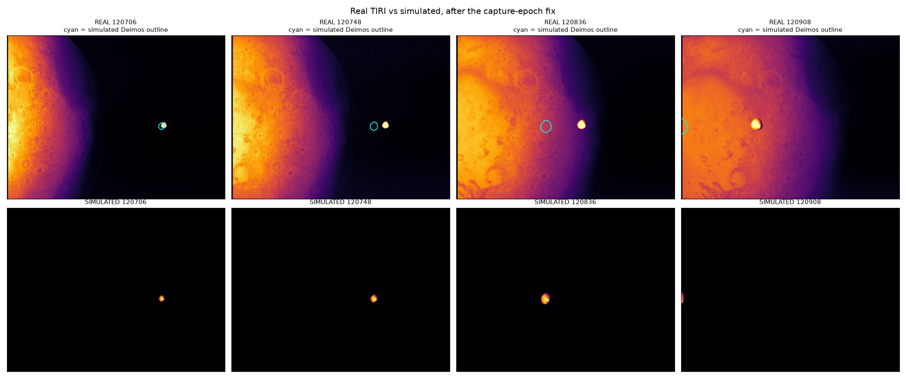
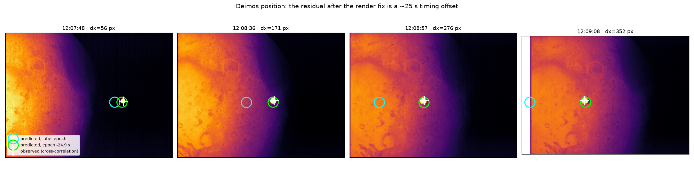

# The Deimos position error: a render bug, and a ~25 s timing offset behind it

Resolves the unresolved defect in `2026-09-02_HANDOFF_tiri_deimos.md` ("THE
BUG"), and re-opens something that note had retracted.

Two independent faults were stacked. The first is ours and is fixed. The second
is larger, is *not* a rendering error, and is the reason simulated Deimos sat
far from the observed Deimos.

## Fault 1: the capture landed on the wrong epoch

`tiri_deimos_fits.py` placed the scene at the stepping-grid epoch and captured
whichever image epoch fell in `[et, et + DT_FINE)`:

```python
hit = numpy.where((et_images >= et) & (et_images < nxt))[0]
```

Its own comment said "the step nearest each image epoch". It was not nearest --
it was the step *at or before*, so the error was one-sided, 0 to `DT_FINE`
(10 s), never negative. The FITS header recorded the image epoch while the
geometry came from up to 10 s earlier.

**Proven without any observation.** Predicting the displacement from the offset
alone, and comparing against the silhouette centre the handoff measured:

| epoch | offset | predicted | measured | resid |
|---|---|---|---|---|
| 11:56:03 | 0.0 s | 0.0 | 0.2 | -- |
| 12:07:17 | 4.0 s | 3.2 | 2.9 | -0.30 |
| 12:07:59 | 6.0 s | 19.9 | 19.2 | -0.70 |
| 12:08:10 | 7.0 s | 30.2 | 30.0 | -0.25 |
| 12:08:47 | 4.0 s | 43.6 | 43.0 | -0.60 |
| 12:09:08 | 5.0 s | 92.0 | 91.4 | -0.65 |

Sub-pixel across a 100x range of displacement. That is the whole of fault 1.

Two things the handoff got wrong, both explained by this:

- **The four distant frames were not a validation.** Their epochs are exact
  multiples of `DT_FINE` from the first, so their offset was exactly zero.
  They agreed because they happened to land on the grid.
- **The silhouette was not "the right width in the wrong place".** `lo` exceeds
  `hi` at every epoch (94.3 against 88.4 at 12:09:08). Over the offset the
  range also falls, so the body shifts *and* grows. The asymmetry is a second
  signature of the same cause.

### Fixed

Image epochs are inserted into the stepping grid and matched by equality, so a
capture lands exactly on its image time. Residual capture displacement is now
**0 px** at every epoch.

That makes the fine steps variable (3-10 s, six distinct lengths), which broke
the precomputed `coefs_fine`: conduction coefficients depend on dt, and reusing
the 10 s set for a 3 s step advances the column as though 10 s had passed. They
are now cached per dt.

## Fault 2: a ~25 s offset that is not ours

With fault 1 gone, a much larger residual survives -- up to 352 px, growing as
the range falls.



Measured by cross-correlating the simulated body against the real frame, which
needs no source detection and is immune to Mars (a high-pass removes anything
smooth on Deimos's scale). That matters: simple centroiding locks onto Mars
from 12:07:06 and fails outright later, which is what made the earlier
`detect()` unreliable.

Fitting the 15 usable frames:

| model | rms residual |
|---|---|
| uncorrected | 141.6 px |
| constant pointing offset only | 77.2 px |
| **time offset only** | **7.2 px** |
| time + constant pointing offset | 4.0 px |

**A pointing error cannot produce this** -- the best constant offset still
leaves 77 px. A time shift can, and one value works everywhere:

    dt = -24.89 +/- 0.86 s   (7 frames, rate 2.7 to 19.6 px/s)



Green is the geometry evaluated 24.9 s before the label epoch; it lands on the
observed body in every frame, while cyan (the label epoch) diverges.

This is the "+20.7 s timestamp offset" the handoff retracted as an artefact of
the render bug. **It survives the fix**, so it is real, and it is now the
dominant error.

### What it is not yet known to be

24.9 s is 220 km of along-track separation at the 8.84 km/s relative speed, so
a timestamp error and an along-track ephemeris error are nearly degenerate here.
Two facts argue against a simple clock offset:

- It matches no standard time-system difference. TAI-UTC is 37 s in 2025,
  GPS-UTC is 18 s, TDB-UTC about 69 s. None is 25.
- **It drifts.** Fitted per frame it moves +3.8 s across the 140 s sequence,
  where a constant clock error would give zero. So a pure constant offset is
  not the whole story either.

### The Mars test was run, and cannot settle it

Mars was the obvious discriminator -- a scene-wide timing or Hera-ephemeris
error must move Mars too, a Deimos-ephemeris error must not. It was run on the
five 2025-03-12 frames where the full disc is in the field, fitting the limb by
least squares.

**Mars cannot detect a 25 s shift.** Hera flies almost straight at it: at
11:30 the relative velocity is -8.661 km/s radial against 0.159 km/s
tangential, so Mars *grows* rather than translating. Its image-plane rate is
0.011 to 0.024 px/s, so 25 s moves it **under 1 px** -- below the measurement
floor. Deimos, offset from the approach axis, sweeps across at up to 19.6 px/s.

For the record, Mars's centre does sit within a few px of prediction at the
label epoch (dx = +0.2, -2.1, -1.4, -2.7 px on the four distant frames), and
`R_obs/R_pred` is 0.96-1.02. Neither confirms nor refutes the offset.

Note the limb fit is threshold-sensitive: a brightness cut halfway to the peak
gives `R_obs/R_pred` of 0.72-0.88, because Mars is cold at the limb and the
contour falls inside the true edge. Referencing the threshold to the space
background instead gives 0.96-1.02. Any limb-derived number should say which
was used.

### What is left

The magnitude argues against an ephemeris error in either body: 24.9 s is
**220 km** of along-track separation at 8.84 km/s, and neither Deimos's orbit
nor a reconstructed Hera flyby trajectory is uncertain at that level.

That points at the image timestamps, but 24.9 s matches no standard time-system
difference, and the fitted value drifts +3.8 s across the sequence, so a single
constant clock offset is not the whole story either. **This is a question for
the TIRI team** -- what time system and what event (integration start, mid,
end, packet time) the filename stamp records.

## Provenance caveats

- `tiri_images_mars_swing-by_deimos.csv` is not on the home machine, so the
  image list was **reconstructed from the FITS filenames** (1 s resolution) and
  the `FW_NUM` header key. It reproduces the handoff's measured displacements
  to sub-pixel, which bounds any disagreement with the original at ~0.03 s, so
  it is sound -- but if the original carries sub-second epochs it should
  replace this one, and the 24.9 s would need re-deriving against it.
- The real frames carry a few non-finite pixels (~4,600 NaN and a handful of
  infinities per frame). They are replaced by the median before any statistic;
  ignoring this silently produced `nan` for every measurement.
- `astropy` was missing from `pyproject.toml` although the FITS scripts import
  it. Added.
