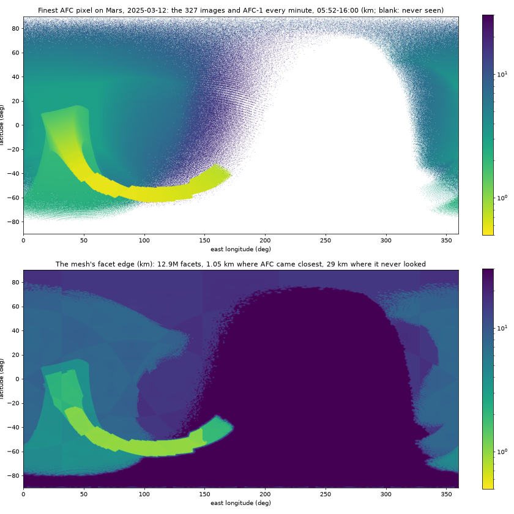
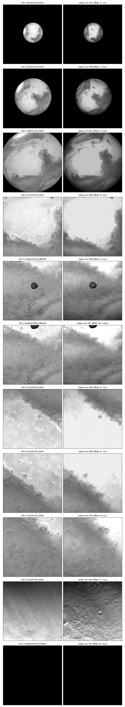

# 2026-10-07 — meshes for every AFC image of the Mars swing-by

Asked: simulate all of the day's AFC images, not only 12:08:31, with Mars
at about a facet per pixel wherever Hera's distance put it, and a better
albedo if needed. Data in `edds_decoder/out/afc_1b_mars_12/data`; geometry
from `hera_ops.tm`, which has pointing for every image.

## The images

327 level-1B images, 1020 x 1020, from 06:20:02 to 13:25:10 UTC: 213 from
AFC-1 (`HERA_AFC-1`), 114 from AFC-2 (`HERA_AFC-2`, `INSTRNAM` in the
header). 205 aimed at Mars, 64 at Phobos, 58 at Deimos; 28 are NAV frames.

| | distance | pixel |
|---|---|---|
| Mars, 06:20 | 207,000 km | 19 km, the whole disc 350 px across |
| Mars, 11:41 | 38,500 km | 3.3 km, the frame full |
| Mars, 12:45:37 (AFC-2), the finest | 9,000 km | 0.57 km |
| Deimos, 12:08:49, the finest | 870 km | 81 m, 156 px across |
| Phobos, 13:05, the finest | 12,000 km | 1.1 km, 20 px across |

Deimos is in view in 49 images, 10 of them over 50 px across. Phobos is
never over 20 px. At 13:00:58 Phobos is in Mars's shadow -- the Sun 20.2 deg
from Mars's centre seen from Phobos, Mars 21.5 deg in radius -- and both
the AFC image and kalast's are black.

## Coverage

Every image's pixels projected onto the IAU ellipsoid every 6 px, keeping
for each 0.25 deg cell the finest `range * IFOV` (93.7 urad) that ever lands
there; then the same for the user's loop in `examples/hera_mars_swingby/afc.py`,
AFC-1 every minute from 05:52 to 16:00 and every 5 s from 12:07 to 12:10, 643
times. The images see 42 % of Mars, with the loop 54 %; 3.4 % is seen under
1 km/px, a swath from 3 deg S, 25 deg E to 64 deg S, 173 deg E, at closest
approach. One facet per pixel would be 15.7M facets for the images, 17.8M
with the loop.

## The Mars mesh

`/Users/gregoireh/data/mesh/mars/mars_mola_afc_20250312.obj`, 539 MB:
6,447,322 vertices, 12,894,640 facets, every edge shared by exactly two and
every normal outward. An icosahedron split level by level, a triangle split
while its longest edge is over twice the target, the target being 1.52 times
the finest pixel (an equilateral facet as large as a square pixel), 29 km
where AFC never looked (the 06:20 pixel's facet), and graded so it grows at
most 0.3 km per km. Then split again until no facet borders one two levels
finer, and the T-junctions closed by halving or thirding the coarser facet.
Radii from MOLA's MEGDR, read at what each vertex needs: 128 px/deg (the four
tiles 0-88 S, 0-180 E, which hold every fine vertex) under 1.6 km facets, 32
under 6 km, 16 under 20 km, 16 averaged to 4 beyond.

The tolerance is a factor of two, so a facet ends up between one and four
pixels: within the 63 images finer than 1.5 km/px, 0.87 facets per pixel at
the median of their medians, 0.42 at least, 2.28 at most. A far image sees
more than it needs, a place refined for 12:45 also being drawn at 06:20: 1.58
over all 217 images that see Mars. Splitting at 1.41 instead gives 18M facets
and 1.22, at 1.25 21M and 1.58 (all images only). Facets below a pixel want
`shading.msaa = 4`, or a flat facet's shade aliases.

Cost in kalast: the three meshes load in 0.6 s, `colors_from_map` puts TES on
12.9M facets in 1.8 s, 11 frames render in 4.0 s, 3.1 GB at the peak.

Per frame, on the GPU (`debug.gpu_timing`, medians of about 20 frames, the
scene held still, `msaa = 1`):

| Mars | 06:20, a 350 px disc | 12:45, the frame full |
|---|---|---|
| 12.9M facets: shadow, render, span | 51, 43, 95 ms | 66, 46, 108 ms |
| `mars_dtm_10x.obj`, 82k | 1.1, 0.6, 0.8 ms | 1.1, 0.6, 0.7 ms |

The pixels cost almost nothing -- ten times as many of them add 3 ms to the
render pass, and `msaa = 4` 4 ms -- because only the pixels the camera sees
are shaded. What costs is every vertex and triangle going through the GPU
every frame, twice: the camera pass draws each body whole, its triangles
clipped only after the vertex stage, and the shadow pass draws Mars whole
into a map fitted to all of it. In a 5.5 deg view nearly all of them land
nowhere.

## Deimos and Phobos

Deimos: Ernst et al. 2023 (doi:10.1186/s40623-023-01814-7), stereophotoclinometry, version 2
(2025-03-10), from SBMT's shared files: `deimos_g_083m_spc_obj_0000n00000_v002.obj`,
83 m, 98,306 vertices, 196,608 facets, beside its label in
`/Users/gregoireh/data/mesh/deimos/`. The best image's pixel is 81 m. The 20,
41 and 167 m versions are there too. Body-fixed, Mars along +x. Phobos: the
10k model already has facets finer than the best image's 1.1 km pixel.

## Against the images

| UTC | camera | corr | offset (rows, cols) | AFC / kalast |
|---|---|---|---|---|
| 06:20:02 | 1 | 0.97 | -1, -2 | 1.44 |
| 09:20:01 | 1 | 0.96 | -1, 0 | 1.44 |
| 10:50:01 | 1 | 0.91 | 0, 0 | 1.36 |
| 11:41:01 | 1 | 0.96 | 0, -2 | 0.95 |
| 12:08:31 | 1 | 0.88 | +4, -2 | 1.19 |
| 12:08:49 | 1 | 0.87 | +12, +32 | 1.12 |
| 12:15:25 | 2 | 0.95 | 0, -2 | 0.85 |
| 12:21:01 | 1 | 0.95 | 0, -2 | 0.86 |
| 12:31:01 | 1 | 0.91 | 0, -2 | 0.94 |
| 12:45:37 | 2 | 0.92 | +7, +1 | 1.26 |

Correlation after a 3 px blur, the offset from high-passed images, the ratio
on the bright half of the frame; Mars TES, Deimos 0.069, Phobos 0.07, Lambert.
Both cameras are drawn with the camera's +X up and +Y right, and both match
unflipped. The geometry holds to 2 px all day; 12:08:49's 32 px is Deimos,
which fills the frame's top and carries the registration -- its own position,
as at 12:08:31. The brightness does not hold: kalast is 30-45 % too dark on
the whole disc (the limb and the terminator, Lambert and no haze), and too
bright on Hellas at 12:15 and 12:21, where TES's bolometric albedo is bright
and AFC sees a hazy basin at Ls 56. At 12:45 AFC shows little of the relief
kalast draws: haze again.

## Albedo

Nothing newer than TES (1999-2004) or MOC-WA's seasonal maps (1999-2006) is
published as a global map; EMM's EXI and MRO's MARCI would give a 2025 one,
from images. With the photometric function this far off, an albedo fitted now
would absorb it: the scattering law first, then the albedo against what is
left.

## Open

- The scattering law: Hapke for Deimos and Phobos; for Mars a surface law
  and a haze term.
- Then the albedo at 655 nm: TES's contrast, MOC red, or a fit to the
  residual.
- `afc.py` steps a clock with AFC-1; to compare image by image, a loop over
  the images' `DATE-OBS` and `INSTRNAM`.
- The coverage and the mesh build are scratch scripts, not in kalast.
- Drawing only what the camera can see: the mesh in chunks with their
  bounds, those outside the view or behind the limb left out of the camera
  pass, and the shadow map fitted to the part of Mars in view rather than all
  of it, which would also give its texels to what is seen.
- `mars_mola16_afc_120831.obj`, the single-frame mesh, is superseded.
