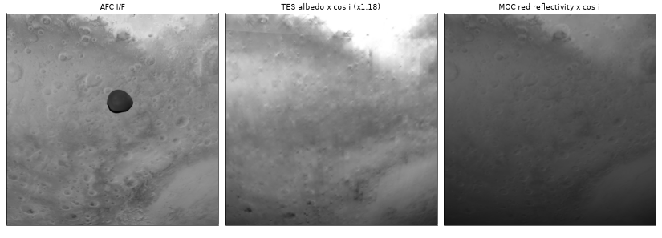
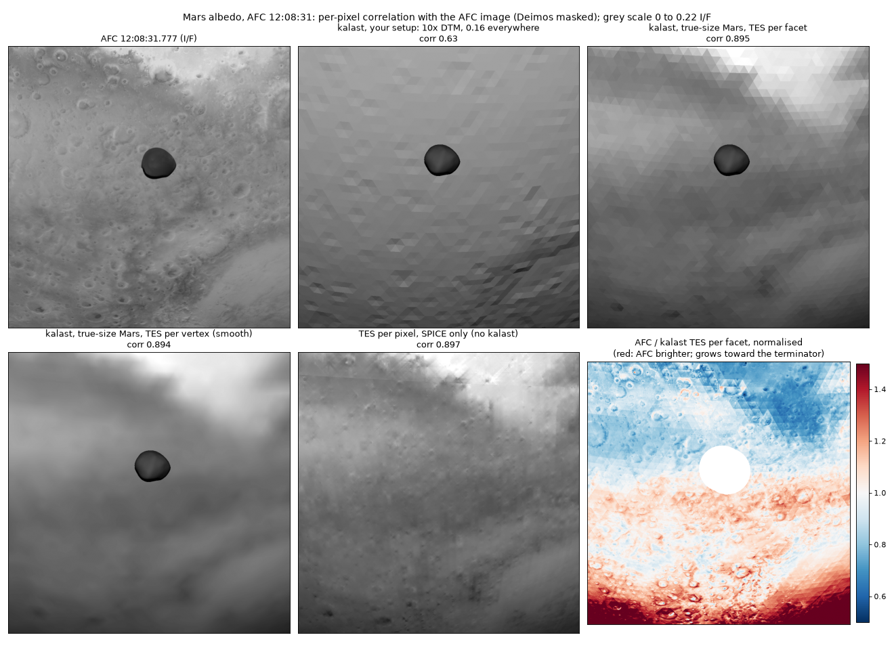
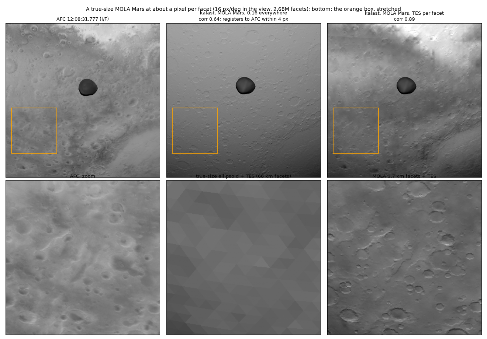

# 2026-10-07 — albedo maps for Mars and Deimos, tried on AFC 12:08:31

Asked: a per-facet albedo map of Mars and of Deimos, and whether kalast can
use one. There are no per-facet maps; albedo maps are latitude-longitude
grids, which kalast can sample per facet -- `mesh.colors` holds one row per
facet on a flat mesh, one per vertex on a smooth one.

## Mars

- **TES bolometric Lambert albedo** (Christensen et al. 2001, JGR 106,
  23823), 0.3-2.9 um, 8 px/deg (7.4 km), simple cylindrical, planetocentric,
  east longitude -180..180. USGS GeoTIFF, 16 MB, public domain:
  `https://planetarymaps.usgs.gov/mosaic/Mars_MGS_TES_Albedo_mosaic_global_7410m.tif`.
  Stored on 249 levels, clipped to 0.06-0.32, the poles filled with 0.06;
  nothing clipped below 60 degrees of latitude. PDS's `global_albedo_8ppd.img`
  is the unquantised original.
- **MOC-WA red**, 575-625 nm, photometrically controlled with Hapke-HG
  (Robbins 2023, doi:10.17189/kxff-cs44): 9 px/deg, one map per Mars year
  and per 2, 5 or 10 degrees of Ls, 10 MB each, public domain.

Tried on AFC 12:08:31.777 (`AF1_00CRROH`): Mars from 21,000 km at 2 km/px,
the view from 6 to 50 deg S and 10 to 74 deg E, incidence 27-82 deg. I/F =
pi L d^2 / F, F = 1.5794 W m-2 nm-1 for the AFC band (the AFC instrument
paper, arXiv:2603.10594: 400-900 nm, effective wavelength 655 nm). Deimos
masked. Rendered with `srgb_mode = 1`, so I/F = value / 255 / light, and
`light.color = 3` for the 8-bit precision; `et` held at 12:08:31.777. The
figures show I/F from 0 (black) to 0.22 (white), AFC and kalast alike: 4.5
times a raw frame at light 1, which is what `light.color = 4.5` reproduces.

| Mars | corr per pixel | corr, 68 km blocks | AFC / model |
|---|---|---|---|
| 0.16 everywhere, `mars_dtm_10x.obj` | 0.63 | 0.67 | 1.07 |
| TES per facet, true size | 0.895 | 0.93 | 1.17 |
| TES per vertex, smoothed | 0.894 | 0.93 | 1.17 |
| TES per pixel (SPICE, no kalast) | 0.897 | 0.93 | 1.17 |
| MOC red per pixel, Ls 50-60, MY25-28 | 0.87 | 0.90 | 1.71 |

The flyby was at Ls 55.7. TES's median in the view, 0.157, is the 0.16
inferred from the AFC I/F alone. Per facet does as well as per pixel: what
the map adds is regional, and the 66 km facets (33 px here) carry it. They
show as triangles; per vertex on a smoothed mesh does not, at the same score.
kalast's render against the SPICE projection: 0.987.

The residual is a trend with incidence: AFC / (TES cos i) is 0.95 below 40
deg, 1.25 at 45-65, 1.5 at 65-70, 2.3 at 75-80. Lambert falls too fast toward
the terminator, and Mars adds atmospheric haze, which no surface law has.

The geometry: `mars_dtm_10x.obj` averages 3537 km in radius (Mars: 3390),
with ten times the relief. A place on Mars is drawn 37 px from where AFC
sees it at the centre of the view, 12 px at the top, 62-66 px at the bottom,
where the emission reaches 60-70 deg. Rendered above with the vertices moved
along their directions onto the IAU ellipsoid, then `recompute_facets()`; the
next section replaces it.

## A true-size Mars from MOLA, about a pixel per facet

`/Users/gregoireh/data/mesh/mars/mars_mola16_afc_120831.obj`, 106 MB. The
radius is MOLA's, from the MEGDR at 16 px/deg (`megr90n000eb`, PDS
Geosciences: planetocentric, east, the IAU_MARS frame). One
latitude-longitude grid over the whole planet: MOLA's own 1/16 deg cells
(3.7 km) inside lat -55..-3, lon 7..76 E -- what AFC sees at 12:08:31.777,
with 2 deg of margin -- and 1 deg (59 km) outside, so Mars stays whole when
the view moves on. Fans close the poles. 1,339,202 vertices, 2,678,400
facets (1,837,056 fine), every normal outward; radius 3373-3417 km, where the
10x mesh had 3491-3608. A facet covers 1.7 px at the top of the frame, 1.3 at
the centre and 0.4 at the bottom, where the emission is steepest. A run from
loading to the exported frame took 0.9 s.

| Mars | corr per pixel | fine detail | kalast's offset from AFC |
|---|---|---|---|
| ellipsoid, TES per facet | 0.895 | 0.17 | none to measure |
| MOLA, 0.16 everywhere | 0.64 | 0.14 | 4 px up, 2 px right |
| MOLA, TES per facet | 0.89 | 0.30 | 4 px up, 2 px right |

Fine detail: the correlation once both images lose a Gaussian blur of 15 px
(30 km), after the offset. The offset is a phase correlation of those
high-passed images: the craters register, and Mars lands within 4 px of AFC.
Deimos lands 10 px up and 20 px left, about 2 km of its own position at
1,000 km. The overall correlation does not move: the regional albedo and the
trend with incidence set it. The craters show where AFC has them, with harder
shading than AFC's: Lambert, and no haze.

The fine box belongs to this one frame. Hera tracked Deimos, so the Mars
behind it changes within seconds; another frame needs the same grid around
its own footprint.

## Deimos

No map to download. Wargnier et al. 2025 (A&A 703, A289; HRSC and SRC,
2004-2024) mapped the single-scattering albedo in 5 x 5 deg bins: even within
a few percent except the equatorial ridge, about 35 % brighter (up to 58 %),
published as figures only. Thomas et al. 1996 (Icarus 123, 536): normal
reflectance 0.068 +- 0.007 at 0.54 um, almost all of it between 0.06 and
0.09, the trailing side about 10 % brighter. The six best AFC images of
Deimos (86-111 m/px, Ernst et al., EPSC-DPS 2025) suit an albedo map; none
is published yet. A per-facet map could be inverted from them, once the
scattering law is in.

## `mesh.colors_from_map`, and `light.exposure`

Asked for after the numpy version of the sampling: `mesh.colors_from_map(map,
west=-180.0)`, in `Mesh::colors_from_map` (`src/mesh.rs`), generic over the
map's float type so a float32 GeoTIFF from PIL is read where it lies, not
copied. A flat mesh's facet takes the mean over its area: cut into `k * k`
equal triangles, one sample at the middle of each, `k` the map pixels across
the facet's widest angle from the centre, at most `MAP_SPLIT_MAX` = 32. The
first version took the corners and the centre, four samples, which is a 1 deg
facet's four points of a 1/8 deg map rather than the 64 pixels under it; a
66 km facet of the 10x mesh on TES now takes 81. A smooth mesh's vertex takes
the map where it lies. Bilinear between pixel centres, the outer rows held
past the outer centres, across the seam at `west`. Non-finite samples are left
out; a facet with none keeps its colour. Tests: four in `src/mesh.rs` on an
octahedron (north row first; the area, a 30-40 deg band covering 0.109 of a
facet whose middle is inside it; the west edge and the seam; NaN and refused
maps) and four in `tests/test_mesh.py` against a numpy rewrite of the
sampling, on `ico3.obj` and on `ico1.obj`, whose facets span four pixels.

`light.exposure`, default 1, multiplies `light.color` where the light uniform
is filled (`src/app/window.rs`, at the window's creation and every frame), so
the ambient term, the diffuse one and the debug cube all follow it, and the
unlit modes do not. The user had found a frame from these renders' setup 4.5
times darker than the figures, which were made with `light.color = 3` and
shown from I/F 0 to 0.22: with `srgb_mode = 1` a lit pixel is `exposure * I/F
* 255`, and `exposure = 4.5` gives the figures' look, 0.3 % of the AFC frame
clipping at white. The colour picker in the settings stops at 1, so a colour
above it could not be edited there anyway.

`--features use_f64` does not build the app: 40 errors in `app/uniform.rs`,
`app/window.rs`, `app/simulation.rs` and elsewhere, none in these changes.
Not looked into further.

## Open

- The MOLA mesh came from a scratch script; a mesh for another frame needs
  the same build around that frame's footprint. Not in kalast.
- The scattering law in the shader (Hapke for Deimos).
