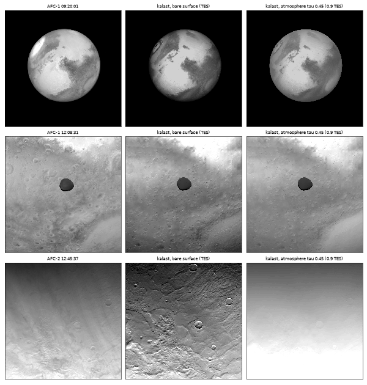
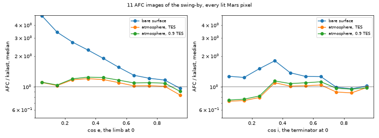

# 2026-10-07 — Mars's atmosphere over the surface in the image

Asked: the dust layer over Mars, after the scattering laws showed that
Mars's brightness in AFC's images is the atmosphere's as much as the
surface's (`2026-10-07_scattering_laws_in_the_renderer/`): a limb far
brighter than Lambert, a terminator past where kalast's is, shadows with a
floor.

## The model (`src/atmosphere.rs`, `body.atmosphere`)

From the research of the same day, which checked the formulas against a
Monte Carlo of the slab (its code reproduces Chandrasekhar's H function to
0.1 %). For a point of the surface, the atmosphere a plane-parallel slab along
the local vertical, its paths through it taken over a sphere:

- **Airmass**, Chapman's, `m(mu) = 2 / (mu + sqrt(mu^2 + 8H / (pi R)))`:
  within 6 % of the erfc form, 22 at Mars's horizon.
- **Dust**: `omega = 0.975` at 650 nm (Wolff et al. 2009, CRISM emission
  phase functions with MER); phase function `q HG(g1) + (1 - q) HG(g2)`,
  `g1 = 0.889, g2 = 0.094, q = 0.743`, fitted to MSL Navcam sky radiance at
  650 nm (Chen-Chen et al. 2019), AFC's 655. Delta-Eddington scaling,
  `f = g^2`.
- **Single scattering** in the truncated-multiple-scattering form (Nakajima
  and Tanaka 1988); **multiple** by the two-stream source-function method
  (Toon et al. 1989) times `1.05 + 0.33 ln(1 + 1/tau')`, fitted to the Monte
  Carlo within 3 % for tau 0.05-4 (uncorrected it is 30-50 % short at these
  thin depths).
- **Surface** in the 6S decomposition (Tanré et al. 1979; Vermote et al.
  1997): the beam that got through times the surface's own law, the sky's
  light on a Lambert surface, both seen directly and through the dust, with
  the light the surface and the air send each other (the atmosphere's
  spherical albedo, the surroundings' albedo `Atmosphere.albedo`).
- **Twilight**: past the terminator only the air above the shadow's height
  is lit; a spherical-shell fit gives `exp(-0.24 d - 0.0235 d^2)`, `d` the
  Sun's depression in degrees, for an 11 km scale height.
- **The column**: `tau` at the level of the IAU ellipsoid (3396.19 x 3376.20
  km about the body's z axis), thinning with height as the pressure does,
  `tau exp(-h / H)`; twice the dust over Hellas as over the uplands.
- **The numbers**: Perseverance measured tau = 0.41 at 630 nm on the
  swing-by sol at Jezero (Mastcam-Z, Lemmon dataset v2), 0.33 normalised to
  610 Pa; H = 11 km; the research fit AFC's low-phase brightening to the
  limb with tau 0.45 +- 0.1, with the surface at 0.9 x TES (TES's albedo is
  seen through the same haze).

One departure from the research's written formulas, which light the surface
with the sky as `u0 td(u0)`, the airmass cosine: its code, which it
validated, uses the geometric `mu0`, and so does this; with `u0` the sky
would light the surface past the terminator, where kalast is already too
bright (below).

`tests/test_atmosphere_render.py`: a plate under it at eight geometries,
twilight included, and three units up at an ellipsoid's pole, read back
against `Atmosphere.iof`: every one within 0.01 %. The Rust unit tests hold
`iof` to the research code's numbers within 1e-5.

## Found on the way

A plate lit exactly face-on, a thousand units from the origin, came out
black, atmosphere or not: a flat scene seen edge-on by the Sun has no depth,
and the shadow layer's depth slab was padded by one float epsilon, noise to
the depth test. Now a ten-thousandth of the scene's reach.

## On AFC

Eleven images over the day, 06:20-12:45 (19 km/px to 0.9 km/px), three
ways: the bare surface with TES albedos, under the atmosphere with TES, and
with 0.9 TES; `msaa 4`, `srgb_mode 1`, the Sun a disc. Every lit pixel of
Mars traced onto the sphere for its incidence and emission:

| AFC / kalast, median | bare | atmosphere, TES | atmosphere, 0.9 TES |
|---|---|---|---|
| limb, cos e < 0.1 | 4.74 | 1.11 | 1.12 |
| cos e 0.4-0.7 | 1.44 | 1.07 | 1.14 |
| centre, cos e > 0.7 | 1.03 | 0.88 | 0.96 |
| terminator, cos i < 0.2 | 1.24-1.27 | 0.73-0.74 | 0.75-0.76 |
| every lit pixel, 16-84 % | 0.89-1.37 | 0.77-1.08 | 0.83-1.15 |

The limb is fixed, the spread a third narrower, the far images' residual
falls from 29 % to 12-16 %. Two things are left:

- **The phase angle.** By image, AFC / kalast goes 1.11-1.14 at 5 deg
  (06:20-10:50), 1.03 at 11, 0.94 at 19, 0.83 at 38 and 0.73 at 71 deg
  (12:45). The bare surface does the same. That is Mars's surface, not its
  air: a regolith has an opposition surge and darkens with phase faster than
  Lambert. A Hapke law in `body.scattering` with the atmosphere is what the
  renderer does now; the parameters are for the next step (CRISM's and
  HRSC's photometric fits of Mars's surface).
- **The terminator**, 25-35 % too bright, at 12:45 most: the two-stream sky
  at grazing Sun, the twilight fit (made for views near nadir, it decays
  twice as slowly seen from the Sun's side), or ice haze, which the research
  found over Hellas and in the morning.

## Open

- Mars's surface photometry under the air (above).
- The limb's haze above the solid planet, a shell the renderer does not
  draw; and the atmosphere's share of Mars's shadow on its moons (Phobos
  leaves it a minute late in AFC: `2026-10-07_penumbra_and_msaa_resolve/`).
- Water ice: `tau = taud + taui`, a second phase function.
