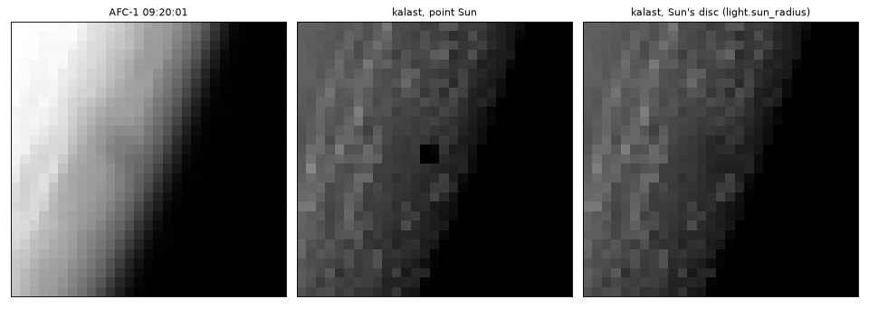
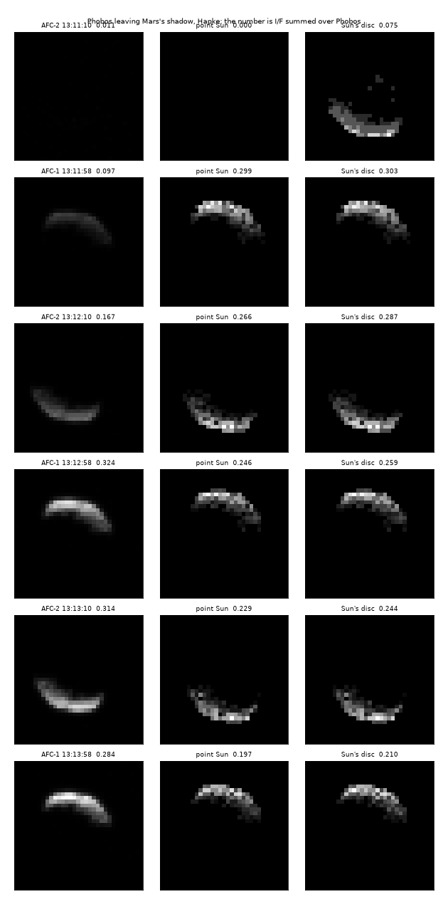

# 2026-10-07 — the Sun as a disc; MSAA averaging stored values

Asked, after the scattering laws: a real penumbra from the Sun's angular
size, and `srgb_mode = 1` averaging correctly under MSAA. Both open in
`2026-10-07_scattering_laws_in_the_renderer/`.

## MSAA in `srgb_mode = 1`

In mode 1 a stored value is the lit value itself, I/F times the exposure: the
shader writes it decoded through sRGB and the sRGB target encodes it back.
The hardware resolve averages what the samples decode to, so a pixel part lit
and part dark stored more than its share -- half a plate at 160 as 117
rather than 80, 13 % over on a 2 px Phobos.

Now, with MSAA, mode 1 and an sRGB image, the main pass stores its samples
and a pass of its own (`shaders/msaa_resolve.wgsl`, `Resolve` in
`src/app/pass/render.rs`) encodes each, averages the encoded values and
decodes the mean for the target to store as it is; after the annotations
pass too. Mode 0 keeps the hardware resolve, which is right for it.

`tests/test_msaa_stored_resolve.py`: a plate at 160 turned 17 deg in the
image at `msaa = 4`, every pixel 0, 40, 80, 120 or 160 exactly, and 68, 4
and 64 pixels at the three partial coverages. Before: off by up to 20.

## The penumbra

`light.sun_radius`, the Sun's radius in the scene's units (`None`, a point,
by default). Percentage-closer soft shadows in `mesh_shadow.wgsl`:

1. **Search.** 32 points of a disc around the receiver in its layer, out to
   the widest penumbra the layer can hold. A texel counts as an occluder
   only if it lies in front of the receiver by at least its offset over the
   Sun's angular radius -- the rays toward the disc pass it there -- so a
   rise of the ground beside the receiver, below them, does not count.
2. **Filter.** The disc's 128 points (a sunflower spiral, so no point
   shimmers from frame to frame), projected through the occluders' mean
   depth onto the receiver: radius = their distance in front times the
   Sun's angular radius. Each is tested against the depth the ray toward
   that point of the Sun has there, and weighted by the limb darkening
   (linear, u = 0.56). The weighted fraction lights the pixel.

Kept hard, the lookup as it was:

- a penumbra narrower than 3 texels;
- a pixel shadowed at its centre by something whose own penumbra would be
  narrower than that;
- a body's shadows on itself.

The first two are a fraction of a pixel wherever the layer is sized to the
view. There, the occluder is a surface rising toward the Sun -- a ridge at
grazing light -- and one depth for the whole disc let light leak into the
umbra: single lit pixels over Phobos's night side.

**Cost.** The search is bounded per layer from the CPU: how far in front
another body can be (`Light::layer_reach`), and the box in the layer's uv its
shadow and penumbra can fall in (`layer_shade`). Outside it a pixel does not
search. A layer is widened by its widest penumbra, up to its own size again.
At Hera's closest the render pass is 1.9 ms with the Sun a disc as without;
searching every pixel, as first written, it was 6.7.

**Checked against the exact answer** (`tests/test_penumbra.py`). A sphere
0.01 rad across from a plate, the Sun 0.02 rad, so its antumbra, as Phobos's
on Mars. The limb-darkened disc's visible fraction, integrated in the test
along a line through the shadow: 0.76 % rms, 3.3 % at worst, 29.6 % hidden
under the sphere's middle read as 29.0 %. A point Sun gives a black disc.

## On AFC

**09:20:01**, Phobos's shadow on Mars, 8,350 km below it. With a point Sun:
two black pixels. With the disc: a dip of about 30 % against its
surroundings, 0.033 to 0.022-0.025 I/F, over a few pixels. AFC shows
nothing there: its image is far brighter near the limb (the atmosphere),
and the dip is under its PSF.

**13:11-13:14**, Phobos leaving Mars's shadow, Hapke, I/F summed over
Phobos:

| UTC | AFC | point Sun | Sun's disc |
|---|---|---|---|
| 13:11:10 | 0.011 | 0.000 | 0.075 |
| 13:11:58 | 0.097 | 0.299 | 0.303 |
| 13:12:10 | 0.167 | 0.266 | 0.287 |
| 13:12:58 | 0.324 | 0.246 | 0.259 |

The disc makes the egress gradual, as AFC's is, but it comes about a minute
early either way. AFC's Phobos is still at 3 % at 13:11:10 and full only by
13:12:58, where kalast's is half lit at 13:11:10 and full by 13:11:58. That
is Mars's shadow being larger than the solid planet: sunlight grazing the
limb crosses a slant optical depth of about 20 in the dust (tau 0.45, 11 km
scale height), so the air is opaque up to some 30 km, and the shadow is
that much wider. A job for the atmosphere: a planet's shadow on other bodies
cast from a shell above its surface, which its own surface does not see.
After the egress kalast is 25-35 % short of AFC at these phases, past the
Hapke fit's, as before. The disc's own few percent above the point there is
8-bit quantization at this exposure (Phobos averages 7 counts a pixel) and
the hard lookup's texel grid moving with the layer's margin.

## Open

- The atmosphere's share of Mars's shadow (above).
- The per-facet shadow query (`shadows.access_shadow_map`) is still the
  point Sun's.
