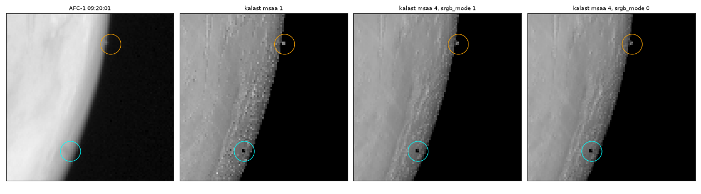
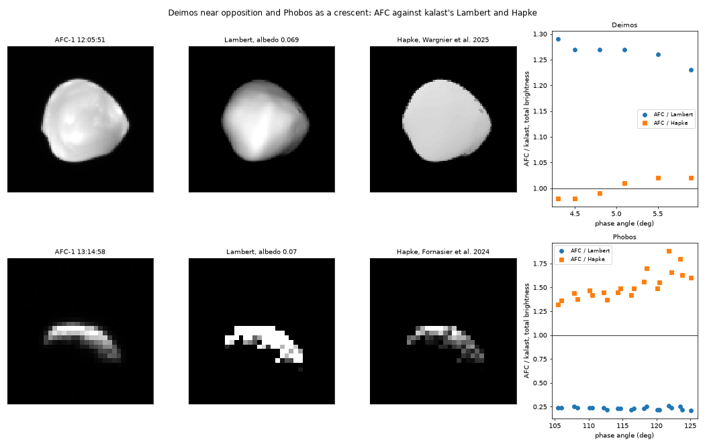

# 2026-10-07 — scattering laws in the renderer; MSAA against a camera

Asked: whether `shading.msaa = 1` is closer to a real camera than 4, shown on
Phobos and its shadow at 09:20; whether the atmosphere matters; then the
scattering law in the shader. Also done: the 12:08:31-only Mars mesh deleted
and `examples/hera_mars_swingby/afc.py` pointed at
`mars_mola_afc_20250312.obj` and the 83 m Deimos, with the Hapke laws below.

## MSAA against a camera

A detector pixel integrates the light over its area, and AFC's optics spread
it further (PSF under 2 px, the AFC paper). `msaa = 1` samples one point per
pixel: a feature under a pixel lands in it or misses, and where a far frame
draws a hundred facets per pixel, one facet's shade stands for all of them,
as speckle no camera makes. `msaa = 4` averages four samples, closer to the
integral, still without the PSF.

The average is taken in the render target's space. With `srgb_mode = 1` the
shader writes the lit value decoded through sRGB and the target encodes it
back, so the resolve averages decoded values, not I/F, and a pixel mixing
bright and dark comes out too bright. Phobos at 09:20:01, summed over its
pixels: 0.376 at `msaa = 1`, 0.357 at 4 in mode 1, 0.315 at 4 in mode 0, the
correct average. For MSAA and photometry: `srgb_mode = 0`, I/F =
sRGB-decode(value / 255) / exposure.

## Phobos and its shadow at 09:20

Four images (AFC-1 09:20:01 and :13, AFC-2 :25 and :37) have Phobos's shadow
on the visible disc. At 10.5 km/px Phobos is 2 px, just off the limb. Its
shadow falls 8,350 km below it, where Phobos covers 22 % of the Sun: a soft
spot 6.6 px across and at most 22 % deep, before the PSF, on the steep
brightness gradient at the limb. AFC shows no dip there. kalast draws a 1 px
black hole: the shadow map takes the Sun as a point, so a moon's shadow has
no penumbra -- and the eclipse that hides Phobos from 12:53 to 13:11 switches
off at once, where AFC-2 at 13:12:10 has it still half lit.

The same crops show the atmosphere: near the limb AFC reads I/F 0.17 where
Lambert gives 0.07, and AFC's lit edge reaches 3-17 px past kalast's
terminator. Phobos in total: 0.24 in AFC, 0.32-0.38 in kalast.

## `body.scattering`

The laws of `src/scattering.rs`, in the shader. `body.scattering` takes
`None` (Lambert, the default), `LommelSeeligerLambert(w, c)` or
`Hapke(w, b, c, b0, h, theta_bar, k)`, the objects the light curves use. A lit
pixel is `exposure * colour * pi * r(i, e, alpha) * cos(i)`: the law's I/F,
scaled by the facet's colour, `e` and `alpha` from the camera. Lambert is
`colour * cos(i)` exactly as before.

- `InstanceInput` gains `law` and two `[f32; 4]`, locations 18-20,
  contiguous from byte 136 (176 bytes, no implicit padding):
  `(w, c)` for the mix, `(w, b, c, b0)` and `(h, theta_bar, k)` for Hapke.
- `Globals` gains `camera_pos` at byte 112, appended past the padding, so
  every other shader's copy of the struct still binds.
- `mesh_shadow.wgsl` writes `h_function`, `henyey_greenstein`,
  `opposition_surge` and `roughness_terms` again in f32, the last branch for
  branch, with the f32 guards of the Rust (`tan(psi/2)` past its pole, `mu`
  kept off zero for an interpolated normal turned past the limb).

`tests/test_scattering_render.py` renders a plate at six geometries per law,
the exposure putting the expected value at 200 of 255, and reads the I/F
back: every law within one count (0.25 %), Lambert unchanged; with each law
checked against the wrong expectation instead, all fail by 80-99 %.

**Hapke's porosity factor `k`**, added to `Hapke` because the fits below are
Hapke 2012: `k` times the reflectance, the `H` functions at `mu / k`, `1` the
IMSA as it was. `k = -ln(1 - 1.209 phi^(2/3)) / (1.209 phi^(2/3))` from the
filling factor `phi`: 1.21 for Deimos (85.7 % porous), 1.19 for Phobos (87 %).
Tests in `tests/test_scattering.py` against the module's own pieces (3e-7).

## Deimos and Phobos against AFC

- Deimos, Wargnier et al. 2025 (HRSC and SRC, H2012 1T-HG): `w 0.068, g
  -0.275 (b 0.275, c 1), B0 2.14, h 0.065, theta_bar 19.4 deg, k 1.21`.
- Phobos, Fornasier et al. 2024 (HRSC, disk-resolved), 538 and 748 nm
  interpolated to AFC's 655: `w 0.0743, b 0.252, c 1, B0 2.283, h 0.0573,
  theta_bar 22.9 deg, k 1.19`.

Rendered with `msaa = 4`, `srgb_mode = 0`; brightness summed over a box round
the moon, less the sky's median round it, in AFC and in kalast.

| | phase | AFC / Lambert | AFC / Hapke |
|---|---|---|---|
| Deimos, 12:04:11-12:05:51, 41-56 px | 4-6 deg | 1.23-1.29 | 0.98-1.02 |
| Phobos, 13:12-13:23, 15-19 px, both cameras | 104-125 deg | 0.21-0.26 | 1.32-1.88 |

Deimos agrees to 2 % near opposition, surge and all, and looks it: evenly lit
to the limb, where Lambert darkens it. 12:06:11 is left out, Mars entering
the frame and its background. Phobos as a crescent is too dark by half,
more so with phase: these phases are past the fit's, and Mars lights
Phobos's night side, which no law here has. 13:12:10 is left out, Phobos
leaving the eclipse.

## Open

- Mars: still Lambert with TES. Its brightness is the atmosphere's as much
  as the surface's -- the limb, the terminator, haze over Hellas, the
  shadow's fill -- so a surface law alone will not do: a dust layer over
  it, single scattering with an estimate of the rest.
- A penumbra: the Sun's angular size in the shadow map, for moons' shadows
  and eclipse ingress and egress.
- `srgb_mode = 1` averaging MSAA samples in I/F: a linear target for it.
- Phobos at high phase: Mars-shine, or a fit that reaches these phases.
