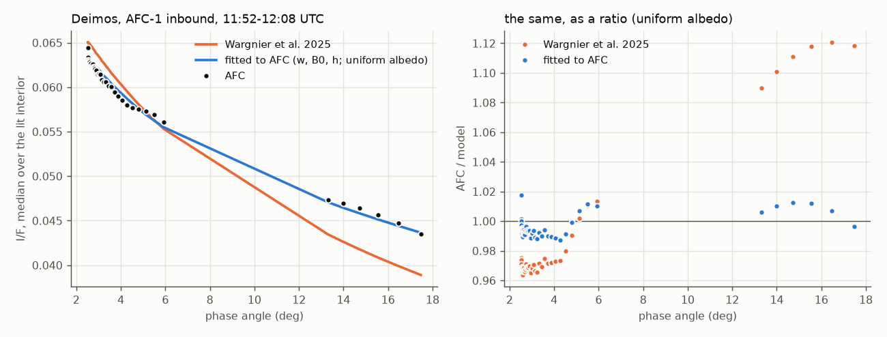
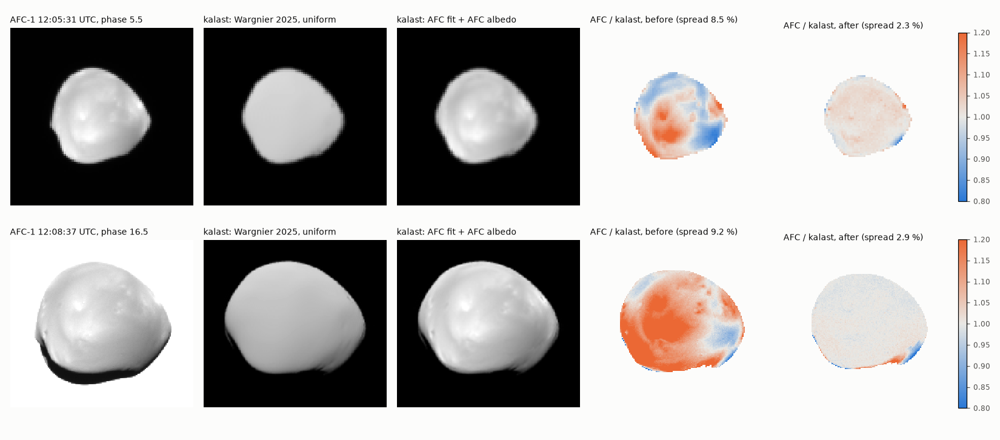
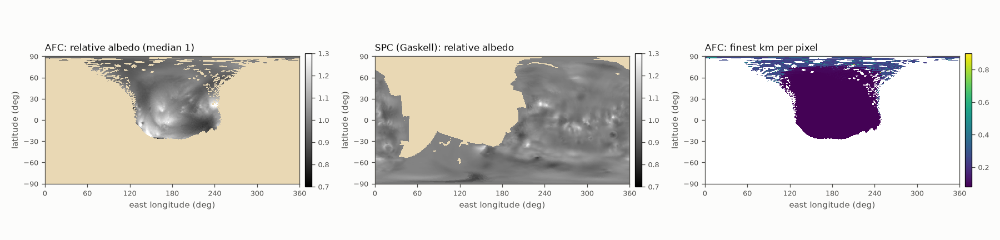

# 2026-10-08 — Deimos's photometry and albedo from AFC

Asked, after `2026-10-08_mars_hapke_terminator_deimos/` (no map there was
reproduced what AFC sees on Deimos; the residual was a gradient across it):
fit AFC, and make a new albedo map or better Hapke parameters from it.

## The frames

Only AFC-1 had Deimos in view; AFC-2 never did. 49 frames resolve it, all
inbound, 11:52:31-12:08:49 UTC. 47 are used here:

| | frames | km/px | phase | exposure | background |
|---|---|---|---|---|---|
| far | 41, 11:52:31-12:05:51 | 0.23-0.89 | 2.5-5.9 deg | 2.98 ms | black sky |
| close | 6, 12:08:13-12:08:43 | 0.086-0.11 | 13.3-17.5 deg | 1.285 ms | Mars |

12:06:11 and 12:08:49 cut Deimos at the image's edge, and 12:07:11 does not
have it at all. The sub-spacecraft point stays within a degree of longitude
180, the side facing away from Mars, and moves from latitude 19 to 2. That is
one hemisphere, seen the same way throughout. No Mars-shine reaches it.

## Method

- **Model.** kalast's facet-id map of Deimos (`facet_id_map`, the build of
  the day, Deimos alone) at 4 x 4 sub-pixels per AFC pixel. Each facet's
  occlusion comes from `facet_shadow`, and its geometry from the SPICE pose.
  Hapke is evaluated as `src/scattering.rs` has it, in numpy, which agrees
  with it to 5e-6. The result is binned into AFC's pixels and blurred by a
  Gaussian of sigma 0.50-0.55 px, fitted on the frames against the sky.
  kalast's own renders of the result agree with this model to 0.4-0.6 % rms.
- **Registration**, per frame: least squares for the frames against the
  sky, the silhouette for those against Mars (IoU 0.94-0.97). After the
  slew at 11:53:51, the shifts are 2.0-2.7 km along the image's columns and
  0.8-1.7 km along its rows, nearly constant in km while the pixel scale
  changed tenfold. That points to Deimos's position (its ephemeris, or
  Hera's), not the pointing. At 12:08:31 the shift is 9 and 28 px.
- **Pixels.** Only pixels whose facets are all lit, with the Sun more than
  6 deg up. Deimos's outline is eroded by 2 px against the sky and by 8 px
  against Mars, whose light otherwise spills over the limb.
- **Fit.** Residuals are taken in log. For the law each frame weighs the
  same, with the albedo solved alongside per patch (800, about 0.5 km); for
  the map, per facet, every pixel weighs the same.

## The gradient was the albedo

A plane fitted to log(AFC / kalast) over Deimos, under Wargnier et al.
(2025)'s law and a uniform albedo, gives 22-32 % over 15 km in every one of
the 47 frames. It points toward -44 to -53 deg in the image in the far frames
and -61 to -79 in the close ones. Over the same frames:

- the Sun's direction in the image turned by 85 deg (-85 to -170);
- Deimos crossed the detector (rows 430 to 960);
- the pixel scale changed tenfold, while the gradient per km stayed the
  same.

So it is fixed to Deimos: neither the photometry nor the camera. It is
brighter toward the south-west of the sub-spacecraft point. A map made from
the far frames alone predicts it in the close frames (below), and with the
map 1-5 % over 15 km is left.

## Photometry



AFC's Deimos fades by 31 % from 2.5 to 17.5 deg: the median I/F over its lit
interior goes from 0.0629 to 0.0435. Wargnier's law fades by 40 %, so kalast
was 2-3 % too bright at 2.5-4 deg and 8-10 % too faint at 13-17.5 deg: the
opposition surge is too strong. Fits with the albedo per patch:

| law | w | B0 | h | other | rms log, far | close | spread of frame means |
|---|---|---|---|---|---|---|---|
| Wargnier 2025 | 0.068 | 2.14 | 0.065 | | 0.0215 | 0.0305 | 0.0343 |
| fit: w, B0, h | 0.0944 | 1.15 | 0.055 | | 0.0117 | 0.0275 | 0.0056 |
| fit: w, B0, h, b | 0.065 | 0.79 | 0.019 | b 0.45 | 0.0110 | 0.0271 | 0.0051 |
| fit: w, B0, h, theta-bar | 0.0939 | 1.17 | 0.055 | theta-bar 18.1 deg | 0.0118 | 0.0269 | 0.0056 |
| fit: w, B0, h, K | 0.113 | 1.16 | 0.056 | K 1.00 (bound) | 0.0117 | 0.0274 | 0.0056 |

In every fit, b, c, theta-bar and K are Wargnier's (0.275, 1.0, 19.4 deg,
1.21) unless freed.

**What AFC constrains:** the surge's shape between 2.5 and 17.5 deg, and the
level (w), given the rest of Wargnier's law. **What it does not:**

- b and c: nothing past 18 deg. Freeing b trades against B0 and h for
  1-6 % less residual.
- theta-bar: 18 deg fits as well as 19.4.
- K: it trades against w.

The phase function, the roughness and the porosity stay Wargnier's, from
their wider phase range.

**Disk functions**, with each frame's level left free (the phase curve out
of the comparison), rms log far / close:

| | far | close |
|---|---|---|
| Lambert | 3.79 % | 5.78 % |
| Lommel-Seeliger | 0.99 % | 2.88 % |
| LS-Lambert mix, 21 % Lambert | 0.90 % | 2.54 % |
| Minnaert, k 0.60 | 0.94 % | 2.60 % |
| Akimov, eta 0.48 | 0.95 % | 2.68 % |
| Hapke, Wargnier's shape, theta-bar 17 deg | 0.95 % | 2.61 % |

Lambert is out. At these phases the regolith laws cannot be told apart.

With the map below the law is refitted: **w 0.0929, B0 1.154, h 0.0500**.
With a uniform albedo, the same law needs w 0.1012, B0 1.061, h 0.0400.

## The albedo map

Solved per facet by least squares over every pixel of every frame, in
relative residuals. Neighbouring facets are held together (lambda 0.3,
chosen on the tests below), and the scale is set so the median is 1.

**Held out**: the spread of log(AFC / kalast) on frames left out of the map,
each frame's mean removed:

| map from -> tested on | uniform | SPC's albedo | AFC map | variance explained |
|---|---|---|---|---|
| far frames (0.23-0.89 km/px, 2.5-6 deg) -> close (0.09-0.11 km/px, 13-18 deg) | 9.01 % | 8.83 % | 3.36 % | 86 % (SPC: 4 %) |
| close -> far | 7.64 % | 7.30 % | 1.97 % | 93 % (SPC: 9 %) |
| far and three close -> the other three close | 9.09 % | 8.91 % | 1.35 % | 98 % |

The last test is the weak one: those frames are 6 s apart, at the same
geometry.

**On the 47 frames it was made from**, the spread of log(AFC / kalast) and
the frames' mean offsets:

| | far | close |
|---|---|---|
| Wargnier 2025, uniform | 7.67 %, -0.029 to +0.016 | 9.02 %, +0.077 to +0.103 |
| Wargnier 2025, SPC's albedo | 7.33 % | 8.83 % |
| AFC law, uniform | 7.63 %, -0.008 to +0.027 | 9.01 %, -0.017 to +0.004 |
| AFC law and map | 1.55 %, -0.010 to +0.024 | 2.51 %, -0.013 to +0.006 |

kalast's own renders give the same: 1.7-2.3 % for the far frames and
1.8-3.9 % for the close ones, against 6.9-9.6 % before.



**Coverage**: 42,660 facets, 136 km², 26 % of Deimos. That is longitude
100-260 and latitude -25 to +90, mostly at 86 m/px.

- **Left out (NaN):** facets seen only past 72 deg of incidence or emission,
  where the map was taking up the limb's errors, and two rings of facets at
  the edge of what was seen.
- **Range:** relative albedo 0.90-1.19 for 90 % of the facets, 0.85-1.27
  for 98 %.
- **Against SPC's albedo**, on the 14,544 facets that have both: they
  correlate at 0.51. AFC's contrast is twice SPC's (0.95-1.05 for 90 % of
  those facets), and SPC does not have the trend across the hemisphere.



## Files

- `deimos_afc_albedo.npy`: float32, one value per facet of
  `deimos_g_083m_spc_obj_0000n00000_v002.obj`, in its order, NaN where
  unknown.
- `deimos_afc_albedo.csv`: the same, with the finest km/px each facet was
  seen at and the number of frames that saw it.
- `deimos_afc_albedo.tif`: simple cylindrical, 0.5 deg per pixel, first row
  90 N, columns east from -180, for `colors_from_map` on any Deimos mesh. On
  the 83 m model it gives the array back to 1 % (correlation 0.99).

In `afc.py`, Deimos being `bodies[1]`:

```python
# Deimos: the opposition surge and albedo fitted to AFC-1's inbound frames
# (notes/2026-10-08_deimos_afc_photometry/); b, c, theta_bar, k Wargnier et al. (2025)'s.
deimos = app.simulation.bodies[1]
deimos.scattering = Hapke(w=0.0929, b=0.275, c=1.0, b0=1.154, h=0.0500, theta_bar=19.4 * RPD, k=1.21)
albedo = numpy.load("notes/2026-10-08_deimos_afc_photometry/deimos_afc_albedo.npy")
deimos.mesh.colors[:] = numpy.nan_to_num(albedo, nan=1.0)[:, None]
deimos.mesh.update_gpu_colors()
```

Without the map, the law alone:
`Hapke(w=0.1012, b=0.275, c=1.0, b0=1.061, h=0.0400, theta_bar=19.4 * RPD, k=1.21)`.

## Caveats

- **One hemisphere, at one geometry.** The map is relative and exists only
  where AFC saw Deimos; elsewhere Deimos keeps 1.
- **Phase and exposure come together.** The phase range splits into
  2.5-6 deg at 2.98 ms and 13-17.5 deg at 1.285 ms. A calibration error
  between the two exposures would be read as surge. Mars in the same close
  frames could check that.
- **The shape model at the limb.** It leaves 1-2 px slivers at the limb
  against Mars, which is why the map is cut there.

## Open

- AFC's phase function past 18 deg: AFC was on Mars after closest approach,
  so there are no other Deimos frames from this day.
