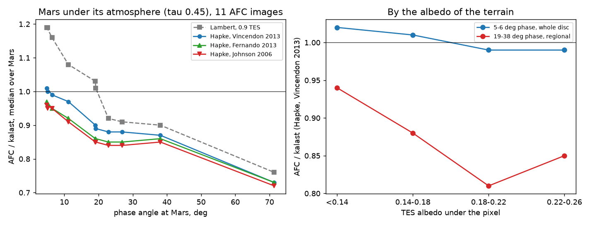
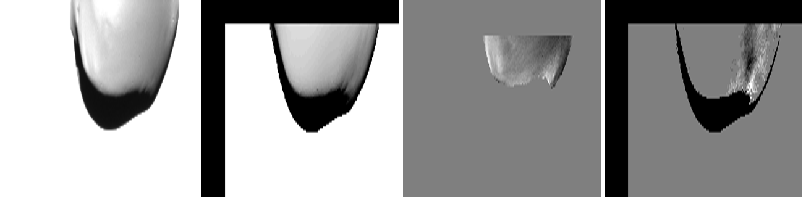

# 2026-10-08 — a Hapke law for Mars; the terminator; Deimos's albedo

Asked, after `2026-10-07_mars_atmosphere/`: a Hapke law for Mars's surface
(the phase trend left over); how to fix the terminator, 25-35 % too bright;
an albedo map for Deimos, so kalast shows the variation AFC sees on its
close images.

## The law

A literature search (the research of the day; full table with references in
this session's report) found no global Hapke fit of Mars's surface at 655 nm.
The sets nearest, all aerosol-corrected, Hapke 1993 (no porosity term), `c`
the backward fraction as kalast's:

| set | w | b | c | theta-bar | B0 | h | surge seen? |
|---|---|---|---|---|---|---|---|
| Vincendon et al. 2013, OMEGA + CRISM, global mean, 1.1 um | 0.85 | 0.12 | 0.60 | 17 deg | 1 | 0.05 | yes |
| Fernando et al. 2013, CRISM, Gusev, 750 nm | 0.70 | 0.19-0.27 | 0.54-0.66 | 14-16 deg | -- | -- | no |
| Johnson et al. 2006a, Pancam, Spirit's soil, 753 nm | 0.69 | 0.24 | 0.48 | 11 deg | 1 | 0.085 | in situ |

Vincendon 2013's shape, with `w = 0.70` for the red (CRISM's and HRSC's at
675-750 nm), is the one global set that constrains the opposition surge:

```python
app.simulation.bodies[0].scattering = Hapke(w=0.70, b=0.12, c=0.60, b0=1.0, h=0.05, theta_bar=17 * RPD, k=1.0)
mars.colors_from_map(0.9 / 0.2145 * tes)
```

A colour under a law scales the law's own brightness. TES's albedo is
Lambert's, seen through the dust (hence 0.9 under the atmosphere); 0.2145 is
this law's reflectance factor at nadir and 45 deg incidence, so a facet's
colour times the law gives TES's albedo where TES saw it. Under the
atmosphere the sky now lights the law's diffuse albedo, not the colour as an
albedo (`2026-10-08_sun_disc_every_shadow/`).

## On AFC

The same eleven images as yesterday, Mars under its dust (tau 0.45), TES
colours; AFC / kalast, median over Mars:

| UTC | phase | Lambert, 0.9 TES | Hapke, V13 | Hapke, F13 | Hapke, J06 |
|---|---|---|---|---|---|
| 06:20 | 5.1 | 1.19 | 1.00 | 0.96 | 0.95 |
| 09:20 | 4.9 | 1.19 | 1.01 | 0.97 | 0.96 |
| 10:50 | 6.4 | 1.16 | 0.99 | 0.95 | 0.95 |
| 11:41 | 11.2 | 1.08 | 0.97 | 0.92 | 0.91 |
| 12:08:31 | 19.1 | 1.03 | 0.90 | 0.86 | 0.85 |
| 12:15 | 22.9 | 0.92 | 0.88 | 0.85 | 0.84 |
| 12:21 | 26.9 | 0.91 | 0.88 | 0.85 | 0.84 |
| 12:31 | 38.1 | 0.90 | 0.87 | 0.86 | 0.85 |
| 12:45 | 71.4 | 0.76 | 0.73 | 0.73 | 0.72 |



- **The opposition surge is the law's.** At 5-6 deg, where Lambert was
  16-19 % short of AFC, Vincendon's set is within 1 %, and the pixel
  residual halves (0.18 to 0.09 of the mean, after a pixel's blur). The
  spread over every lit pixel narrows from 0.83-1.15 to 0.77-0.99 (16-84 %).
- **Left over, a trend with phase** that no set changes: from 1.00 at 5 deg
  to 0.87-0.90 at 19-38 and 0.73 at 71. The three sets agree to 4 %.

## The terminator is the phase angle

Within each image AFC / kalast is flat with incidence, to about 3 %: the
early images give 0.98-1.00 at `cos i < 0.2` as everywhere else on them, and
the 71 deg one 0.73 at the terminator and 0.72 beside it. The terminator's
25-35 % came from 12:45, the one image that has a terminator, too bright as a
whole. So there is no terminator to fix; there is the phase trend.

That trend depends on the terrain. Binned by TES's albedo under each pixel:
at 5-6 deg, 1.03 to 0.99 from dark to bright; at 19-38 deg, 0.92-0.96 on dark
terrain, 0.85-0.89 at 0.14-0.18, 0.75-0.85 at 0.18-0.22. Bright, dusty
terrain darkens with phase faster than any of these laws under this dust;
dark terrain about as they do. What it is cannot be told apart with this
day's images, which see the whole disc at low phase and regions at high
phase: the bright terrain's own phase function (a stronger back lobe), the
dust's phase function at scattering angles 110-160 deg (its back lobe is
nearly flat), TES's bolometric albedo against the 2025 red albedo of dusty
regions, or all three. A fit would need one region seen at two phases, or
the surface law fitted per albedo class jointly with the dust's back lobe.

## Deimos's albedo

AFC saw Deimos closest inbound, 12:05-12:08:49, at 80-230 m/px, the
longitude-180 side at low phase; after the closest approach AFC was on Mars.
The only per-facet albedo there is, SPC's (Gaskell; the SBMT's CSV for the
83 m model, one row per facet, in the OBJ's order), covers 63 % of Deimos:
91 % of longitudes 180-360, 39 % of 0-180, and 34-37 % of what AFC saw lit.
Its albedo varies little: median 0.068 (Thomas et al. 1996's normal
reflectance, 0.068 +- 0.007), 0.064-0.072 for 90 % of facets, 0.058-0.088 at
the ends.

At 12:08:49 (0.08 km/px, 2,560 lit pixels of Deimos, kalast shifted 12, 32
px to AFC by correlation), with SPC's albedo as relative colours (unknown:
1) against uniform:

| | uniform | SPC |
|---|---|---|
| spread of log(AFC / kalast) | 0.092 | 0.093 |
| fine-scale correlation with AFC | 0.79 | 0.78 |

SPC's albedo correlates 0.11 with what AFC / kalast leaves. The residual is a
gradient across Deimos, not spots:



So no map there is reproduces what AFC sees on Deimos. In order of promise:
Deimos's photometry first (the gradient: the law, or the shape's tilt at
this resolution); then a relative albedo from AFC's own inbound images --
projected onto the facets from the frames at 12:05-12:07 and tested on
12:08:31-12:08:49, the same side at the same phase, so a check of
consistency rather than an independent one; or Wargnier et al. 2025's
single-scattering-albedo map (5 deg bins, published as figures only: the
authors' data).

## Open

- Mars: the phase trend by terrain, as above.
- Deimos: the gradient, then an albedo map.
