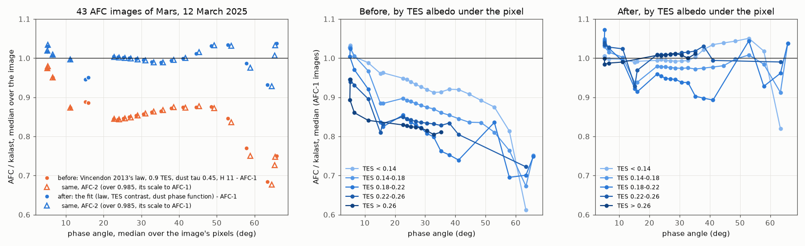
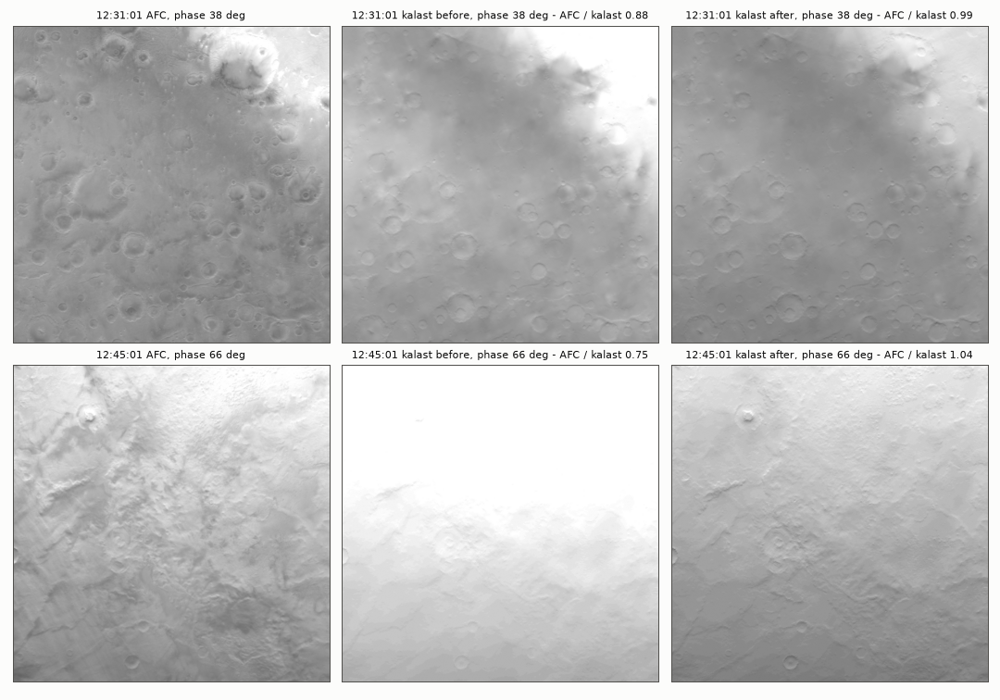
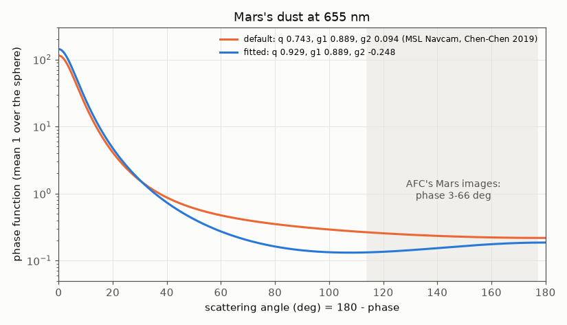

# 2026-10-08 — Mars's phase trend, fitted to AFC

Asked, after `2026-10-08_mars_hapke_terminator_deimos/`: under Vincendon et
al. (2013)'s Hapke law kalast's Mars was 10-13 % too bright at 19-38 deg of
phase and 27 % at 71, and two other published laws did the same. Can it be
fixed or improved?

Yes, with existing parameters: a fit of the law and of the dust's phase
function to AFC's images of the day brings every image to within 5 % at
phases of 5-66 deg, against 2-33 % before. No code change is needed.

## Data and method

- **43 AFC images**, 06:20-12:45: the eleven of the earlier notes, plus each
  one's AFC-2 twin 24 s later, and every 2 min from 12:15 to 12:45, both
  cameras. The image median phase runs from 5 to 66 deg (3-68 over pixels).
  12:47-12:51 look mostly past the terminator, and AFC registers too poorly
  against them to use.
- **Per pixel**, from kalast itself (`scratchpad`, frozen build):
  - the facet from `facet_id_map`, and its occlusion from `facet_shadow`;
  - geometry from the facet's centre and normal;
  - TES from `colors_from_map`.

  Each AFC image is registered to kalast's frame by shift and scale, then
  sampled per pixel after a 1 px blur. The shifts are up to 31 px (12:08), and
  AFC-1 and AFC-2 are offset in opposite directions; the scale is
  1.002-1.004. Kept: 40,000 pixels per image, lit (no occlusion), clear of
  Mars's edge, the image border and the moons.
- **kalast's shading in numpy**: `law_factor`, `air` and `fs_shaded`'s
  atmosphere block, written again. It agrees with `Hapke.reflectance` and
  `Atmosphere.iof` to within 6e-6, and with kalast's own frames to their
  8-bit rounding. Fits run in numpy, and the result is checked on kalast's
  renders.
- **Fit**: robust least squares on log(AFC / kalast). Each 10 deg band of phase
  weighs the same, and so does each image within a band.

## The earlier medians were biased high at low phase

The earlier table left out pixels that kalast's 8-bit frames saturated (I/F
over 0.22 at `exposure` 4.5): half the disc at 5 deg, the bright and central
half. Over every pixel, the same setup reads:

- 0.95-0.98 at 5-6 deg, rather than 0.99-1.01;
- 0.87 at 11 deg;
- 0.83-0.88 at 15-50 deg;
- 0.67-0.77 at 58-66 deg.

The trend is the one the earlier note described.

## AFC-2 reads 1.5 % under AFC-1

Every pair 24 s apart at 5-49 deg gives 0.985, from 0.981 to 0.988. This is not
a kalast setting: when comparing with AFC-2 frames, scale kalast by 0.985.

## What the fit needs

Weighted mean |log(AFC / kalast)|, 6,000 pixels per image:

| fit | free | cost | where it went |
|---|---|---|---|
| before | V13, 0.9 TES, dust tau 0.45, H 11 | 0.171 | |
| law alone | b, c, theta-bar, B0, h, TES scale and contrast | 0.076 | to the bounds: theta-bar 45, h 0.01, B0 3, w 0.2 when free |
| dust alone | V13 kept; tau, H, omega, g2, q, TES | 0.060 | omega 0.993, a narrow back spike (g2 -0.70, 0.6 %), tau 0.69 |
| both | law, TES, g2, q, tau, H | 0.058 | g2 -0.23, q 0.93, tau 0.40, H 10.3 |
| **chosen** | law (w 0.70, B0 at most 1), TES, g2, q; tau 0.36, H 8.7 set | 0.059 | below |
| law, TES, dust's depth, default phase function | | 0.069 | theta-bar 45, w 0.2, h 0.01 |

The surface law alone cannot do it, nor the dust alone. Both pieces are
needed: a backscattering surface, and a dust that scatters less light to the
side than its default phase function says.

**Recommended** (fit on every pixel, 1.72 M):

```python
# Mars, fitted to AFC's 43 Mars images of 12 March 2025 (phase 3-66 deg):
# Hapke under the dust; the dust more forward-scattering, with a small back
# lobe (g2 < 0), its depth held by Phobos's egress; TES's albedo with 0.75 of
# its contrast.
law = Hapke(w=0.70, b=0.141, c=1.0, b0=1.0, h=0.052, theta_bar=21.5 * RPD, k=1.0)
app.simulation.bodies[0].scattering = law
app.simulation.bodies[0].atmosphere = Atmosphere(tau=0.36, scale_height=8.7, g2=-0.248, q=0.929)
ref = numpy.pi * law.reflectance(numpy.cos(45 * RPD), 1.0, 45 * RPD)  # 0.2379
mars.colors_from_map(0.799 * (0.19 + 0.754 * (tes - 0.19)) / ref)
```

- **The dust.** The forward lobe keeps `g1 = 0.889` at 93 % of the light
  (0.743 before), and the rest is a backward lobe, `g2 = -0.25`. Its depth,
  0.36 with an 8.7 km scale height, matches Phobos's egress: the slant
  transmission at 25-45 km is within 3 % of the `tau 0.45, H 8` that fitted
  it (`2026-10-08_sun_disc_every_shadow/`). It is also near Perseverance's
  0.41 at Jezero. Photometry alone allows `tau` 0.32-0.52 with H 9-11.
- **The surface.** A single backward lobe (`c = 1`, `b = 0.14`), Vincendon's
  surge (`B0 = 1`, `h = 0.05`), roughness 21.5 deg.
- **TES.** TES's albedo enters with 0.75 of its contrast about 0.19, at
  0.89 x 0.9 of its level: AFC's red sees less contrast than TES's
  bolometric albedo does. Every fit gives 0.73-0.79.



## Before and after, kalast's own frames

`verify_render.py` renders with kalast itself (exposure 2.5, so nothing
saturates; point Sun, `msaa` 1, LOD off). Medians of AFC / kalast:

| UTC | cam | phase | before | after |
|---|---|---|---|---|
| 06:20:02 | 1 | 5.2 | 0.977 | 1.031 |
| 09:20:01 | 1 | 5.0 | 0.973 | 1.017 |
| 10:50:01 | 1 | 6.5 | 0.950 | 1.007 |
| 11:41:01 | 1 | 11.1 | 0.873 | 0.997 |
| 12:08:31 | 1 | 15.1 | 0.889 | 0.946 |
| 12:15:25 | 2 | 22.8 | 0.832 | 0.988 |
| 12:21:01 | 1 | 26.8 | 0.849 | 1.000 |
| 12:31:01 | 1 | 38.0 | 0.872 | 0.994 |
| 12:37:01 | 1 | 48.5 | 0.876 | 1.031 |
| 12:41:01 | 1 | 57.9 | 0.770 | 0.987 |
| 12:43:01 | 1 | 63.4 | 0.684 | 0.932 |
| 12:45:37 | 2 | 65.3 | 0.716 | 0.991 |

The phase here is the median over the image's pixels; the earlier notes used
the phase at Mars's centre, 71.4 deg for 12:45.

Pooled over all 43 images, AFC-2 scaled by 1/0.985:

| | median | 16-84 % | mean abs. log |
|---|---|---|---|
| before | 0.856 | 0.766-0.951 | 0.169 |
| after | 1.001 | 0.931-1.067 | 0.058 |

By phase band, the medians go from 0.97, 0.88, 0.85, 0.87, 0.84, 0.72 before
to 1.02, 0.98, 1.00, 1.00, 1.02, 1.00 after (bands 0-10, 10-20, 20-30, 30-45,
45-60 and 60-70 deg).

**By terrain.** At 19-38 deg, dark terrain read 0.92-0.94 and bright 0.82-0.84
before; after, 0.98-1.02 and 0.99-1.03. One class stays low: TES 0.18-0.22 at
29-41 deg, at 0.89-0.95. That is a few regions rather than the class.

**Within an image**, after the fit:
- Over most pixels, incidence changes the ratio by under 3 %. A few small
  groups at incidence over 50 deg differ by 5-8 %: the 12:08 images, and
  65-75 deg incidence at 45-60 deg phase. Before, the 5 deg images ran from
  0.92 at the disc's centre to 1.04 near the terminator.
- At 60-66 deg phase (12:43-12:45), incidence 75-90 deg reads 1.00-1.04. It
  was 0.71-0.74.



## What the data can and cannot tell apart

- **Robust.** The dust's lobe comes out the same in every fit that frees the
  dust: `q` 0.91-0.95, `g2` -0.19 to -0.35, with `g1` held. So do the TES
  contrast (0.73-0.79), the TES level (0.87-0.89) and the AFC-2 scale.
- **Held out.** Fitted on the images up to 45 deg alone, the law predicts
  0.90-1.03 at 45-66 deg (0.67-0.88 before).
- **Not separable.**
  - **The law's parameters one by one.** With TES fixed, quite different
    sets fit within 1.3 % of each other: w 0.93 with B0 3; w 0.2 with c 0;
    w 0.7 with b 0.14 and c 1.
  - **Roughness.** With every 1 deg cell's albedo free (1,530 cells seen
    under 10 deg and over 20 deg), the dust lobe stays (g2 -0.29 to -0.35,
    q 0.93-0.95), and so do b 0.14 and c 1. Roughness drifts from 22 to 8 deg
    while the cost changes by under 0.3 %, so these images do not constrain it.
  - **Dust depth.** `tau` against `H` comes from the egress, not from these
    images.
- **What the phase function is.** It is an effective one for kalast's
  two-stream model. In AFC's range of scattering angles, 114-177 deg, it is
  17-50 % under the Navcam fit, with more light in the forward peak. It is
  not a retrieval of the dust's phase function.



## Open

- **The limb at low phase.** Seen at 78-84 deg of emission, AFC / kalast is
  0.91-0.95 after the fit (0.93-0.97 before): kalast's limb is 5-9 % too
  bright. The fit's weights have few pixels there.
- **Regional residuals.** Relative to the recommended TES mapping, each
  cell's own factor spreads over 0.94-1.05 for 16-84 % of cells, and
  0.80-1.13 for 95 %. TES is 20 years old, and AFC's red is not its band.
  Two images stand out:
  - 12:08, the closest images, read 0.95;
  - at 12:43, Hellas's dark rim reads 0.82.

  An albedo map of Mars from AFC's low-phase images (the cell factors above,
  per facet) would take these up.
- **The moons and their shadows**: untouched.
