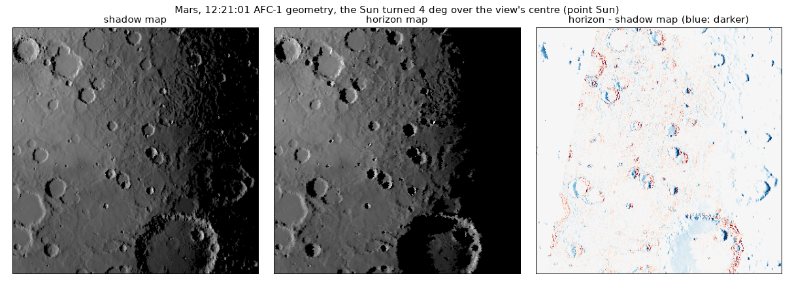
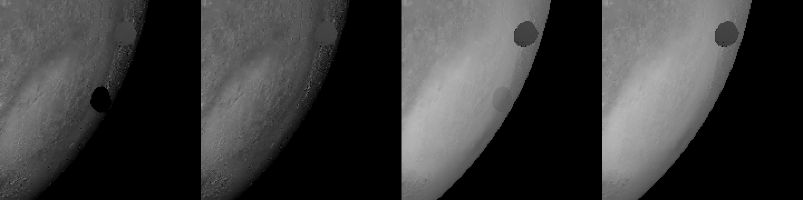

# 2026-10-08 — the Sun's disc in a pass of its own; horizon maps

Asked, after `2026-10-08_sun_disc_every_shadow/`: the compute pass for the
penumbra pixels it named as the next speed-up ("ok go"), and Mars's horizon
map ("do the mars horizon map"). And, during the work: is it normal that
Phobos's shadow on Mars at about 09:16 is hidden by Mars's atmosphere?

## The disc in a pass of its own (`pass::penumbra`)

Before, everything was in the main pass's fragment stage: the pyramid's look
round every lit pixel (`sun_reach`), and for the few in a penumbra, the walk
along 32 directions one after another (`sun_hidden`). On Didymos from 1 km
with Dimorphos's shadow across it (the user's first view of iteration 702,
1999 x 1096, MSAA 4), GPU span p10 31 ms against 5 with a point Sun; split
with a switch: the pyramid 1 ms, the look round 5.5 ms, the walks 18.

Now, before the main pass:

1. **A prepass** draws the bodies again, single-sampled, writing each pixel's
   surface (normal, shadow layer) and depth, nothing else (`fs_penumbra`).
2. **A scan**, compute, per pixel: its place from the depth through the
   camera's inverse, the look round, and a walk queued where one is needed,
   a place in the queue per workgroup (`cs_scan`).
3. **The walks**, compute, an invocation per receiver and direction: a
   receiver's 32 directions side by side on one SIMD group (`cs_walk`).
4. **The main pass** reads its pixel's code where the prepass saw its
   surface -- the same depth, to twice its change over a pixel -- or a
   neighbouring pixel's that did, and takes the hard lookup where none did.

On the way:

- **Queued from the prepass's fragments**, the first version: a fragment
  stage that writes to memory is run for hidden fragments too, and it queued
  270,000 walks for the 50,000 pixels that needed one, past the queue's room.
  The prepass writes only its attachments now, and the queue is the scan's.
- **The main pass walking where the prepass saw another surface** -- every
  pixel of Didymos's limb and of Dimorphos's edge, 1,600 of them, 344 walking
  -- cost 13 ms: each held a SIMD group. A neighbour's code instead, a pixel
  away, and the hard lookup past that.
- **The prepass's depth stored**, not discarded: the scan reads it. Discarded,
  the penumbra came out hard along Dimorphos's shadow.

| Didymos, iteration 702, view 1 (span p10) | |
|---|---|
| point Sun | 4.7 ms |
| the disc, before | 30.5 ms |
| the disc, now | 11.6 ms |
| of which the prepass and scan | 2.6 ms |
| of which the walks | 2.8 ms |

The image: 705 of 2.2M pixels differ from the walk in the fragment stage, by
14 at most -- edge pixels taking a neighbour's answer. AFC 12:08:31 (MSAA 1)
is the same to the bit. `test_penumbra.py`, `test_penumbra_self.py`,
`test_atmosphere_shadow.py` give the same numbers. `sim.gpu_timings()` has
`"penumbra"`, the HUD `{gpu_penumbra}`.

At AFC's closest frame the disc cost as much as before (span p10 9.1 against
8.7 ms): Mars has few penumbrae there, and the prepass draws its 12.9M facets
again. That is what the horizon map takes away (below).

## Horizon maps (`body.horizon_map`, `app::horizon`)

Per facet, the sine of how high the terrain rises in 32 azimuths (snorm16, two
to a word, 64 bytes a facet: 825 MB for Mars's 12.9M). Worked out on the GPU
(`shaders/horizon.wgsl`) from the mesh itself:

- **Radius grids**, longitude by latitude: a coarse one over the body (half a
  typical facet, at most 5760 x 2880, 1/16 deg) and a fine one over where its
  facets are smaller than two coarse cells, as fine as 64M cells allow
  (Mars: 10612 x 5143, 0.02 deg, 1.2 km). Each facet writes the cells whose
  direction from the centre meets it, at the radius it meets it, clamped to
  its corners' (a direction just past a steep facet's edge met its plane far
  off: horizons of 90 deg); a fill takes the few cells left.
- **The march**, from each facet's centre on the grids' surface, both ways
  along the great circle in each azimuth: the fine grid within 64 fine cells,
  then the coarse; steps of half a cell, growing 4 % of the distance, at most
  two coarse cells; until the highest radius within reach of that 4 deg cell
  could no longer be seen above what was. Elevations by the half angle, so a
  metre over thousands of km does not cancel away in f32.
- **In Morton order**: invocations side by side take neighbouring facets in
  the same azimuth, so a SIMD group reads one stretch of the grids. By facet
  (16 lanes, 16 ways) the march took 55 s; in the mesh's own facet order,
  which is not where the facets are, 139 s; along a Morton curve, 6 s.
- Mars: 7.8 s (1.3 s on the CPU), the highest horizon 65 deg.

In the shading (`horizon_seen`): the Sun's elevation and azimuth in the
frame the map was made in (up the radius, east along the spin axis cross it),
the horizon between the two azimuths about the Sun's, and with the Sun a disc,
the limb-darkened disc's light above that line, tilted by the horizon's slope
there (`disc_above`). The body is not drawn into its own layer; with nothing
else in it the layer is empty, the body's fragments skip the map lookups and
the penumbra prepass skips it. The per-facet shadow query takes the horizon
too (`facet_shadow.wgsl`).

**The read per pixel.** At first the main pass got 2 ms slower at 12:08:31:
a read per pixel from 825 MB in the mesh's facet order, which is not the
image's. A grid of the highest horizon per quarter degree (4 MB, each cell's
taken over the reach of the widest facet) is read first, and where the Sun
stands above it -- most of a lit planet -- the facet's horizons are not.

| Mars, AFC-1, 1020 x 1020, LOD on, M1 Pro (span p10) | shadow map | horizon map |
|---|---|---|
| 12:08:31, point Sun | 4.7 ms | 2.8 ms |
| 12:08:31, the disc | 8.9 ms | 4.2 ms |
| 12:45, the terminator in view, point Sun | 7.0 ms | 4.5 ms |
| 12:45, the disc | 12.2 ms | 5.9 ms |
| 06:20, the whole disc 350 px, point Sun | 1.2 ms | 0.8 ms |

### Against rays

**A test sphere** (`tests/test_horizon_map.py`): radius 100, hills and craters
1.5-3.5 high about +x, 81,920 facets; the Sun 1.5-12 deg over them from three
ways; for each sunward facet nearby a ray from its centre to the Sun on the
mesh is the truth, against `sim.facet_shadow`:

| | wrongly lit | wrongly dark |
|---|---|---|
| shadow map | 2.04 % | 0.00 % |
| horizon map | 0.67 % | 0.03 % |

With the Sun a disc of 0.005 rad, 4 deg high, rays to 64 points of it, over
200 facets either calls a penumbra: the horizon map 70 % within 0.05 of the
rays (mean +0.04), the shadow map's walk 40 % (+0.08).

**Mars**, the 12:21:01 view with the Sun turned 4 deg over its centre: of
565,512 sunward facets in view the two disagree on 14,182 (2.5 %). Rays on
the 12.9M-facet mesh, 150 of those: the horizon map right on 146, the shadow
map on 4 -- it lit what is in shadow. On 60 where they agree, both right.

The shadow map's misses are its bias, which lifts a lookup off the surface
and lights what is dark, most where the Sun grazes. The horizon map's are
its 32 azimuths: a hill narrower than the 11 deg between two of them, seen
between them, is missed (on the test sphere, two sub-rays per azimuth with
their maximum took 146 wrongly lit to 44 and 6 wrongly dark to 97: kept at
one). A shadow's edge is a facet's, lit or not as its centre is -- at AFC a
facet is about a pixel. The march's step hardly matters: growing 2 % instead
of 4, 146 to 140.

**Tried and dropped**: a pyramid of highest radii to pass over stretches of
the march lower than what was seen. Near a facet the terrain is seldom that
much lower, and the test cost what it saved: 22 s, then 7.4 with it tried
only far out, against 6.5 without.

### What it is for, and not

For a body each direction from whose centre crosses its surface once, in its
own frame, z its spin axis; an overhang is said on the console. Not with
`shadows.per_body = False`, where the body is in the one layer anyway. Worked
out each time it is turned on (a cache on disk would take 825 MB).

## Phobos's shadow under Mars's dust, 09:16

At 09:16 the line from the Sun through Phobos meets Mars at 76 E, 55 S: the
Sun 14 deg over the horizon there, Hera seeing it 15 deg over (phase 4.4 deg),
Phobos 8,078 km away. With Phobos ten times its size, its umbra on bare Mars
is black against 50 around; under the dust (tau 0.45), 109 against 122, 9 %
deep.

kalast's shadow takes the direct beam from the surface and nothing else. At
that geometry the dust's own light is 74 % of the pixel (I/F 0.074 of 0.100),
and the beam the ground gets is a third of its bare value: hence 9 %. What is
missing: at 4.4 deg of phase Hera looks nearly down the shadow's column, so
the dust along the line of sight is in Phobos's shadow too, and its once-
scattered light -- 0.040 of the 0.074 -- would be gone, the sky over the
shadow dimmer besides. Phobos x10's shadow would be some 50 % deep; the real
Phobos's, which hides at most a fifth of the Sun from 8,000 km, about 10 %
instead of kalast's 3 %.

## Open

- The dust in a shadow's column: the once-scattered light along the line of
  sight where the shadow map says it is shadowed, a few lookups per pixel of
  a body with an atmosphere. Offered.
- Horizon maps: 32 azimuths miss narrow hills seen between two; more azimuths
  at 8 bits each with a range per facet would cost the same memory.
- A body with a horizon map still builds the pyramid of its empty layer.
