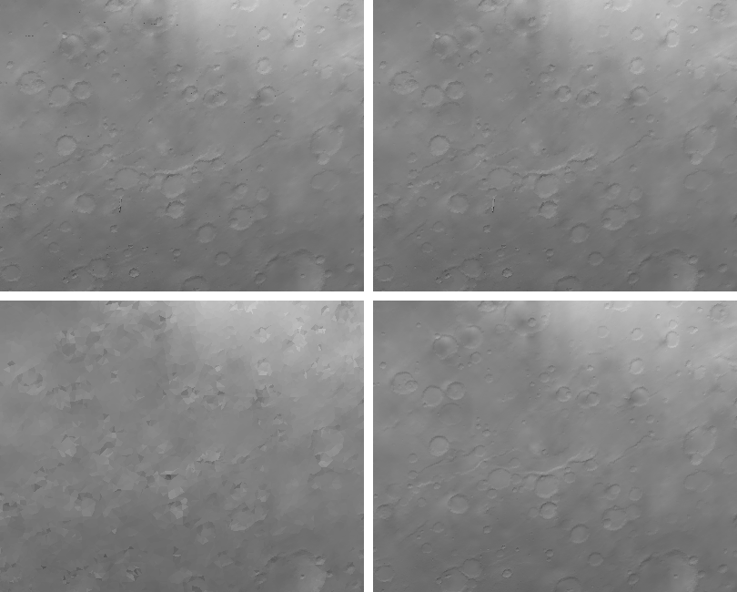
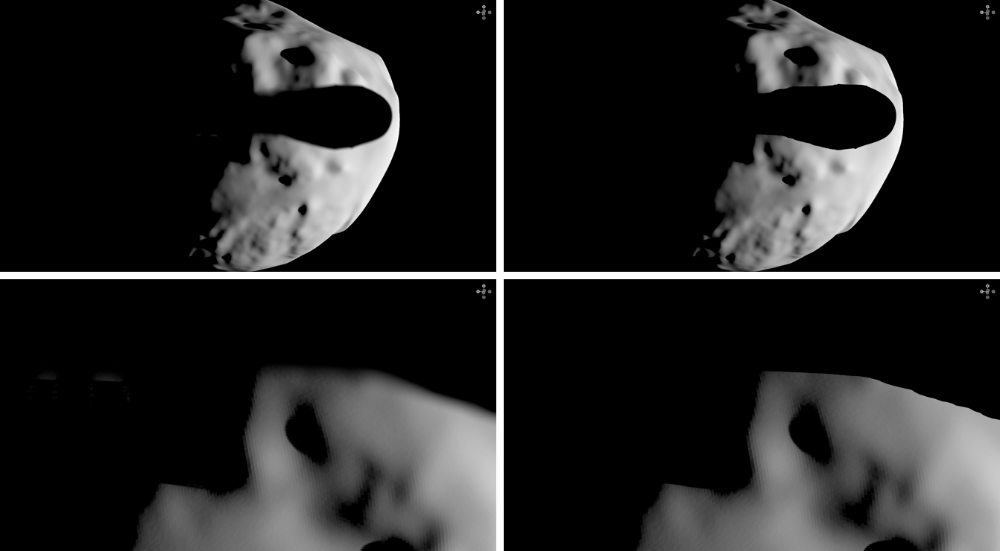
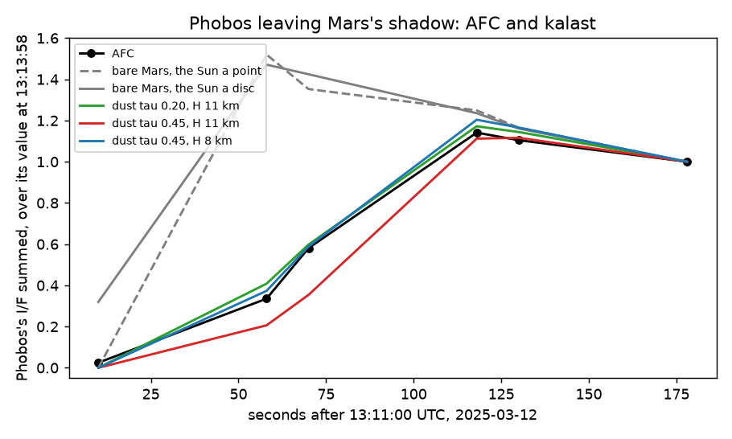

# 2026-10-08 — the Sun's disc for every shadow; LOD skirts; a planet's shadow through its air

Asked, after yesterday's work:

- LOD drew black dots over Mars at `lod_pixels = 2`, and at higher values
  black streaks and wedges; on Didymos, dashed black lines along the
  patches' edges.
- With the Sun a disc, Dimorphos's shadow on Didymos softened but the body's
  own shadows did not, and where the two overlapped they did not merge.
- The Sun a point by default, the disc by `light.sun_as_point = False`
  rather than by typing its radius.
- Phobos leaving Mars's shadow a minute before AFC sees it: make kalast's
  shadow match AFC's.
- Horizon maps for the terrain's own shadows, if faster at the same physics.

## LOD: the dots were skirts in shadow

A skirt hangs below the outline of each patch, to fill the gap left where
two neighbours were simplified differently. It was coloured and lit as the
facet above it, but its fragments looked the shadow map up at their own
position, under the surface, which every shadow map has dark. Each skirt
vertex now knows the outline vertex it hangs from (`Lod::skirt_top`), and the
vertex stage lights it as that vertex: a storage read for skirt vertices
only, `skirt_base` in the per-draw immediates (8 bytes now).

At AFC 12:08:45: 75 dark dots on Mars with LOD, 15 now, 13 without LOD (dark
features of the mesh itself). The two extra are a thin triangle standing on
edge, one bright column and one dark. At `lod_pixels = 8` the dark wedge and
streaks are gone; what is left there is a coarse cut, a triangle 8 px across
showing one facet's colour and normal. Didymos at 8: no dashed lines.

Also found: the per-facet shadow query (`shadows.access_shadow_map`)
dispatched one workgroup per 64 facets in one row, past wgpu's 65,535 on
more than 4.2M facets, and stopped the app on the 12.9M-facet Mars. Rows now
(`dispatch_2d`, as the TPM's).

## `light.sun_as_point`

`True` by default; `False` makes the Sun a disc of `light.sun_radius`,
695,700 by default, the Sun's in km. `afc.py` sets `sun_as_point = False`.

## A penumbra for every shadow

Percentage-closer soft shadows, yesterday's, took one depth for all the
occluders under the disc and extrapolated the receiver's plane to every tap.
At grazing light both failed: Dimorphos's shadow on Didymos kept a grey
umbra (median 5 of 255, up to 15), and light leaked behind ridges near the
terminator. So a body's own shadows had been left hard. Replaced, in
`mesh_shadow.wgsl` (`sun_reach`, `sun_hidden`, `sun_seen`):

1. **The sheet model.** A ray toward a point of the disc tilted by `t` in
   direction `a` moves `t` across for each unit it climbs. A shadow-map
   texel `u` away along `a` and `dz` in front is taken as a thin sheet at its
   depth: the ray crosses that depth `t dz` across, so the texel hides tilts
   `(u - w/2)/dz` to `(u + w/2)/dz`. Two samples in a row no more than twice
   as far in front of the receiver as each other are one surface, and the
   tilts between their bands are hidden too (a ray between would go through
   it). Over relief the bands join into a horizon; beside a body floating in
   front -- a moon -- they leave the rays that pass it. Treating the map as
   solid from each texel back, the first try, blacked out every antumbra.
2. **The union, exactly.** The disc is cut along each of 32 directions into
   32 rings of a 32nd of its light each, limb-darkened (linear, 0.56); a ring
   hidden by any texel, of any body, is one bit. Overlapping shadows hide
   what either hides.
3. **The receiver's plane** is not an occluder (a texel must stand above it);
   its own horizon is analytic, a tilt of one over its rise.
4. **Where to walk.** A depth pyramid of the shadow layers (`DepthPyramid`,
   `shaders/depth_pyramid.wgsl`): the nearest and farthest depth per block
   of `4 * 2^m` texels, built after the shadow pass. Per pixel, from the
   layer's nearest depth, then 3 x 3 blocks the reach's size twice and 5 x 5
   of half that: what reaches the receiver (a block counts only if it is
   nearer the receiver than its own reach), the umbra (everything in reach in
   front, one surface: 0 at once), or nothing (the hard lookup).
5. **The walk** is hierarchical: blocks up to a quarter of the way out, an
   empty one passed over (its nearest depth behind the plane's farthest
   corner), a full one hiding its band at once (its farthest in front of the
   plane's nearest), one with an edge in it looked into, texels at the
   bottom. A fixed step of the reach over 24, first written, passed over
   Phobos's own relief when Mars, thousands of km in front, made the reach
   hundreds of texels: Phobos came out 25-43 % too bright leaving Mars's
   shadow. Blocks tested against the wrong corner of the plane leaked too.

| test | rms | worst |
|---|---|---|
| sphere 0.01 rad over a plate, Sun 0.02 (antumbra), `test_penumbra.py` | 0.35 % | 1.1 % |
| a wall's own shadow on its plate, `test_penumbra_self.py` | 0.54 % | 2.1 % |
| a ball's antumbra across the wall's penumbra, same | 1.13 % | 4.7 % |

The references cast rays through the limb-darkened disc against the shapes
themselves. Every umbra reads 0. Didymos at iteration 702: the band of
Dimorphos's shadow is black (63,678 of 64,000 sampled pixels 0, the rest its
edge) and soft-edged, and the ridges' own shadows have their penumbrae.

**What the map cannot see.** It holds what the Sun sees first. A body partly
hidden from the Sun behind another, which still hides part of the disc from
a surface, is missed there: a ball on the line from the wall's shadow edge
to the Sun gives 3-5 % too much light across the overlap. The test puts it
0.15 aside.

**Cost** (M1 Pro, GPU p10, another kalast window and other apps running; each
pair run back to back):

| scene | point | disc |
|---|---|---|
| AFC 12:08:31, closest approach, span | 8.2 ms | 13.5 ms |
| Didymos 702, the user's first view, span | 8.9 ms | 37.5 ms |

The pyramid reads every layer whole each frame: 2-4 ms here for three
4096-texel layers. The walk is bound by each step waiting on its read;
about Dimorphos's shadow 11 % of Didymos's lit pixels walk. Tried: the
pyramid by gathers (no gain); four reads issued at once (slower); the four
pixels of a quad sharing the directions through subgroups (1.6 times faster,
twice the error: backed out); a finer last pre-check (kept, same time). Next,
if the disc is to be fast: the penumbra pixels walked in a compute pass of
their own.

## A planet's shadow on its moons: its ellipsoid and its air

A body with an atmosphere -- the first two -- casts into no other body's
shadow layer. Its shadow on another is computed from its IAU ellipsoid and
its dust (`through_air`): along each of 16 points of the limb-darkened disc
(its centre, for a point Sun) the ray passes the body `z` above the
ellipsoid; under it, stopped; over it, through the slant optical depth
`tau exp(-z / H) sqrt(2 pi r / H)` (Chapman's function at 90 deg). Phobos's
layer, widened to hold Mars's penumbra of twice Phobos's size, had halved
its texels and doubled its bias, and Phobos's crescent came out 5 % too
bright after the egress. With one layer for the scene (`shadows.per_body =
False`) the map stops the rays under the limb and the dust dims the rest.
`tests/test_atmosphere_shadow.py`: a plate behind a planet, within 0.2 % of
the formula (point Sun) and 0.8 % of the disc's mean, 0 under the limb, and
the shadow map's again with the atmosphere taken off.

**AFC.** Phobos's I/F summed about it, over its value at 13:13:58:

| UTC | AFC | bare Mars | dust 0.45, H 11 | 0.45, H 8 | 0.20, H 11 |
|---|---|---|---|---|---|
| 13:11:10 | 0.02 | 0.32 | 0.00 | 0.00 | 0.00 |
| 13:11:58 | 0.34 | 1.47 | 0.21 | 0.37 | 0.41 |
| 13:12:10 | 0.58 | 1.42 | 0.35 | 0.59 | 0.60 |
| 13:12:58 | 1.14 | 1.23 | 1.11 | 1.20 | 1.17 |

The bare planet lets Phobos out a minute early; yesterday's dust, tau 0.45
at the surface with an 11 km scale height, 15-20 s late. The egress measures
the slant opacity some 25-45 km over the limb, and it wants about half that
model's: an 8 km scale height at tau 0.45, or tau 0.2 at 11 km -- dust held
lower than the gas, as in a clear season. Not changed in the defaults: the
same dust sets the limb's brightness, which yesterday's fit of the disc
needs, so the two want fitting together. After the egress kalast's Phobos is
25-30 % short of AFC's, its photometry at these phases, as before.

## Under a law, the sky lights the law's albedo

The atmosphere's sky light and the light exchanged with the surroundings took
a facet's colour as its Lambert albedo. Under `body.scattering` the colour is
a scale on the law's own brightness -- 4 for Mars under Hapke -- so those
terms were 4 times too bright. They now take the colour times the law's
albedo for a diffuse sky (`Law::diffuse_albedo`: the bihemispherical albedo
by quadrature over the law itself, cached per body; Lambert's is 1). Hapke's
closed form for it, `bond_albedo`, is 16 % over at `w = 0.1`, where the
quadrature agrees with single scattering, `w (2/3)(1 - ln 2) H^2`.

## Horizon maps

At AFC's closest frame the shadow pass is the larger part of the frame (p10
5-7.5 ms against 3-3.8 ms for the shading, the two overlapping on the GPU),
and nearly all of it is Mars drawing its own layer: Mars with an atmosphere
no longer draws into the moons' layers, and the time did not move, since it
was not between the Sun and either at 12:08. A horizon per facet, computed
once, would replace that layer: Mars's would hold only the moons. The costs:

- **Accuracy.** The Sun's disc is 0.35 deg across from Mars, 0.5 from
  Didymos. The horizon has to be known to a fraction of that in every
  direction the Sun's azimuth takes; between sampled azimuths it is
  interpolated, and a crater rim's changes by degrees across 11 deg (32
  azimuths). The shadow edge moves accordingly near the terminator.
- **Memory.** 12.9M facets x 32 azimuths x 2 bytes = 825 MB (1 byte, 0.7 deg
  steps: too coarse for the disc).
- **Resolution.** One horizon per facet: shadow edges at facet size. At AFC,
  a facet is a pixel; on Didymos at 200 m a facet is 8 pixels, and its
  shadows would step.

The walk above gives the physics horizon maps were wanted for -- penumbrae
on a body's own shadows, overlaps merged -- from the shadow map, at its
resolution, with nothing precomputed. Horizon maps stay worth a prototype
for speed on a body seen at about a pixel per facet: Mars's, checked against
the shadow map on the eleven AFC images before anything is kept.

## Open

- The disc's cost (a compute pass for the penumbra pixels); a shadow map
  sees only the first surface.
- The dust at the limb against the limb's brightness, fitted together.
- The per-facet shadow query is still the point Sun's.
- Horizon maps, as above.
