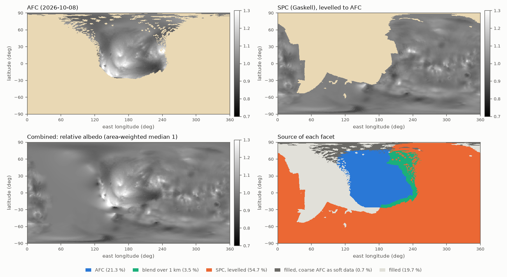

# 2026-10-09 — one albedo map of Deimos, from AFC and SPC

Asked: combine the new AFC albedo map of Deimos
(`2026-10-08_deimos_afc_photometry/`) and Gaskell's SPC albedo into one map
to update with.

## Inputs

Both per facet of `deimos_g_083m_spc_obj_0000n00000_v002.obj` (196,608
facets, 521.5 km²), in its order:

- **AFC**: `deimos_afc_albedo.npy` and `.csv` from that note, median 1,
  42,660 facets (26.1 % of Deimos). The finest pixel each facet was seen at
  splits cleanly, with nothing in between: 40,459 facets at 0.086-0.110
  km/px, seen in the six close frames (median 13 frames), and 2,201 at
  0.20-0.89 km/px, in the far frames only (median 4), 82 % of them north of
  60 N.
- **SPC**: the `Albedo` column of `deimos_g_083m_spc_obj_0000n00000_v002.csv`
  (0.058-0.088), 124,012 facets (62.5 %), with a gap at 50-230 E north of
  about 30 S. Its rows are the OBJ's facets: its X, Y, Z are their centroids
  to 2e-16 km.

| facets with | facets | area | in the map |
|---|---|---|---|
| close-frame AFC and SPC | 13,606 | 7.8 % | AFC 7,483, blend 6,123 |
| close-frame AFC, no SPC | 26,853 | 17.0 % | AFC |
| far-frame AFC and SPC | 938 | 0.5 % | SPC |
| far-frame AFC, no SPC | 1,263 | 0.7 % | fill, pulled toward AFC |
| SPC only | 109,468 | 54.2 % | SPC |
| neither | 44,480 | 19.7 % | fill |

The edge of SPC's gap runs through AFC's core, at 195-210 E: the overlap is
a band 50 deg wide, not a strip along the border.

## Method

1. **AFC where it is reliable**: where it was seen in the close frames
   (finest pixel 0.15 km/px or better; any cut from 0.11 to 0.20 gives the
   same). Facets seen only in the far frames give way to SPC where it has a
   value. The frame count adds nothing: 90 % of the 343 close-frame facets
   seen in fewer than 5 frames lie within two rings of the close-frame
   region's edge.
2. **SPC on AFC's scale**: SPC divided by its own area-weighted median, times
   k = 0.9716, the ratio of AFC's median to SPC's over the 13,606 facets with
   both. A level, not a fit (below).
3. **Blend**: on the facets with both, SPC's share is
   σ = (1 − a) b / (a + (1 − a) b), with a = s(d₁ / 1 km) and
   b = s(d₂ / 1 km), s the smoothstep, d₁ the distance to the nearest facet
   where SPC is used alone, d₂ to the nearest facet without SPC, both
   geodesic over the facets' adjacency. SPC takes over at the border with
   SPC-only facets and gives way next to facets without SPC, and AFC is
   untouched from 1 km inside.
4. **Fill**: what is left, by the Laplacian over the adjacency (what iterated
   neighbour averaging converges to), bounded by the map around it.
   Far-frame AFC facets without SPC pull the fill toward their value, with a
   tenth of an edge's weight: they keep it to 0.7 % rms (5 % at most).
5. **Median 1**: divided by the area-weighted median, 0.9759.

**Level or fit**: AFC against each, over the 13,606 facets with both
(correlation 0.53):

| SPC on AFC's scale | rms of AFC minus it |
|---|---|
| level: 0.9716 SPC | 0.0708 |
| linear fit: −0.118 + 1.101 SPC | 0.0697 |
| SPC as it is | 0.0718 |
| contrast matched: slope 2.07, AFC's spread over SPC's | 0.0803 |
| a constant, AFC's median | 0.0832 |

The fit gains 1.6 %: either way SPC predicts about a quarter of AFC's
variance there. Its slope would raise SPC's contrast by 13 % and carry its
offset onto the 55 % of Deimos where SPC is used alone, for nothing
measurable. The level keeps SPC's own contrast. Matching AFC's contrast,
twice SPC's, does worse than both: AFC's extra contrast is not SPC's pattern
amplified.

## The map



AFC and SPC are drawn on the combined map's scale, divided by 0.9759 like it.

| in the map | facets | area |
|---|---|---|
| AFC, as it is | 34,336 | 21.3 % (111.1 km²) |
| blend | 6,123 | 3.5 % (18.2 km²) |
| SPC, levelled | 110,406 | 54.7 % (285.5 km²) |
| fill, pulled toward far-frame AFC | 1,263 | 0.7 % (3.9 km²) |
| fill | 44,480 | 19.7 % (102.8 km²) |

The fill covers 20.5 % of Deimos, mostly 50-130 E north of 30 S, the rest
south of AFC and near the north pole. Area-weighted median 1, by facet
0.9993, area-weighted mean 1.012; range 0.78-1.52, p1-p99 0.906-1.222.

## Checks

- **AFC kept**: 34,336 facets equal AFC ÷ 0.9759 (to 6e-8 in float32): the
  close-frame facets without SPC (26,853), and those with it 1 km or more
  from SPC-only facets (7,483).
- **No new extremes**: each blended facet lies between its AFC and SPC
  values, the fill between the values around it. The map's range is AFC's.
- **No seam**: how much neighbouring facets differ.

  | | edges | median | p99 |
  |---|---|---|---|
  | inside AFC | 50,827 | 0.0036 | 0.029 |
  | inside SPC | 164,529 | 0.0015 | 0.015 |
  | inside the blend | 8,444 | 0.0032 | 0.024 |
  | blend - SPC | 1,151 | 0.0018 | 0.020 |
  | blend - AFC | 329 | 0.0032 | 0.021 |
  | fill - the rest | 2,025 | 0.0009 | 0.023 |

  The far-frame AFC facets meet SPC along 50 edges at 0.0014 (at most
  0.0067); kept as they are, they would step by 0.009 (0.023). Five edges
  join close-frame AFC without SPC directly to SPC-only facets, with nothing
  to blend: 0.009, at most 0.019.
- **The TIFF**: kalast's `colors_from_map` on the 83 m model gives the array
  back to 1 % on 99.7 % of the facets (rms 0.16 %, correlation 0.9995). The
  AFC note's TIFF, read the same way: 99.2 % (0.28 %). Each pixel holds the
  facet its direction from the centre meets, every ray meeting exactly one;
  the AFC TIFF took the nearest facet centre, a different facet for 16 % of
  the pixels.
- **Order**: kalast loads the facets in the OBJ's order (centres to 7e-7 km).

## The Hapke law

The law of 2026-10-08, `Hapke(w=0.0929, b=0.275, c=1.0, b0=1.154, h=0.0500,
theta_bar=19.4 * RPD, k=1.21)`, was fitted with AFC's map on the facets AFC
saw. On those facets this map is AFC's divided by 0.9759: exactly on 34,336
of the 42,660, and at the median over all of them. Their I/F stays the same
with **w = 0.0907**: within 0.02 % over AFC's geometries (phase 2.5-17.5 deg,
incidence and emission up to 72 deg, kalast's own `Hapke`); w × 0.9759 rounds
to 0.0907 too. On the blend and the far-frame facets under SPC, 7,061
facets, the map differs from AFC's by 5-6 % rms around a median of
0.99-1.00, and on the far-frame facets in the fill by 0.7 %. The law was not
refitted for that.

## Files

- `deimos_albedo_combined.npy`: float32, one value per facet of
  `deimos_g_083m_spc_obj_0000n00000_v002.obj`, in its order, no NaN.
- `deimos_albedo_combined.tif`: float32, simple cylindrical, 0.5 deg per
  pixel, first row 90 N, columns east from -180, for `colors_from_map` on any
  Deimos mesh.
- `deimos_albedo_combined.png`: the figure above.

In `afc.py`, Deimos being `bodies[1]`:

```python
# Deimos: the opposition surge fitted to AFC-1's inbound frames (notes/2026-10-08_deimos_afc_photometry/), w rescaled
# for the AFC + SPC albedo map (notes/2026-10-09_deimos_albedo_combined/); b, c, theta_bar, k Wargnier et al. (2025)'s.
deimos = app.simulation.bodies[1]
deimos.scattering = Hapke(w=0.0907, b=0.275, c=1.0, b0=1.154, h=0.0500, theta_bar=19.4 * RPD, k=1.21)
albedo = numpy.load("notes/2026-10-09_deimos_albedo_combined/deimos_albedo_combined.npy")  # path from the repo root
deimos.mesh.colors[:] = albedo[:, None]
deimos.mesh.update_gpu_colors()
```

On another Deimos mesh, the TIFF instead of the last three lines:

```python
deimos.mesh.colors_from_map(numpy.asarray(Image.open("notes/2026-10-09_deimos_albedo_combined/deimos_albedo_combined.tif")))
```

## Caveats

- **Two contrasts.** AFC's hemisphere has twice SPC's contrast (0.082
  against 0.040 rms over the overlap). The level keeps SPC's.
- **SPC's level comes from the overlap**, 195-255 E. AFC's own median moves
  by ±4 % across its hemisphere (0.95-1.04 in bands of 30-50 deg of
  longitude), and along its border with SPC it is 2-3.5 % brighter than SPC
  levelled. The blend spreads that over 1 km.
- **No SPC to the west and south-west.** AFC runs to its edge there (its west
  edge at 105-130 E, and its south edge west of 180 E), and the fill carries
  its outermost facets on, among them the darkest of the map (0.78 at 155 E,
  26 S) and a dark patch at 125 E, 16 N. The fill is an interpolation, with
  no detail, over a fifth of Deimos.

## Open

- Refit w, B0 and h on AFC's frames with this map.
