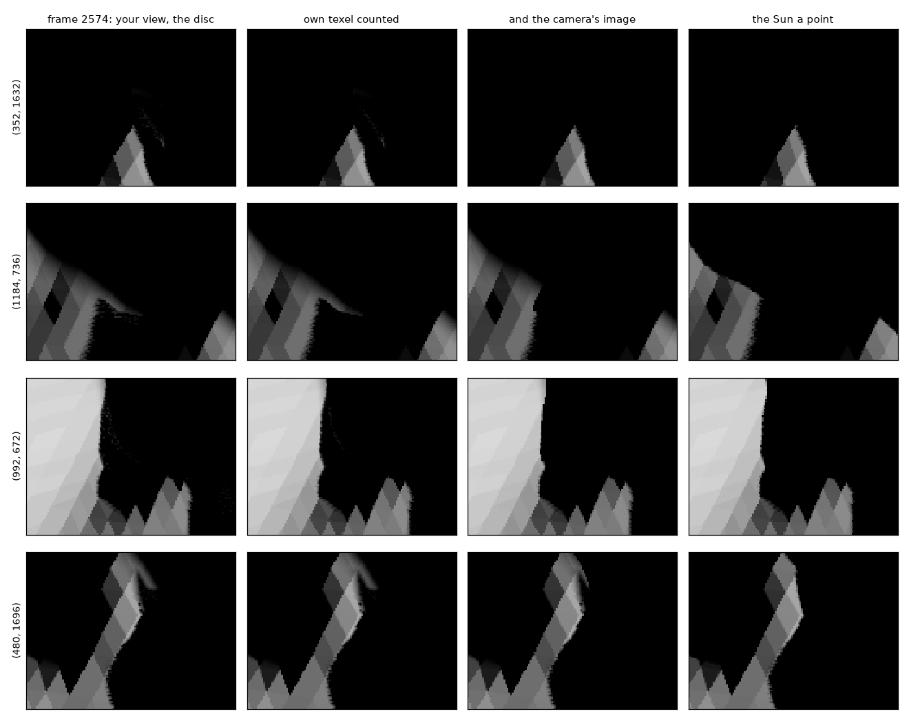

# 2026-10-09 — gaps in the disc's shadows behind relief the Sun cannot see

Asked, after `2026-10-09_near_shadow_layer/`: "am i using the latest kalast
build? it doesnt seem you fixed it" (frames 2574-2575, camera
`pos=[-0.2535386, -1.1693418, 0.20004359]`, "it 0"), then "i do see the
option second depth but idk it does almost nothing, sun_as_point=False keeps
showing gap in shadow as shown on my screenshot". With permission, for this
once, to read the running kalast window to reproduce it.

## Reproducing the frame

Three things the script alone did not give, read from the window:

- **The field of view.** The UI showed the image pinned at 3234 x 1774 in a
  smaller viewport: the camera's `viewport_scale` (image height over window
  height, 0.8213) narrows the view, tan(fovy/2) times it, about fovy x 0.827
  in a script, where a pinned image has scale 1.
- **The settings**: `shadows.resolution = 16384`, `second_depth` and
  `near_layer` on.
- **The iteration.** The UI's "iteration 0" frame shows iteration 1's poses,
  et0 + 60 s.

With those, 98.7 % of the frame's pixels the same.

## What the gaps are

Thin lit structures inside shadows that a point Sun keeps dark: 291 pixels of
the frame lit where the point Sun's image is dark 4 px all round, in shapes
less than half a 7 x 7 window wide. At the ones traced, the hard lookup 0,
the walk 0.1-0.4 of the disc, rays from the surface to the limb-darkened disc
on the full mesh 0.

- **Both depth layers held far relief** in the receiver's own texel: ridges
  12-16 m off toward the Sun, penumbrae 3.5-8 texels wide.
- **What stops the rays is near**: a bump a centimetre or two above the ray
  to the Sun's centre, 0.1-2 m from the receiver, at a grazing Sun -- a third
  surface along the Sun's ray, in neither layer.
- A blocker at distance d hides the disc only within d tan(theta) of the
  ray to its centre: under a texel (0.75 cm) out to 1.6 m. So only the
  receiver's own texel could have held it, and that texel held the far ridge.
  The walk saw the ridge's edges let part of the disc through, and lit the
  pixel.

**The rays' offset.** Rays started 1 cm off the surface, as in the earlier
notes, gave 13 of 40 such pixels 0.12-1.0 of the disc; started 1 mm off, all
0. The blockers rise 1-2 cm above the ray, and a 1 cm start passes over them.
The numbers below are against rays from 1 mm.

## Two changes

1. **The receiver's own texel** (`sun_walk`): the first surface there, if in
   front, hides the part of the disc that each direction crosses before it
   leaves the texel. Before, a direction's walk started at the next texel.
   291 thin structures to 208.
2. **The camera's image** (`near_blocked`, in the penumbra pass's scan): 6 of
   7 of those blockers were seen by the camera, within 1.5-2.4 cm of where the
   rays met them. For each pixel queued for a walk, the ray to the Sun's
   centre is stepped out to where a blocker's penumbra would be two texels
   wide (3.7 m at 16384 on this view), 32 steps closer together near the
   receiver, each found in the image by the prepass's depth.
   - Where a step goes behind the surface the camera sees, the stretch since
     the last step is gone over a pixel at a time to the first point behind.
   - The ray is stopped if that surface is not in front of the pixel's
     stretch of ray by more than two pixels (`NEAR_THICK`): the ray went
     into it. The pixel is then in umbra.
   - A surface well in front is something the ray passed behind, a rock
     between the camera and the ground, and is passed over.

   The first version, 24 steps and a surface within 4 pixels of the step,
   took 208 to 137. Steps 7-16 pixels apart in the image went from in front
   of a slope to 6-16 pixels inside it, and missed. Going over the stretch
   between them took it to 101.

**Against rays**, 100 pixels of the frame:

| | n | disc - rays | the walk alone | point Sun - rays |
|---|---|---|---|---|
| changed by the camera's image | 40 | -0.002 (rms 0.011) | +0.190 (0.253) | +0.066 (0.196) |
| still thin and lit | 30 | +0.043 (0.067) | +0.075 (0.098) | -0.022 (0.050) |
| penumbrae, unchanged | 30 | the same before and after | | |

The camera's image only darkens: 1,743 pixels of 5.7M changed, none brighter.

**Cost**: none measured on this view. The penumbra pass took a median
29.35 ms with the test against 29.46 without, 110 frames each in alternating
blocks, with the user's kalast drawing on the same GPU (hence the size).

**The second depth layer still counts.** The same frame with
`second_depth` off: 163 thin structures and 5,121 pixels lit within the
point Sun's shadow, against 101 and 3,264 with it on.

## What remains

- **Far relief at a grazing Sun.** 10-16 m off with the Sun 2.5-6.5 deg over
  the ground, the disc gives 0.07-0.27 where rays give 0.01-0.18 from 1 mm
  and 0.07-0.26 from 1 cm. That is within the spread the offset gives, a real
  penumbra: the soft fringe below lit patches where the point Sun's edge is
  hard.
- **A ray that only grazes the ground** 2.3 m out (pixel (488, 1664)): it
  passes the surface the camera sees within a tenth of a pixel, the steps 7
  pixels apart in the image there, and dips under it between two. The disc
  gives 0.1-0.2 where rays give 0: a small lit tip on the shadow's edge, the
  last row of the figure.
- **Relief the camera does not see**, or off the image, is still missed. The
  second depth layer takes one more surface of it.

## Test

`tests/test_penumbra_hidden.py`, all of it one body:

- a plate, with a ridge 1 high on half its width;
- the Sun 25 deg over it, angular radius 0.005;
- a bar 0.1 thick, 20 up the Sun's rays, whose penumbral stripe crosses the
  ridge's umbra on one side and open ground on the other;
- seen from beside the plate, toward the ridge's shaded side.

The map holds the bar where the ground's rays cross the ridge. Without the
camera's image the stripe across the umbra was lit to 95 of 200; with it,
black. On open ground the stripe is the bar's penumbra: its mean within
0.3 % of rays past the bar, its darkest pixel 0.18 against the rays' 0.19.
Pixel by pixel it is moved toward the ridge by about a fifth of its width,
as the point Sun's shadow of the bar is, by the lookup's offset off the
ground. All 33 tests pass.

## Rays that graze the ground

Asked next ("ok do"). A step of the march in front of the surface the camera
sees, but within a pixel of it (`NEAR_CLOSE`), now has the stretch since the
last step gone over a pixel at a time too, as a step that went behind it has
(`near_refine`): a ray that only skims the ground can dip under it between
two steps 7 pixels apart. On frame 2574 (at `pcf = 0`, as it was drawn): 137
pixels changed, all darker, 103 by more than 20 levels; the thin lit
structures 101 to 98.

## Open

- Relief the camera cannot see, three surfaces deep along the Sun's ray.
