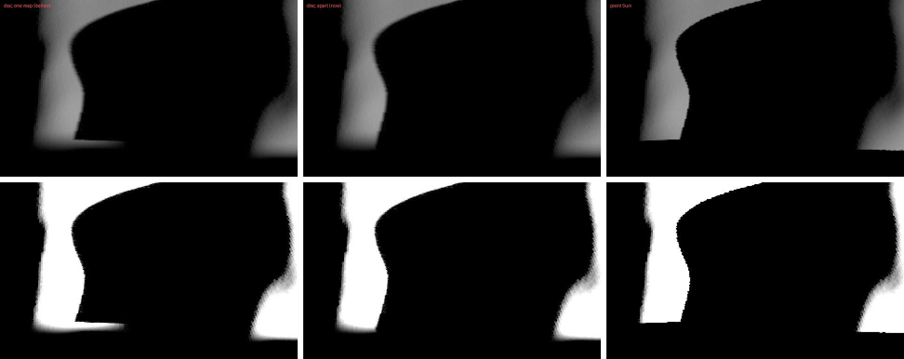
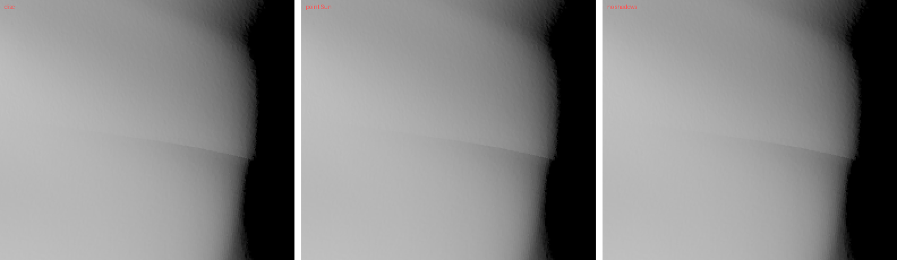
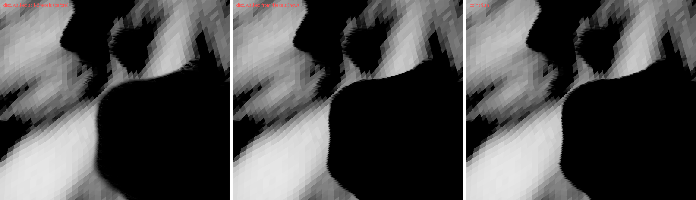

# 2026-10-09 — a body's own shadows and another's, apart, with the Sun a disc; penumbrae the map cannot place

Asked: "you dont seem to have fixed shadows merging between self and mutual
with sun penumbra" -- `examples/didymos/main.py`, iteration 707, from
`pos=[-1.2454287, -0.11119447, 0.48537666]`. And from
`pos=[0.8763693, -0.5550074, 0.913999]`, the same iteration: "i also see an
artefact".

## The lit line

With the Sun a disc, a thin lit line ran along the edge of Dimorphos's shadow
where it crosses Didymos's own: about 50 px into Didymos's shadow, up to a
third of the light, where the point Sun has it black.

A shadow map holds what the Sun sees first. There, in the inner half of
Dimorphos's penumbra, the map held Dimorphos, and the ridge of Didymos that
shades the ground lay behind it, out of the map. The walk (`sun_hidden`) saw
Dimorphos's texels hide the middle of the disc and nothing hide its rim: the
rim Dimorphos leaves was lit, though the ridge hides it. The point Sun was
right, its one ray stopped by either. `2026-10-08_sun_disc_every_shadow/`
had this as what the map cannot see, and `test_penumbra_self.py` put its ball
0.15 off the line where it showed.

## Slices apart

With the Sun a disc, a layer whose body and another body both cast into it
keeps them apart: the body in the layer's slice, the others in a slice of
their own after the layers, with the layer's matrix and cuts
(`Window::shadow_others`, `light.apart`, `others_slice`):

- **The walk**, along each of the 32 directions, walks both slices into one
  mask of the disc's rings (`sun_walk`): a ring hidden in either is hidden.
- **The look round** (`sun_reaches`), per slice: the umbra in either is 0; a
  slice with no penumbra in reach answers by its hard lookup, times what the
  walked one leaves; neither, the two hard lookups.
- **The hard lookup** (`sun_lookup`): lit where both are.
- **The per-facet query** reads both, the nearer depth (`facet_shadow.wgsl`):
  Didymos's 3,145,728 facets at iteration 707 come out the same to the bit as
  with one map.

Only with the Sun a disc, per body, and while both cast; the point Sun, one
body, or a body with a horizon map keep one slice. The array grows by the
slices wanted and is not shrunk, as for the layers.

**The view.** 715 pixels change, all where Dimorphos's band meets Didymos's
own shadow, 709 darker; the line is gone, both shadows keep their penumbrae.

**The test.** `test_penumbra_self.py` puts the ball on the line too, half
behind the wall's top as the Sun sees it. Past the shadow's edge, where that
half hides what the wall does not:

| | mean | rms |
|---|---|---|
| one map | +2.67 % | 2.96 % |
| apart | +1.06 % | 1.79 % |

The new check fails on the build of yesterday. The worst pixel, 5.0 %, is the
hard edge's in both: the lookup's normal offset moves both shadows by part of
a pixel there, and the two add. The ball 0.15 aside gives what it gave.

**Cost.** M1 Pro, with another kalast window drawing; eight pairs back to
back, the slices apart and not, in one build:

| GPU p10, median of pairwise differences | shadow | penumbra | render | span |
|---|---|---|---|---|
| iteration 707, the user's view | +0.27 | +0.62 | +0.63 | +1.22 ms |
| iteration 702, view 1 | +0.30 | +0.55 | +0.82 | +0.88 ms |

The slice's store, its pyramid, the scan's second look round, the walks of
two slices, the second lookup. Memory: a slice, `resolution^2 x 4` bytes,
67 MB at 4096, and its pyramid, 11 MB, per layer with another body in it.

**Still missed:** two other bodies one behind the other as the Sun sees them,
which share the others' slice, and a body's own overhang.

## The other line: Didymos's shape model

From the second view, a line across Didymos at about 36 S, from 172 W to
178 E: as much with the point Sun, and with shadows off, the pixels the same.

It is the seam between two of the six faces of `g_01165mm_spc_didy_v003`'s
cube-sphere grid (Gaskell's ICQ, 6 x 512^2 x 2 = 3,145,728 facets): the facet
indices under it jump from about 2.7M to 0.65M, and the facets' normals turn
1-4 deg in one step (tilt from the radius 9.4 to 11.5 deg at one column, 14.4
to 16.1 at another), 2-4 % in the shading. In the model, not in kalast.

## Penumbrae narrower than the map can place

Asked next, two close views ("see difference penumbra or not, a lot of
detached shadows"), `out/frames/002568-002571.png`: with the disc, shadows
that meet with a point Sun had lit gaps between them and thin lit lines
along their edges. The views are of Dimorphos, from 37 m (the shadows
matched iteration 684; the frames' field of view is about 1.2 times
narrower than the default).

**Rays.** For 24 pixels in the gaps and lines, from the surface point under
each (`facet_pick`) to 512 points of the limb-darkened disc against
Dimorphos's 3.1M facets: 0-5 % of the disc seen, where kalast gave 3-42 %.
On 23 of the 24, what stops the rays is in the map: the Sun sees its face
first. So not the slices' matter above, and the build of yesterday, which
walked in the main pass, gives the same values: the walk.

**The map's scale.** The view reaches far across Dimorphos, and the map,
fitted to what the camera sees of it, spans 124 m: texels 3 cm. The
boulders' penumbrae are 4 cm (10 m from their shadows, at 1.16 AU), and
every walked pixel of the view walked 1-3 texels. Each texel then stands for
half the disc's radius or more, and which texel a junction of two occluders
falls in decides the answer. The shadow map's resolution against rays, 56
pixels (32 walked, at random, and the 24):

| texel | reach | walk rms (random / gaps) | hard lookup rms (random / gaps) |
|---|---|---|---|
| 3 cm (4096) | 2 | 0.234 / 0.174 | 0.239 / 0.019 |
| 1.5 cm (8192) | 3.4 | 0.180 / 0.087 | 0.170 / 0.019 |
| 0.75 cm (16384) | 7 | 0.080 / 0.050 | 0.122 / 0.019 |

By the reach, the three resolutions pooled (168): under 4 texels the walk is
7-9 % too bright on average and no closer to the rays than the hard lookup
(rms 0.17-0.18 against 0.14-0.18); from 4 texels it is (0.05-0.08 against
0.09-0.15). Didymos at iteration 707, texels 10 cm, its own penumbrae all
walked at 1-4 texels: walk 0.171, hard lookup 0.175. A filter of the hard
lookup the reach wide was tried: better on Didymos (0.105), worse on
Dimorphos (0.300), and leaking at the gaps as the walk did.

**So the walk is taken from four texels (`WALK_MIN_REACH`)**; narrower, the
hard lookup answers, as with a point Sun. The gaps and lines are gone, the
two views' shadows are the point Sun's, and the tests give what they gave
(their penumbrae are 12-90 texels). A close view wants a finer map for its
penumbrae: at 16384 this one has them, within 0.08 of the rays.

## Open

- The cost: the second lookup skipped where the scan found nothing of the
  others in reach; a smaller map for the others, whose penumbrae are wide.
- Close views: a map fitted to where the camera looks closest (cascades),
  for penumbrae of a few cm without 16384 texels over the whole view.
