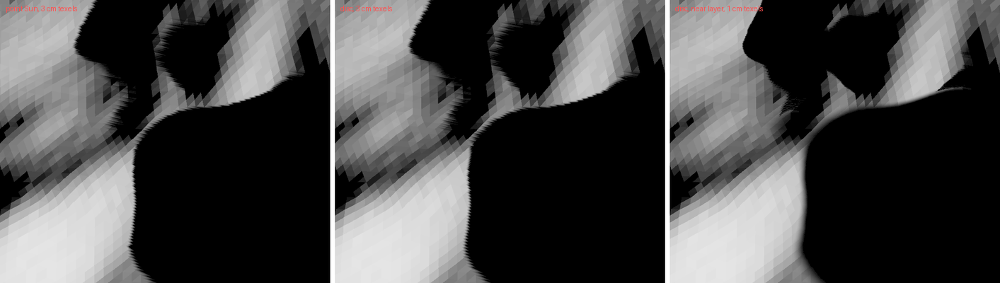
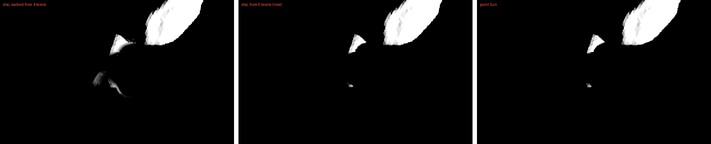

# 2026-10-09 — a near shadow layer for a body seen up close; slivers at the terminator

Asked: "yes do the finer map near the camera", after
`2026-10-09_disc_shadows_apart/`: on Dimorphos from 37 m the map's texels were
3 cm against 4 cm penumbrae, too coarse for the Sun's disc, and the open item
there was a map fitted to where the camera looks closest.

## Why the layer was coarse

A body drawn by its cut has its layer fitted to the spheres of the patches
the camera draws (`fit_light_to_spheres`). From close to the surface those
reach to the horizon and behind the nearest hills: on that view, 42 patches
spanning 124 m as the Sun sees them, while everything in the image lies within
40 m of each other. The pixels there are 1 cm.

## The near layer (`shadows.near_layer`)

Per body, a second layer after the bodies' own (`Window::update`,
`LayerPlan`, `near_fit`):

- **Its fit**: the drawn patches whose distance from the camera is within a
  few times the nearest one's -- 1.5, 2, 3, 4, 6 or 8 times, the farthest that
  keeps its texels half the image's pixel at the nearest patch
  (`NEAR_TEXEL_PIXELS`), the nearest if none does. Wanted only when the
  body's own layer is at least twice as coarse as that, and kept only if it
  is at least twice as fine as the body's own.
- **The rest as for any layer**: its casters, widened for the penumbrae its
  casters can throw into it, its own cuts of every large mesh, its own bias,
  the body and the other bodies apart with the disc. Its casters are cut at
  the far side of what it was fitted to, as the body's layer is at the far
  side of what the camera sees.
- **Which layer a point uses** (`shadow_layer_at`): the near one if inside
  what it was fitted to -- not in the widening round it, which holds the
  penumbrae reaching in and which a walk from nearer the edge would run
  past -- and no farther from the Sun than it, past which its casters are left
  out; else the body's own. The penumbra prepass and the main pass both choose
  by it, so a walk is in the layer its pixel reads. The instance carries the
  layer, the inner fraction and the depth (`InstanceInput::with_near`, three
  words that were padding).
- **Only** with a perspective camera, per-body layers, the body drawn by its
  cut, no horizon map, no per-facet reading of the maps (the per-facet query
  reads the body's own layer, camera-free), and up to the eight layers in
  all.

## Dimorphos from 37 m

The near layer came out at 0.98 cm (the nearest patches 24 m off, 20 of the
42), and every pixel of the view used it. Against rays from the surface point
under each pixel to the limb-darkened disc, the same 56 pixels as in
`2026-10-09_disc_shadows_apart/` (32 walked at random, 24 in the gaps):

| | texel | disc rms (random / gaps) | hard lookup rms (random / gaps) |
|---|---|---|---|
| 4096, no near layer | 3.0 cm | 0.242 / 0.111 | 0.239 / 0.019 |
| 4096, near layer | 0.98 cm | 0.116 / 0.059 | 0.109 / 0.019 |
| 16384, no near layer | 0.75 cm | 0.080 / 0.050 | 0.122 / 0.019 |

At 4096 the near layer comes close to a whole map at 16384, which takes 1 GB
a slice. With it the penumbrae are 5 texels wide (reach median 5.3) and were
walked; the big shadow's edge moves by about one and a half coarse texels,
which was the coarse layer's bias. (These with the walk from four texels; from
six, below, 0.137 and 0.019.)

**Cost**, the same view at 3303 x 1774, five pairs back to back, GPU p10:

| | shadow | penumbra | render | span |
|---|---|---|---|---|
| point Sun | 1.09 to 2.11 | -- | 2.67 to 2.71 | 3.04 to 3.40 ms |
| disc | 1.07 to 2.12 | 5.53 to 7.81 | 7.72 to 9.29 | 10.10 to 12.87 ms |

With the disc most of it is the walks: penumbrae that were drawn hard at
3 cm are walked at 1 cm. Memory: a slice, 67 MB at 4096.

**Not wanted** from 95 m off the same terrain (the user's view of frames
2570-2573): the nearest patches 95 m away, the body's layer 3.8 cm against
3.5 cm pixels, and a near layer would have been 2.5 cm, under twice as fine.

## Test

`tests/test_near_layer.py`: a plate 200 wide of 524,288 facets and a wall on
it, a body of its own, the Sun a point at 25 deg; the camera over the line
the wall's shadow ends on, 13 from it, the plate reaching the horizon behind.
Across that line, the middle row: with the near layer half light within
0.1 px of the line and 1.6 px from nine tenths to a tenth; without, 0.9 px
off and 3.0 px wide. From 80 above, no near layer: the image the same to the
bit. The wall had first been part of the plate's mesh: simplified with it
far from the camera, it became a tent over the plate with a shadow tens of
units wide.

## On the way

- The comparisons were first run on frames exported before the
  level-of-detail trees were built (80 frames, under the trees' two seconds),
  so with the whole meshes and a layer fitted to all of Dimorphos: near
  layer on and off came out the same to the bit. Repeated with ten seconds
  to settle; the 4096 numbers without the near layer then agree with those
  of `2026-10-09_disc_shadows_apart/`.
- The first selection took a point by where it falls across the Sun's view
  alone; points behind the near region as the Sun sees it took it too, with
  its casters there left out. The depth is checked now.

## Slivers near the terminator

Asked next ("i still see the self shadows a lot detached on dimorphos using
penumbra", frames 2572-2573, then "what do you mean you can't reproduce the
lines? i have highlighted in red the areas where shadows mismatch", camera
`pos=[-0.34695894, -1.1920483, 0.22689459]`, "mismatch between sun as point
True/False, iteration 0"): thin lit curves in the dark near Dimorphos's
terminator with the disc, none with a point. I had tried the camera of
frames 2570-2571 at iteration 684, which matched the frames' shadows to 82 %
and showed none; the user's camera at iteration 0, its field of view 0.8 of
the default (the frames' own pose was not quite this one either), showed them.

Sixteen pixels of the brightest, traced as before (rays from the surface
point to the disc against Dimorphos's facets):

- **The walk, not the passes**: the penumbra pass's answer is the main pass's
  own walk to 0.01; the hard lookup is 0 at all of them. Texels 3.4 cm, the
  penumbrae walked at 4.0-4.4 texels: the walk gave 0.03-0.31 of the disc,
  the rays 0-0.2, mostly 0.
- **At 16384** (0.86 cm, the same penumbrae 17 texels wide) most come within
  0.06 of the rays; four do not: 0.05-0.17 where the rays give 0.
- **Those four are hidden from the Sun**: classing every ray's blockers by
  how many sunlit faces lie in front of them as the Sun sees it, a single
  map holds none of what stops their rays -- the disc fully seen through it
  at some -- and a second depth layer, the nearest surface behind the first,
  holds all of it.

So two changes:

1. **The walk from six texels** (`WALK_MIN_REACH`, was four): at 4.0-4.4 the
   walk is further from the rays than the hard lookup (rms 0.10 against 0.06
   on the sixteen). In the user's view, disc-lit pixels with the point Sun's
   shadow two pixels round them went from 516 to 14. The near layer above
   then walks less too: on Dimorphos from 37 m most of its penumbrae are
   five texels; against rays the disc 0.137 rms (random), 0.019 in the gaps,
   the hard lookup 0.109 and 0.019.
2. **A second depth layer, opt-in** (`shadows.second_depth`): the shadow pass
   again per layer, keeping what is behind the layer's first surface
   (`fs_peel` in `shadow.wgsl`), its slices after the others', walked beside
   the first (`peel_slice`). At 16384 it takes the four to 0 (0.167, 0.074,
   0.028, 0.017 before). Off by default: the pass drops fragments one by one,
   so the GPU cannot hide them first, and it cost 5.2 ms of shadow pass and
   6.6 of frame on Dimorphos from 37 m, 2.0 on the user's view (the GPU
   shared); and with penumbrae under six texels drawn hard, at 4096 it
   changed nothing there (the same 14 pixels) and on the 56 of the view from
   37 m, 0.137 to 0.129.

Without the near layer, a few pixels of the view from 37 m stay lit under the
disc (0.26-0.42) and dark under a point: not walked, the hard lookup in the
disc's layer, widened for its penumbrae and so on another grid of 3 cm
texels, against rocks a metre off. With the near layer they are dark.

## Open

- The seam between the near layer and the body's own, where a view has both
  near and far ground: not blended.
- Three surfaces one behind the other, as the Sun sees them, even with the
  second depth layer. Where the third is near the ground it shades and the
  camera sees it, the penumbra pass finds it in the image:
  `2026-10-09_disc_gaps_hidden_relief/`.
