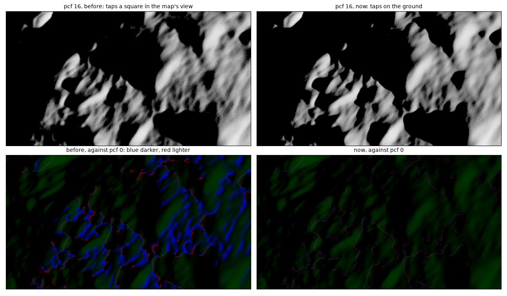
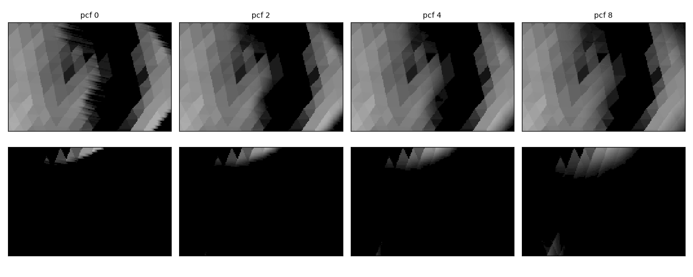

# 2026-10-09 — PCF on the ground; its default 2, `second_depth` on

Asked: "if i turn PCF too high, close to 16, it like creates artificial wrong
dark shading on every facets, even those without shadows, edges of facet
becomes darker like a wrong ambiant occlusion ... Can you fix it so i can use
it? I would like to have a default of PCF=4 or 2". And whether `sun_as_point`
should be off and `second_depth` on by default, `second_depth` following
`!sun_as_point` when the Sun is switched.

## What PCF did

`examples/didymos/main.py` at iteration 1, the user's view of frame 2574
(68 m from Dimorphos), a point Sun, 3234 x 1774, linear output, against the
image with the shadow test off. Over the pixels lit at pcf 0 and more than
12 px from any pixel it shades, the part each radius darkened:

| 16384 | mean | darkened > 5 % | > 20 % | darkness centroid moved | darkness integral |
|---|---|---|---|---|---|
| pcf 2 | 0.23 % | 1.7 % | 0.06 % | 4 px | x 1.006 |
| pcf 4 | 1.18 % | 7.6 % | 1.2 % | 19 px | x 1.026 |
| pcf 8 | 4.4 % | 22 % | 8 % | 65 px | x 1.085 |
| pcf 16 | 11.8 % | 45 % | 25 % | 156 px | x 1.208 |

- **By the Sun's height**: at pcf 4, ground at cos(incidence) under 0.1 lost
  5.2 % on average, over 0.7 0.04 %; at pcf 16, 18-21 % and 3 %.
- **Not the level of detail**: with `shading.lod` off, worse (pcf 16: 15.9 %
  mean, 55 % of the pixels).

The kernel was a square of texels in the shadow map's view, each tap compared
against the receiver's plane extended to it. A texel across the map's view is
`1 / sin(elevation)` texels along the ground, so at a low Sun sixteen reach
over a metre along it, where the relief rises above the plane and is taken
for an occluder: hollows and the far sides of facets' edges came out dark.

## Now

The taps lie on the receiver's own plane, a texel apart along it: across the
light, and up the plane's slope toward it (`SunAt::across`, `up`, worked out
by the layer's projection of a texel's step, without subtracting two
projected positions). A kernel then reaches as far along the ground whatever
the Sun's height. With the plane alone, the hollows between facets still
counted (pcf 16 at 16384: 1.1 % mean, 7 % of the pixels darkened by over
5 %), so a tap takes the surface it finds for the receiver's own if it is no
nearer the Sun than ground rising 0.25 per unit out would be (`PCF_RELIEF`,
14 deg; as depth, `0.25 r texel / cos(incidence)`, the cosine held at 0.05 or
more).

| relief allowance | 16384, pcf 16: darkened > 5 % | 4096, pcf 16, beyond the blur: darkened / shadow lit > 5 % |
|---|---|---|
| 0 | 7.0 % | |
| 0.1 | 0.40 % | 5.0 % / 0.08 % |
| 0.25 | 0.04 % | 1.4 % / 1.0 % |

At pcf 2 and 4 nothing is darkened at either resolution, the centroid moves
under a pixel, and no pixel deep in a shadow is lit.

The stairs of a 4096 map up close are smoothed as before:

## Cost

The image's pass on that view, a point Sun at 4096, medians of alternating
blocks (the user's kalast drawing on the same GPU):

| | pcf 0 | pcf 2 | pcf 4 |
|---|---|---|---|
| the old kernel | 3.0 ms | 11.3 ms | 26.8 ms |
| taps two texels apart, early exit | | 4.05 ms | 5.06 ms |
| a texel apart, early exit (kept) | 3.0 ms | 4.5 ms | 7.4 ms |

- **The early exit**: the four corners and the middle first; where they
  agree, wholly lit or wholly dark, the rest are skipped.
- **Two texels apart** used a third of the taps, each the hardware's 2x2
  comparison, but taps off the texels' grid do not tile and left ripples
  across the edges, streaks along the light, with or without the early exit.
  Dropped.

## Defaults

- `shadows.pcf = 2` (was 0): smooths the stairs where the map's texels are
  larger than the image's pixels, for 1.4 ms on a 5.7 Mpx image.
- `shadows.second_depth = True` (was False). It only acts with the Sun a disc
  (the peel is drawn only then, `Window::update`), so it already follows
  `!sun_as_point` as asked, without being switched with it: a user's own
  choice survives switching the Sun. The settings show it only while the Sun
  is a disc -- `:when:` in `tools/gen_config_panel.py` now takes a field of
  another group, `light.sun_as_point == false`.
- `light.sun_as_point` stays `True`. The TPM runs inside the render loop
  (`examples/hera_didymos/tpm_phase2.py`) and reads the per-facet query,
  which is hard whatever the Sun; the disc would add its penumbra pass, the
  other bodies' slices and, now, the second depth layer to every step, for
  nothing the TPM sees -- Didymos from 1 km 13 ms a frame against 5, before
  the second layer's 2-7. What would justify the disc by default: the
  per-facet query taking the disc's penumbrae too.

## Tests

- `tests/test_pcf_relief.py`, new: wavy ground, slopes of at most 11 deg,
  under a Sun 20 deg high, which hides the Sun from no point. At pcf 4 and 8
  nothing darkened (mean 0.00 %); with the old kernel, run through a
  temporary switch, pcf 4 darkened 0.5 % of the pixels by over 5 % and pcf 8
  35 %, mean 5.7 %.
- `tests/test_pcf_filters.py` (the crater, pcf 4 against 0): centroid 0.02 %
  of the width, integral -1.2 %.
- `tests/test_facet_shadow.py`: the per-facet query the same at pcf 4 and 8.
- `tests/test_near_layer.py` pins pcf 0: it measures the map's edge, and at
  the new default it came out at 1.9 px of its 2.
- All 34 tests pass.
