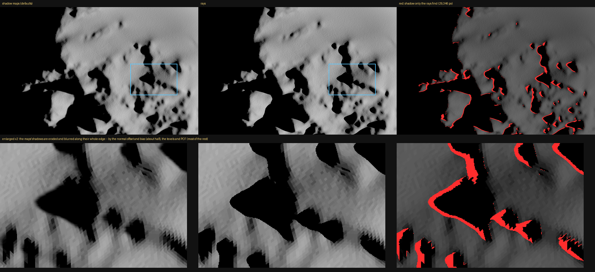

# Ray-traced shadows: the thermophysical model's and the image's (`shadows.rays`)

The handoff of 9 October (`2026-10-09_HANDOFF_ray_tracing.md`), on the home
PC: RTX 5080, driver 610.88, Windows 11. Step 1 traces the per-facet query
the thermophysical model reads (`sim.facet_shadow`); step 2, further down,
the image.

## What the platform gives, here

A probe of wgpu 30.0.1's adapters on this machine:

| Backend | Adapter | `EXPERIMENTAL_RAY_QUERY` |
|---|---|---|
| Vulkan | RTX 5080 | yes |
| Vulkan | AMD Radeon (integrated) | yes |
| DX12 | RTX 5080, AMD | **no** -- no DXC, the default compiler falls back to FXC |
| GL | RTX 5080 | no |

`request_adapter` with high performance picks Vulkan on the 5080, as kalast's
window does, so nothing about the backend needed changing. A second probe
built a one-triangle BLAS and TLAS and traced rays from a compute shader:
hits at t = 1 inside the triangle, none outside.

## What was built

- **The device** asks for `EXPERIMENTAL_RAY_QUERY` when the adapter offers
  it, as it does the timestamp and primitive-index features, with wgpu's
  `ExperimentalFeatures` opted into for it alone (`window.rs`).
- **`src/app/raytrace.rs`**: one bottom-level acceleration structure per
  body from its mesh as loaded -- the shared vertices and the facets'
  indices, body-local, full resolution, never a level of detail's cut --
  built again when the window's meshes are (`mesh_epoch`), in a submission of
  their own before any top level (Metal did not order the two in one,
  gfx-rs/wgpu #9215). A top level over the bodies, rebuilt each frame from
  their matrices, while `shadows.rays` is on; nothing at all while it is off.
  Its buffers are its own, from the CPU mesh: `gpu.rs` is untouched.
- **`shaders/raytrace.wgsl`, `cs_facets`**: each facet's corners and centre,
  as the shadow maps' `cs_facets` takes them, its flat-plate normal; a point
  facing away from the Sun's centre sees nothing, as there. Each point
  traces to the Sun: one ray for a point Sun, `shadows.ray_samples` across
  the disc. The answer is the same array, one minus the mean lit share.
- **`sim.rays`** says whether this frame's query was traced; without ray
  queries the shadow maps answer and the kalast tab says so once.

### Sampling the disc

Linear limb darkening, `I(mu) = 1 - u (1 - mu)` with `u = 0.56`, as the shadow
maps' disc. With `x = r^2` on the unit disc, the light inside `x` is
`(1 - u) x + u 2/3 (1 - (1 - x)^1.5)`, of `1 - u/3`; inverted by six Newton
steps, so sample `i` of `n` sits at the radius holding `(i + 0.5)/n` of the
light, at angle `i` times the golden angle -- every ray the same share of the
light, the answer a count. The pattern is turned per point by a hash of facet
and point, so neighbouring points do not miss the same part of a penumbra,
and fixed, so the same scene gives the same answer. A sample is a point on
the disc of radius `sun_radius` square to the line to the Sun's centre, the
ray aimed at it and stopped there.

### The ray's origin

Offset from the surface by 16 units in the last place of each coordinate
along the facet's normal (Waechter & Binder, Ray Tracing Gems ch. 6): about
2 mm at 1.2 km in km, and it scales with the scene's units. A fixed 1 cm
passed over bumps of 1-2 cm (`2026-10-09_disc_gaps_hidden_relief/`).

### The probe (`shadows.ray_probe`, 16)

Nearly every point is wholly lit or wholly hidden; tracing all of
`ray_samples` there was the cost. A point tries 16 first and traces the rest
only where they disagree. Spread by light, as the samples are, the 16 kept off
the dim rim and a penumbra's edge passed between them: at the edge of a
wall's shadow, 357 facets moved, by up to 4.8 %. Half of them on the rim
(r = 0.999), half inside: an occluder's edge comes onto the disc across the
rim, so a sliver between two rim rays is all that is missed -- about 0.6 % of
the disc's light at most for eight. Measured: 85 facets moved, by up to
0.20 %, on the wall; on Didymos, 0.002 % rms and one facet by 0.88 %.
`0` traces everything.

## Validation

**The wall** (`tests/test_facet_shadow_rays.py`, the scene of
`test_facet_shadow_disc.py`: 80,000 facets, a wall 4 high, the Sun 25 deg up,
angular radius 0.02). Against float64 rays:

| | rms | mean | worst |
|---|---|---|---|
| point Sun, rays | exact on all 1,716 facets across the edge | | |
| disc, shadow maps, against an 81 x 81 grid | 0.92 % | -0.54 % | 2.4 % |
| disc, rays 16, same | 1.22 % | -0.12 % | 5.7 % |
| disc, rays 64, same | 0.48 % | -0.14 % | 3.0 % |
| disc, rays 256, same | 0.29 % | -0.13 % | 1.3 % |
| disc, shadow maps, against 401 x 401 | 0.70 % | -0.42 % | 1.8 % |
| disc, rays 256, same | 0.15 % | -0.01 % | 0.8 % |
| disc, rays 1024, same | 0.06 % | -0.01 % | 0.3 % |

The rays' -0.13 % was the 81 x 81 grid's: against 401 x 401 it is gone, and
the error falls about as `N^-0.75`, as stratified samples should. The test
holds 256 rays to 0.3 % rms and 0.05 % mean.

**Didymos and Dimorphos at full resolution** (3,145,728 facets each),
Dimorphos 1.19 km off, between Didymos and the Sun, a point Sun: the shadow
maps and the rays disagree on 12,083 of Didymos's facets. A float64 ray test
on samples of each -- every facet of both bodies within 10 m of the ray's
line, hits nearer than 0.1 mm ignored -- sides with the rays:

| Sample, 150 facets each | rays exact | maps exact |
|---|---|---|
| maps lit, rays shadowed, grazing (cos < 0.1): 9,818 such | 147 | 0 |
| maps lit, rays shadowed, not grazing: 1,577 such | 148 | 0 |
| maps and rays agree, grazing (control) | 150 | 150 |

At grazing light centimetre relief casts shadows a metre long, which the
maps' texels and bias cannot hold; the others are ridges farther off, and
the edge of Dimorphos's shadow, where the maps' texels quantise it (688
facets the maps shadow by 2-26 % that rays light). A first version of the
float64 test looked only within 100 m and blamed the rays for ridges past
that; the line test fixed it.

## Cost

The pair, every facet every step (`access_shadow_map`), 1600 x 1000, median
of 30 steps after 10:

| | ms a step | steps/s |
|---|---|---|
| point Sun, shadow maps | 7.2 | 139 |
| point Sun, rays | 7.4 | 136 |
| disc, shadow maps | 8.1 | 123 |
| disc, rays 16 | 24.8 | 40 |
| disc, rays 64, probe 16 | 30.8 | 32 |
| disc, rays 256, probe 16 | 57.5 | 17 |
| disc, rays 1024, probe 16 | 170 | 5.9 |
| disc, rays 64, no probe | 83.5 | 12 |
| disc, rays 256, no probe | 322 | 3.1 |

About 10 billion rays a second without the probe, in line with the survey's
5-15. With it, the 16 probe rays of some 12.6 million lit points are most of
a step. The bottom levels of the pair take a fraction of a second to build,
once.

## Step 2: the image

`shadows.rays` shades the image too. `mesh_shadow.wgsl` has `//@rt` lines --
`enable wgpu_ray_query`, the top level at group 7, the hook in the fragment
stage -- that `gpu::shader_for` keeps only on a device with ray queries, and a
`//@rays` line where it puts `shaders/sun_rays.wgsl`: the tracing, shared
with `raytrace.wgsl`'s per-facet query, `ray_`-named to keep clear of the
maps' `sun_seen` and `GOLDEN_ANGLE`. Elsewhere the shader is as before. The
Light uniform's two words of padding became `rays` (samples a pixel, 0 for
the maps) and `ray_probe`; the main pass binds group 7 on such a device every
frame, the top level built empty at once so it may be. With rays on, the
maps' lookups and the horizon map are skipped in the fragment stage (the
shadow passes still run).

Getting a pixel's ray to start in the right place took four tries, each
caught by a check:

1. **From the fragment's own position**, off along its normal by 16 ulps:
   sunlit ground speckled black at full resolution -- a rasterised,
   interpolated position is not on the triangle the hardware tests -- and
   with the level of detail on, 61,816 pixels of Didymos darker than at full
   resolution, the cut passing under the relief.
2. **From the point a ray from the camera finds**, stepping back toward the
   camera: the level of detail's false shadows gone (793 pixels left), but 534
   pixels of Didymos dark on facets that rays from 40 points each across their
   whole surface, in float64, find lit throughout. They were where the camera
   sees the ground edge on, and "back toward the camera" is then along it.
3. **The same point, off along the surface's normal**: Didymos clean. But a
   plate at z = 0 seen from 45 above was ringed with black: a point found at
   the camera's distance carries that distance's error in its last place,
   far more than a coordinate near zero's own.
4. **The camera's line, from eight of the surface's pixels in front of the
   fragment** (`in.pixel`, its width on the surface; a level of detail's cut
   is within about two): the point as exact as its own coordinates. Clean on
   both.

`tests/test_image_rays.py` holds it: the wall from above and obliquely, the
Sun a point and a disc, each pixel against its facet's ray-traced answer
through the facet map -- 0 of 480,000 pixels of wholly lit facets dark, 0 of
184,000 of wholly hidden ones lit, the penumbra graded. On Didymos (1200 x 800,
both bodies, the level of detail on or off): no dark pixel on a facet lit and
facing the Sun; of the 1,363 dark pixels on facets at grazing light, 1,341 on
facets the per-facet rays shadow too.

An image of the pair at 1200 x 800 on the RTX 5080, median frame: a point Sun
0.8 ms (maps 0.4), the disc 5.2 (maps 1.0).

## Dimorphos up close: the shadows the maps lose

Asked why the rays find so much more self-shadow on Dimorphos. Seen from 150 m
at 1400 x 900, the Sun a point, Dimorphos 1.19 km off Didymos, the maps at
their defaults (4096, PCF 2, near layer): 29,346 pixels of Dimorphos that the
maps light are black with rays (3.9 % of what the maps light), and 211 the
other way; with the disc, 30,072 and 67.

Not scattered acne: a band along the whole edge of every cast shadow, the
maps' shadows eroded and blurred by a few pixels. Who is right, from the
facet under each such pixel (`sim.facet_id_map`), against a float64 ray from
its corners and centre (every facet of both bodies within 2 m of the ray's
line), points on a facet facing away counted shadowed as the query counts
them:

| Facets under pixels only the rays shadow | float64 | rays | maps | exact, of 100 (rays, maps) |
|---|---|---|---|---|
| facing the Sun, cos > 0.05: 2,634 | 0.720 | 0.718 | 0.413 | 99, 0 |
| grazing or away: 1,254 | 0.892 | 0.892 | 0.660 | 100, 60 |

The rays are right. The shadows lost are short ones at a low Sun -- the cos
of its angle 0.07 at the median, about 4 deg up -- cast by relief 0.5 to 7 m
away (median 1.4 m). Where they go, from the same view:

| The maps | pixels only the rays shadow |
|---|---|
| defaults | 29,346 |
| `normal_offset_scale = 0`, `bias_scale = 0`, `bias_minimum = 1e-7` | 15,838 |
| and `resolution = 16384`, `pcf = 0` | 3,198 |

About half is the normal offset and depth bias -- a lookup lifted a few
centimetres sees past a caster that close, and at 4 deg the ground it clears
is fourteen times as long -- most of the rest the texels and the PCF kernel,
which blur an edge a few texels wide away; 11 % is lost even then. With no
bias the maps showed no acne here.

## The crash at 16384, and the maps put away while the rays answer

Reported: `examples/didymos/main.py`, close to Dimorphos, `shadows.resolution`
and `shadows.pcf` at their maxima, rays on -- the app crashed, at once or after
a few turns of the camera. Reproduced from a script, the Sun a disc: `wgpu
error: Out of Memory` from `create_depth_texture_shadow_pass` -- nine layers of
1 GB at 16384 (two bodies, their second depth layers, the other bodies'
slices, the near layer), beside the meshes and two bottom levels, on a 16 GB
card. wgpu treats it as fatal. Two fixes:

- **`shadow_array_that_fits`**: the array made inside error scopes for
  out-of-memory and validation -- the views and pyramid of a texture that did
  not fit fail validation, which was just as fatal -- and halved until it
  fits, the kalast tab saying so once; the window keeps the side it got
  (`shadow_resolution`) and every fit and lookup uses it, and what was asked
  (`shadow_requested`), so a side that did not fit is not tried every frame.
  The old array is destroyed first, not left to its bind groups. The scenario
  with rays off: 16384 refused, 8192 taken, 600 frames orbiting.
- **With rays on, the maps put away**: no shadow layer drawn, no penumbra
  pass, no cache, and the array 512 a side until the rays are turned off.
  The scenario with rays on: 4.4 GB at most, against more than 11 before the
  crash, 600 frames orbiting.

## Found on the way, not ray tracing's

- `tests/test_horizon_map.py` fails one check, "and not more or less on the
  whole" (mean +0.058), on `main` as pulled (1aa1420) as well: not this work.
- The plate-and-wall mesh of the penumbra tests, drawn by its level of
  detail from 45 above, has holes -- angled patches of the background in the
  image, with the maps or with rays alike; with `shading.lod` off it is whole.

## Not done

- **The progressive reference mode**, then bounces.
- **Compaction** of the bottom levels (`Queue::compact_blas`), for the Mac's
  memory.
- **The Mac**: not run on Metal yet; the M1 Pro traverses in software.
- A body's `shadow_mesh` stand-in is not used: rays see the body's own mesh.
- A body with a horizon map: the rays see its relief directly, the map is
  not read.
