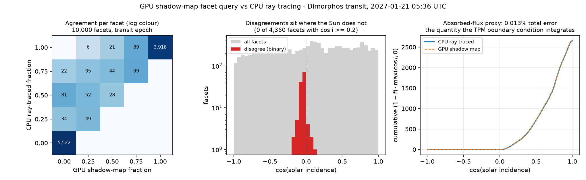

# Per-facet shadow queries from the GPU shadow map

Reads back, for every facet of a body, what fraction of it is occluded from
the Sun — using the depth map the renderer already builds each frame instead
of ray tracing. Intended for the thermophysical model's surface boundary
condition (is this facet illuminated?) and for dropping occulted facets when
converting temperature to TIRI radiance.

**Result: 98.7% per-facet agreement with CPU ray tracing, and 0.013% error on
the absorbed-flux integral the TPM actually uses — at 7 ms for 3.1M facets,
against an extrapolated ~36 days for the brute-force ray trace.**



## 1. API

The app runs two callbacks per frame, either of which may be left unset:

```python
app.config.facet_shadow = True     # compute for every body, every frame

def before_render(sim, dt):        # set the scene
    et = et0 + sim.state.iteration * dt_sim
    # ... position bodies / sun / camera from spice ...

def after_render(sim, dt):          # GPU results for THIS frame exist here
    lit = 1.0 - sim.facet_shadow(0) # per facet, Mesh.facets order
    # ... TPM step / radiance accumulation ...

app.before_render = before_render
app.after_render = after_render
```

`config.facet_shadow` is off by default because the query is not free (~1.6 ms
per body at 100k facets, ~7.3 ms at 3.1M), and most runs only want images.
One flag at setup turns it on for every body; `sim.facet_shadow(body)` returns
`None` for anything not computed this frame, never a stale array.

For sparse use — only particular epochs — leave the flag off and call
`sim.request_facet_shadow(body)` from `before_render` for the frames you
want.

`frac[i]` is the occluded fraction of facet `i`: `0.0` fully lit, `1.0` fully
shadowed, quarter steps between for facets straddling a shadow boundary
(4 samples per facet — the 3 vertices and the centroid).

**Why two callbacks.** The dependency is ordered: `before_render` sets the
geometry, the shadow pass builds the map from it, and only then can the map
be queried. `after_render` runs once that has happened, so it sees the
current frame's answer with no lag. (The query cannot simply run inside
`before_render`: the Python `App` is mutably borrowed for the whole event
loop, which is also why results are delivered through `Simulation` rather
than off the app.)

`app.tick` remains as an alias for `before_render`, so existing scripts are
unaffected.

Both callbacks see the same `state.iteration` for a given frame — the counter
advances only once both have run, so a loop deriving an epoch from it cannot
see two different times within one frame.

Reading `facet_shadow()` from `before_render` still works and returns the
*previous* frame's result. Occasionally that is what you want (comparing
consecutive steps); mostly it is a trap.

Two caveats for `after_render`:

- **Scene changes there take effect next frame** — this frame's GPU work is
  already submitted.
- **Heavy CPU work there blocks the render loop.** Fine for a simulation run,
  but frame rate stops being a meaningful number once a TPM step dominates.

Rust: `App::set_after_render`, `Window::facet_shadow_fractions(body)`, or
`FacetShadowQuery::query(...)` directly.

## 2. How it works

`shaders/facet_shadow.wgsl`, one compute invocation per facet:

1. Read the facet's 3 vertices straight out of the render pass's
   `geometry_buffer` (so the geometry tested is the geometry drawn — no
   second upload that could drift), transform to world space.
2. Take 4 sample points: the vertices and the centroid.
3. Project each into light clip space with the same `light.view_proj` the
   fragment shader uses, apply the same normal offset and depth bias, and
   `textureLoad` the shadow map.
4. Write `occluded_samples / 4` to a storage buffer, copied back to the CPU.

The bias and normal-offset arithmetic is copied from `mesh_shadow.wgsl` so
what this reports and what you see rendered cannot disagree. `textureLoad`
replaces `textureSampleCompare` because compute shaders cannot use comparison
samplers; the comparison is done explicitly instead.

Facets whose samples land outside the light frustum are reported lit — the
fitted frustum covers the whole scene, so that only happens for geometry the
light cannot reach anyway.

**This is an algorithmic change, not just "the GPU is faster."** Ray tracing
each facet against every triangle is `O(n_facets x n_triangles)`. Shadow
mapping is `O(n_triangles)` to rasterize the map once, then `O(n_facets)`
lookups. The map is already being built for rendering, so the query is only
the second term.

## 3. Performance

M1 Pro, release build, `vsync = False`, 1020x1020, query requested every
frame. Cost is the frame-time difference:

| Facets | query off | query on | added per query |
|---|---|---|---|
| 100k | 307.3 it/s (3.25 ms) | 206.9 it/s (4.83 ms) | **1.6 ms** |
| 3.1M | 56.7 it/s (17.6 ms) | 40.2 it/s (24.9 ms) | **7.3 ms** |

Most of that is the blocking readback, not the compute: 3.1M facets is a
12.6 MB transfer plus a full pipeline stall. Calling it once per simulation
step rather than per frame makes it negligible.

For comparison, the CPU reference below — *vectorised numpy*, far faster than
a naive loop — took **32 s for 10,000 facets** (8x10^8 ray/triangle tests).
Scaling to 3.1M facets against both bodies is ~7.8x10^13 tests, about
**36 days**. `crate::mesh::intersect_mesh` would be slower still: it is
brute-force per ray *and* allocates a `Vec` of every triangle on each call
([mesh.rs:947](../../src/mesh.rs#L947)) — worth fixing if it stays as the
validation path.

## 4. Validation

`notes/facet_shadow_query/validation.png`, at the Dimorphos-transit epoch
(2027-01-21 05:36 UTC — a real cast shadow, not just terminators), 10k-facet
meshes so the O(n²) reference is tractable. Reference: vectorised
Möller-Trumbore from the same 4 sample points, against **both** bodies, so
terrain self-shadowing and the eclipse are both covered.

| Metric | Value |
|---|---|
| binary lit/shadowed agreement | **9,872 / 10,000 (98.72%)** |
| exact fraction match (all 5 levels) | 9,616 (96.16%) |
| mean abs fraction error | 0.0144 |
| GPU shadowed where CPU says lit | **0** |
| GPU lit where CPU says shadowed | 128 |

Where the 128 disagreements sit:

| Incidence | Disagreeing | of total |
|---|---|---|
| night side (cos i ≤ 0) | 121 | of 4,211 (2.9%) |
| grazing (0 < cos i < 0.2) | 7 | of 1,429 (0.5%) |
| **well lit (cos i ≥ 0.2)** | **0** | of 4,360 (0.0%) |

They cluster within a few degrees of the terminator, which is where a
half-texel of bias decides the answer — and where `cos i -> 0` means the
energy at stake goes to zero anyway. Weighting each facet by
`(1 - fraction) x max(cos i, 0)`, the proxy for absorbed solar flux the TPM
boundary condition integrates:

```
CPU total   2651.8014
GPU total   2652.1554
error         0.0133 %
```

Note the asymmetry: the GPU never reports a shadow the ray tracer does not
see. The depth bias errs toward "lit", so the failure mode is missing a
sliver of shadow at grazing incidence, never inventing one.

## 5. Accuracy budget

Numbers for the Didymos system, mesh in km, 8192² shadow map:

| Quantity | Value |
|---|---|
| light frustum span (auto-fitted to both bodies) | ~2 km |
| shadow-map texel | **0.24 m** |
| facet edge, 3.1M mesh (~0.55 m²/facet) | **1.13 m** |
| facet edge, 100k mesh | ~6.3 m |

So each 3.1M facet covers ~5 texels across and each 100k facet ~26 — the map
resolves individual facets comfortably. Resolution is not the limiting term;
the depth bias at grazing incidence is, and section 4 bounds what that costs.

If you change `shadow_resolution`, or the light frustum grows (bodies further
apart), recheck this table: once a texel approaches a facet edge the error
stops being terminator-only.

## 6. Limitations

- **Blocking readback** — do not call per frame in an interactive session at
  3.1M facets; 7 ms is a third of the frame budget.
- **Occultation from the camera is a different query.** This one is from the
  light. The same machinery would work from the camera's point of view, but
  at 25.8 km with a 5.5° FOV the camera depth buffer is ~2.4 m/pixel against
  1.13 m facets — it does *not* resolve individual facets. For TIRI
  visibility, prefer an exact CPU backface test (`n·view < 0`) for
  self-occultation, and reserve a depth test for *inter-body* occultation
  (Dimorphos in front of Didymos), which is a coarse-scale question. Limb
  facets stay ambiguous either way at that range.
- **A `shadow_path` proxy is fine to combine with this** — measured, not
  assumed. The query always tests the real full-resolution facets; only the
  *depths* in the map come from the coarser occluder. At the transit epoch,
  3.1M-facet bodies with a 100k proxy versus a full-resolution occluder:

  | | |
  |---|---|
  | binary agreement | 3,145,091 / 3,145,728 (**99.98%**) |
  | facets differing at all | 2,272 (0.07%) |
  | mean fraction difference | 0.0002 |

  637 facets flip lit/shadowed — 60x smaller than the 1.28% the shadow map
  itself disagrees with ray tracing (section 4), so the proxy is well inside
  the method's own noise and buys ~1.5x. Re-check if you decimate much below
  100k, where the occluder silhouette starts to move.

## 7. Future work: the Sun is not a point source

**This is currently the largest approximation in the shadow calculation —
larger than anything measured above — and both methods share it.**

Shadow mapping and the ray tracer both treat the Sun as a point, producing a
hard umbra edge. The real Sun has an angular diameter of ~0.33° at 1.6 AU
(0.27° at 1 AU, 0.14° at 2 AU), so an occluder casts a penumbra that widens
with distance behind it:

```
penumbra width  ~  d_occluder->surface  x  angular_diameter_sun
                ~  1150 m  x  5.8e-3 rad   ~   6.7 m
```

for Dimorphos shadowing Didymos at their ~1.15 km separation. Put against
the error budget in section 5:

| | scale |
|---|---|
| solar penumbra (unmodelled, both methods) | **~6.7 m** |
| facet edge, 3.1M mesh | 1.13 m |
| shadow-map texel | 0.24 m |

The penumbra is ~6 facets wide at 3.1M and ~28 texels — **an order of
magnitude larger than the sampling error this note spends its time
bounding**. Every facet in that 6.7 m band currently flips from fully lit to
fully dark in one step, where physically it should ramp.

For the TPM this matters more than for rendering: a facet entering eclipse
sees its solar input drop over the penumbra crossing time, not instantly, and
the thermal response to a sharp step differs from a ramp.

Approaches, roughly in order of effort:

1. **Analytic penumbra from occluder distance.** The shadow map already
   stores the occluder depth, so `d` is available per sample: convert
   distance into an expected penumbra width and soften the transition. This
   is essentially PCSS (percentage-closer soft shadows) with the kernel set
   by real solar geometry rather than an artistic constant. Cheap, and it
   reuses everything here.
2. **Multiple shadow maps** from points sampled across the solar disk,
   averaged. Physically direct, costs one shadow pass per sample.
3. **Analytic solar-disk integration per facet** — exact, expensive, probably
   only worth it as a reference to validate 1 or 2.

**Consistency requirement:** whichever way this goes, the TPM's own
illumination term has to change with it, or the renderer and the thermal
model will disagree about the same eclipse. That coupling is why this is
deferred rather than bolted on — it is a change to the physics, not to the
renderer. Worth doing before any quantitative comparison against real TIRI
eclipse observations.

## 8. Reproducing

Validation and timing scripts were throwaway copies under `/tmp`. To redo:
freeze the scene at one epoch, `request_facet_shadow(body)` each tick and
read `facet_shadow()` the next, and compare against a Möller-Trumbore sweep
from the same 4 sample points against both bodies' world-space triangles.
Weight disagreements by `max(cos i, 0)` — the raw facet count overstates the
error by two orders of magnitude relative to what the physics integrates.
